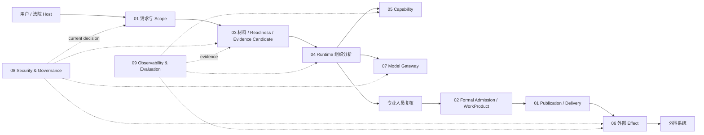

# Zuno 目标架构：一项法律任务如何从材料变成可交付结果

Zuno 是一个面向法律工作的智能 Agent 平台。它面对的难点不只在“模型能不能回答”，而在一项任务从材料进入系统以后，如何长期保持来源、版本、专业判断、运行进度、权限和现实副作用之间的关系可解释、可恢复、可审计。

项目背景和历史事实由 [`docs/project/README.md`](../project/README.md) 负责。本文描述 Zuno 当前接受的 **Target Architecture**：它回答系统应该怎样分工，不表示这些能力已经全部在 Current 代码或法院环境中实现。Current 只由 [`docs/evidence/`](../evidence/README.md) 中与具体代码 SHA、Migration、Test、Trace、Eval 和运行结果绑定的材料证明。

<!--
status: normative-target
architecture_state: ACCEPTED_TARGET
overall_architecture_state: ROUND_02_FROZEN
target_logical_module_count: 9
final_module_count: 9
module_decomposition_gate: OPEN
module_design_baseline: AVAILABLE_V1
module_deep_design: AVAILABLE_V2
module_deep_design_coverage: 9/9
cross_module_consistency: AVAILABLE_V1
module_detail_freeze: NOT_YET
implementation_authorization: NO
owner: Cross-cutting Architecture Owner
canonical_question: Zuno 作为一个长期法律智能工作系统，应该怎样划分事实权威、执行控制、知识能力、安全和现实副作用，使系统可以解释、恢复和演进？
project_source: docs/project/README.md
module_source: docs/modules/
decision_source: docs/decisions/
evidence_source: docs/evidence/
research_source: docs/research/
-->

## Part A — Human Narrative（人类技术叙事）

### 复杂度从业务约束里长出来

简单法律问答不需要九个责任域全部参与。用户只问“合同第 8 条写了什么”，材料范围明确、当前有权访问，也不需要长期正式成果时，受控 RAG、一次模型调用和普通应用服务已经可能足够。固定流程能稳定解决的问题也应继续用固定 Workflow。

Zuno 的额外复杂度只在这些简单假设失效以后有价值。

| 现实约束 | 最简单方案 | 简单方案开始失效的地方 | 长期责任 |
| --- | --- | --- | --- |
| 材料很多、版本会变、OCR 和索引异步完成 | 上传后直接做 RAG | 上传成功不等于当前任务依赖的关键材料已经可用 | 03 Knowledge & Evidence |
| 模型和检索会产生流畅但错误的候选 | 保存最后一次模型输出 | 机器成功不等于专业结论已经被长期采用 | 02 Legal Domain & Work Product |
| 多步骤任务会等待，新材料会进入，旧结果会晚到 | 固定 Workflow + Checkpoint | 旧 Checkpoint 不能判断晚到结果是否仍适用，也不能证明业务提交已成功 | 04 Agent Runtime & Control |
| 研究模型、LLM、规则和外部 Provider 会替换 | 调用点直接绑定 class / model name | 接口兼容不代表专业语义、质量和失败边界仍等价 | 05 Capability & Skill + 07 Model Gateway |
| 权限、用途、Credential 会在长任务期间变化 | 入口鉴权一次 | 10:00 的 allow 不能替 10:20 的新读取、外发或 Tool send 做决定 | 08 Security & Governance |
| 外部 POST timeout 后无法确认现实世界是否已改变 | timeout -> Failed -> Retry | 第一次请求可能已经成功，Blind Retry 会制造第二次业务动作 | 06 Tool Runtime & Effects |
| 各环节都有自己的“成功” | 一张全局 status 表 | Runtime complete、Domain committed、Effect confirmed、Publication delivered 是不同事实 | 01 Application 组合各 Owner facts |
| GraphRAG、Memory、Reflection、Specialist 容易越做越多 | 默认开启复杂能力 | 成本和故障面增加，收益却可能没有稳定证据 | 09 Observability & Evaluation |

九个责任域由这些长期责任自然形成。它们是逻辑 Authority，不是九个微服务。默认实现仍可以是**模块化 Python 后端**，加少量按照工作类型划分的 Worker 和成熟基础设施；逻辑模块不等于独立网络服务。

通用 Agent Harness 也不是 Zuno 必须长期自研的差异化。Conversation、普通 Workflow、MCP、Checkpointer、Queue、Secret Manager、OpenTelemetry、模型 SDK 等能力成熟以后应优先 Buy / Reuse。Zuno 真正需要长期保护的是法律任务的材料与证据语义、正式业务事实、专业能力资格、现实副作用、安全治理和可复现 Eval。

### 一宗合同争议怎样从材料走到正式结果

假设专业人员上传合同、补充协议、聊天记录和扫描附件，希望系统整理付款义务、违约事实、证据引用，并形成一份可以复核和后续交付的分析成果。



请求先由 Application 建立稳定身份和任务范围。Security 判断当前主体能访问什么。Knowledge 围绕正式材料版本生成可重建知识，并针对当前任务判断材料是否足够。简单问答可以在这里走短路径，不进入 Native Runtime。

真正需要等待、并行、人工介入或崩溃后恢复的任务才交给 Runtime。Runtime 管理 Plan、Step、等待、预算和 Replan，但它拥有的是执行控制，不是法律业务事实。为了避免两套计划同时修改全局控制，Target 使用一个逻辑 `Single Controller` 激活和替换 PlanVersion；Worker、模型和专业分析仍然可以并行。

Runtime 调用 Capability 和 Model Gateway。Capability 固定“事件抽取、冲突识别、类案检索”等专业能力承诺，具体论文模型、规则、LLM 或第三方服务只是 Provider。Model Gateway 负责真实模型路由、Attempt 和 Usage。Provider 能调用、Schema 合法、模型返回 200 都不自动证明专业结果可用。

机器分析结束后，结果仍然是 Candidate。需要长期保存、交付和追责的内容，由 Legal Domain & Work Product 在材料版本、专业规则、必要 HumanDecision 和当前资格满足以后正式接纳。工程上把这个边界称为 `Formal Admission`。WorkProduct 保存自己的版本、引用和形成依据，而不是只保存最后一段模型文本。

结果离开 Zuno 时，Application 决定“应该把哪一版成果交付给谁”；Effects 负责“现实世界究竟发生了什么”。如果外部 POST timeout，Application 不能自己宣布失败并重发。06 必须先确认过去那次动作是否已经发生，结论仍然未知时保持 Unknown。

### 四个故障窗口解释了为什么不能只有一个 status

**材料变化。** 任务已经运行二十分钟，新补充协议进入，旧 Plan 的一个 Worker 此时返回。结果即使计算正确，也可能基于旧材料。系统需要知道它依赖哪一版 DocumentVersion / KnowledgeGeneration 和哪一版 Plan，再决定接受、重新验收或重做。

**Domain 已提交、Checkpoint 还没写。** 专业人员已经确认结果，02 的事务成功，Runtime 在写下一份 Checkpoint 前崩溃。恢复时如果只相信旧 Checkpoint，就会再次提交正式事实。正确顺序是先查询 Domain 的耐久完成证明，再修 Runtime projection。

**外部动作越过 send boundary 后响应丢失。** timeout 只说明本地没有得到确定响应，不能证明远端没执行。此时必须进入 Reconcile，不能把 transport failure 直接变成 Retry。

**权限和资格随时间变化。** 任务 10:00 启动时允许读取，10:20 权限被撤销；或者 Plan 形成时使用 Tool schema v1，真正 dispatch 时已经升级到 v2。过去成立的资格不能永久授权未来动作。

这四种窗口分别需要 Knowledge / Domain / Runtime / Effects / Security 等 Owner 保存不同事实。把它们压成一个 `SUCCESS / FAILED` 状态，只会在恢复时丢掉最关键的信息。

### 九个责任域保护九类长期事实

| 编号 | 责任域 | 长期保护的事实 |
| --- | --- | --- |
| **01 Application & Integration** | 外部请求、Invocation、Publication、Delivery、失效传播和 Host Contract |
| **02 Legal Domain & Work Product** | Matter / DocumentVersion identity、正式 Evidence / Finding、HumanDecision、WorkProduct、DomainVersion、AdmissionReceipt |
| **03 Knowledge & Evidence** | KnowledgeGeneration、Serving、ReadinessDecision、EvidenceCandidate、RetrievalResult、CitationLineage |
| **04 Agent Runtime & Control** | AgentRun、PlanVersion、StepRun、Checkpoint、Ready/Join、Budget、Retry/Replan/Reconcile 控制、RunOutcome |
| **05 Capability & Skill** | CapabilityVersion、ProviderBinding、Conformance、Qualification / Eligibility、专业 Candidate / Proposal |
| **06 Tool Runtime & Effects** | PreparedAction、ToolAttempt、EffectReceipt、ReconciliationReceipt、RetrySafety |
| **07 Model Gateway** | Model Role resolution、Provider/Model Attempt、Usage / Cost、取消与 fallback 调用事实 |
| **08 Security & Governance** | SecurityEpoch、Authorization、Approval、Model Egress、Secret / Credential policy、Lifecycle / Recall policy、AuditRequirement |
| **09 Observability & Evaluation** | Telemetry、Eval Dataset / Run / Result、Experiment、Release Evidence、复杂度 kill test |

Platform / Infrastructure 不作为第十个业务模块。PostgreSQL、Object Store、Queue、Checkpointer、CAS、Lease、Fencing、Clock、Backup、Network、Secret Delivery 和模型 SDK 提供物理原语，但不拥有法律业务成功语义。

### Context 和 Memory 不形成第十个业务 Authority

长任务需要 recent window、task summary 和临时 working context；某些跨会话场景也可能从 structured long-term memory 获益。最简单基线仍然是 Raw Event + task summary + 按需读取的 Owner facts。只有 A/B 证明跨会话复用稳定改善质量或效率时，structured memory 才值得增加。

即使启用，Memory 也只是非权威 Context Provider。Provider 可以保存带来源、Scope 和生命周期信息的 record；08 决定当前主体能否 Recall、何时 No-Recall、何时 Retain / Purge；01 / 04 在请求或 Step 开始时消费当前允许的 snapshot。02 的正式材料、Evidence、Finding、HumanDecision 和 WorkProduct 始终拥有更高 Authority。

旧 Memory 与当前 Domain 冲突时，系统重新组装 Context，不让“模型曾经记住的内容”覆盖正式事实。Runtime resume 也不应把旧 Context blob 当成被冻结的业务世界，而是重新读取当前 Domain、Knowledge、Security 和允许的 Memory snapshot。

Context trace 同样只证明 lineage。`source_event_ids` 可以说明 summary 从哪里来，却不能单独证明来源真实、调用者仍有权读取，也不能证明压缩过程保留了所有关键法律限定。因此 Zuno 明确区分：

```text
Provenance != Truth != Authorization != Semantic Preservation
```

### 版本变化沿依赖链处理，不建立全局 Version God Service

一次 Step 可能同时依赖 DocumentVersion / KnowledgeGeneration、CapabilityVersion / ProviderBinding、Model / generation config、ToolVersion、Credential 和 SecurityEpoch。计划形成以后，这些版本都可能变化。

04 记录本次 Step 真正解析出的 input-version set，但不替相邻 Owner 猜兼容性。03 判断 KnowledgeGeneration 仍不仍适用；05 判断 ProviderBinding / config 是否仍满足同一 Capability；07 判断模型候选仍不仍合格；06 判断 Tool schema、effect class、幂等和 reconciliation semantics 是否变化；08 判断当前授权和 Credential 资格。

纯实现替换如果已经证明与同一 Contract 等价，可以 re-resolve 后继续。只要专业语义、Schema、EffectClass、关键配置或安全条件改变，旧 Plan 的假设就失效，应 Reject、Review 或 Replan，而不是把不兼容变化包装成 Retry。

这个设计不需要一台统一 Version Service。每个 Owner 继续维护自己的版本和资格；Runtime 只记录当前计划依赖了什么，并在 dispatch、late result、resume 和正式准入前重新验收。

### 系统里保存的不是一种“状态”

第一类是不能靠重算找回的业务历史：正式材料版本、HumanDecision、正式 Evidence / Finding、WorkProduct、AdmissionReceipt。模型升级、索引重建或服务重启不能覆盖它们。

第二类是可重建知识派生：OCR、chunk、Embedding、graph、index 和其他 Knowledge projection。它们可以重新生成，但新一代没有完整验证以前不能替换正在 Serving 的 generation。

第三类是 Runtime 控制状态：Plan、Step、Checkpoint、Interrupt、Budget。它们使长任务可恢复，却不证明 Domain Commit 或外部 Effect。

第四类是 Effect 与安全治理事实。外部世界一旦可能被改变，本地事务回滚不能让现实倒流；Authorization 可以随当前策略变化，但已发生的 Approval、Audit 和 Effect history 不能被普通日志覆盖。

Cache、UI projection 和大部分 Telemetry 处在更低权威层。它们可以丢失和重建，不能要求更强 Owner fact 跟随旧缓存回退。

### 一致性靠 Owner 内事务和跨 Owner 对账收敛

让 PostgreSQL、Object Store、Queue、Checkpoint、模型 Provider 和外围法院系统加入同一笔 2PC 不现实。Zuno 把强一致缩到真正拥有事实的局部边界：02 在自己的事务中保护 Domain mutation；03 只在 generation 完整以后切 Serving；04 串行化自己的控制事实；06 在危险 send 前固定 Action / Attempt identity；08 保存当前决策和必要治理事实。

跨边界以后依赖稳定 identity、版本、causation ref 和可查询的完成证明。没有 Owner proof 时，状态停在 Candidate、WAITING、UNKNOWN、REVIEW 或 REJECT，不为了推进 Workflow 猜一个 success。

恢复顺序也因此固定为：先判断哪类事实有疑问，再查询对应 Owner；比较 causation / version / freshness；新的受保护动作重新消费当前 Security；最后才修 Runtime、Cache、Projection 或 Delivery，并选择 Retry、Replan 或 Reconcile。

### 有些事情发生以后只能向前修正

正式业务接纳以后，后来的 Cancel 或 Replan 只能影响未来，不能把 WorkProduct 历史改成“从未发生”。新证据改变当前判断时，形成新版本、review-required / stale / superseded 关系，同时保留旧版本当时为什么成立。

外部 Effect 更明显。动作已经可能到达远端以后，旧 Plan 变成 stale 也不能否认现实世界。结果未知时 Reconcile；已经确认发生而业务需要撤回时，发起新的受控 Compensation。补偿有自己的授权、Attempt 和结果，不修改旧 EffectReceipt。

模型调用也属于真实历史。几年以后重新跑出同样文本不是审计前提；需要保存的是当时用了哪些材料、Capability / Provider / Model / config、机器返回什么、专业人员怎样修改、哪些条件下正式接纳，以及最终哪一版结果被交付。

### 默认部署保持简单，复杂机制要有退出条件

九个责任域默认不对应九个服务。合理起点是**模块化 Python 后端 + justified Workers + 成熟基础设施**。OCR / ingestion、Knowledge rebuild、模型、外部 Tool、Eval 等工作只有在资源、吞吐、故障隔离、安全出口或发布节奏出现真实差异时才值得拆成**独立网络服务**。

同样，GraphRAG、Reflection、Long-term Memory、Specialist / Multi-Agent、Native Runtime 都是 measurement-gated complexity。最简单方案能够满足业务约束时应继续使用。每个复杂机制都要回答：它解决了哪个已观察的 baseline failure；增加了什么状态、成本和故障面；怎样测收益；什么结果出现时应该关闭、缩小或删除。

Multi-Agent 尤其不按角色数量体现架构深度。默认升级阶梯仍是：

```text
Tool
→ Subgraph
→ parallel worker
→ Specialist Agent
→ Persistent Multi-Agent
```

只有前一级在真实任务中出现可测失败，才进入下一层。

### Current / Target / Evidence / Unknown

**Target：** 本文描述的九个逻辑责任域及其 Authority、版本、恢复、安全和复杂度治理边界。Simple QA 继续允许走 Generic Host / controlled RAG 短路径；Generic Host + Zuno Legal Backend 仍是重要 baseline；Native Runtime 继续 measurement-gated。

**Current：** 实现按 scoped slice 向 Target 收敛。当前仓库已经存在覆盖多个责任域的代码、Migration、selected verification 和 fault probes，但本文不维护每个 implementation wave 的 SHA、run、临时 blocker 或转绿状态。判断“今天做到哪里”时，以 [`docs/evidence/`](../evidence/README.md) 绑定的具体代码快照和验证结果为准。

**Evidence：** 正向测试可以证明某个窄行为成立，负向 fault probe 也可以证明某个 Target invariant 尚未成立。Evidence 只提升它实际覆盖的 Current 范围；它不会修改 Target，也不会把 selected suite、smoke 或局部 PostgreSQL probe 扩写成 Full CI、正式 benchmark 或 Production Qualification。main 继续变化而 Evidence 尚未推进时，这属于 freshness gap，不表示 Target 回退。

**Unknown / Gap：** 尚未得到实现或测量证明的 Target 机制继续保持 Gap；真实法院质量、容量、Backpressure / fairness、RPO / RTO、HA / DR，以及 GraphRAG、Memory、Native Runtime、Multi-Agent 等复杂机制的增量收益继续依赖独立 Evidence。某个 gap 被实现后，只应在 Evidence 中升级对应 Current 结论，不需要反复改写本文的架构因果链。

九个责任域的连续说明见 [`docs/modules/`](../modules/README.md)。需要精确查看 Contract、状态、Owner 和恢复规则时进入 [`reference.md`](reference.md)；长期设计理由由 [`docs/decisions/`](../decisions/README.md) 保存。
