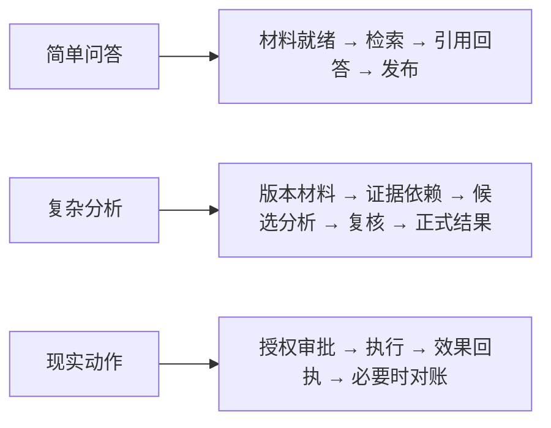
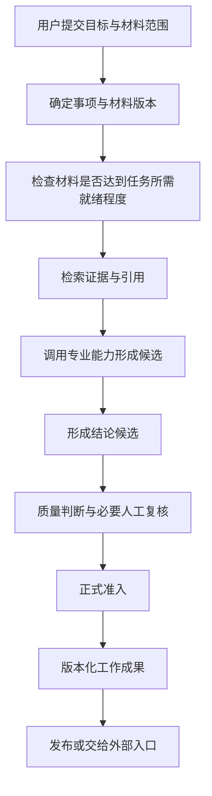
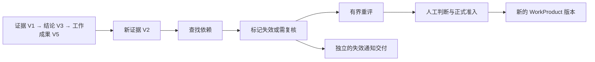
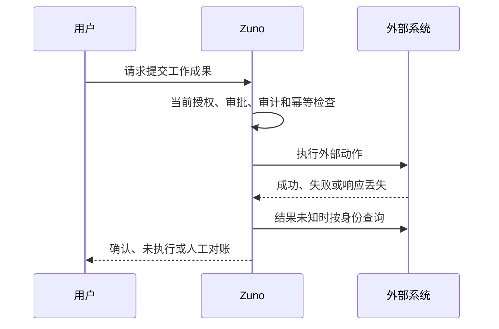
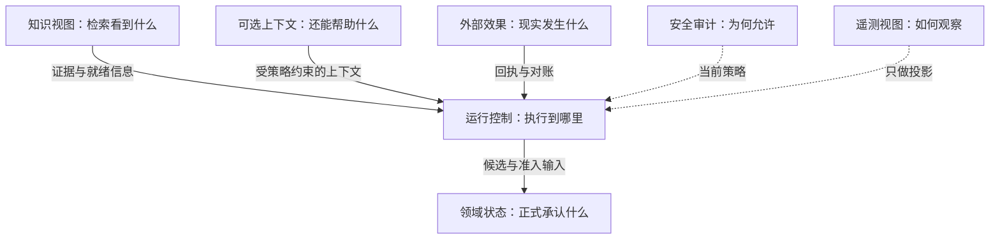
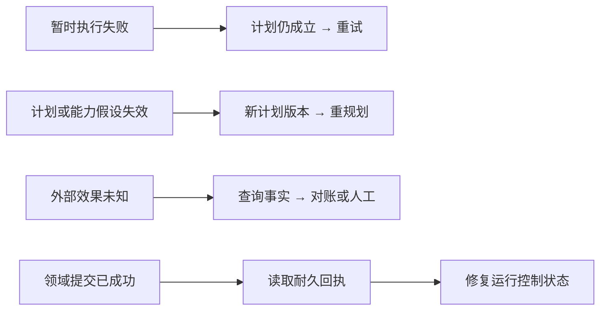

# Zuno 总体 Target 架构

Zuno 面向智慧司法场景，尝试把法律材料、专业分析能力和可复核的业务结果组织成一套可以被独立产品或现有 Agent Host 使用的法律智能能力。它不是把更多 Agent 名词堆在普通 RAG 上，而是要解决一个更具体的问题：当任务涉及多份材料、版本变化、人工判断或外部动作时，系统怎样知道依据是什么、结果是否仍然有效，以及现实世界到底发生了什么。

对简单问题，通用 Host 加检索完全可能已经够用；Zuno 只有在复杂法律任务中确实带来可测量收益时，才值得保留额外的领域状态、证据依赖和恢复控制。本文件记录这一 Target 方向，不把设计自动写成当前实现，也不把 Pilot 写成 Production。

本文的 Part A 先用业务场景解释整体架构，面向新加入的工程师和架构 Review；Part B 再给出 Owner、Contract、状态和恢复规则，面向实现、测试和审查。项目背景见 [`docs/project/`](../project/)，当前代码和验证见 [`docs/evidence/`](../evidence/)，Round 02 的质询过程见 [`docs/history/red-blue/`](../history/red-blue/README.md)。History 解释架构如何演进，不能反过来成为 Current 或 Target 的事实源。

<!--
updated: 2026-08-15
status: normative-target
architecture_state: ACCEPTED_TARGET
architecture_revision: COMPLETED
architecture_revision_sha: 7ce987f5d747395d4926622f42ac4f0013bc53ed
canonical_revision_gate: PASS
overall_architecture_state: ROUND_02_FROZEN
target_logical_module_count: 9
final_module_count: 9
platform_infrastructure: RESPONSIBILITY_LAYER
context_provider: OPTIONAL
module_decomposition_gate: OPEN
observability_architecture: OTEL_COMPATIBLE
langsmith_role: PREFERRED_AGENT_TRACE_AND_EVAL_PROVIDER
canonical_question: Zuno 如何把法律领域状态、证据、执行控制、安全和可验证交付组合成可恢复且可替换的 Target？
owner: Cross-cutting Architecture Owner
acceptance_scope: Round 02 Main Judgment 的 Canonical Revision；实现、测量和外部资格尚未完成
readability_state: HUMAN_FIRST_PART_A_AND_PART_B
canonical_taxonomy: docs/architecture/ 仅保存总体架构四文件；项目事实由 docs/project/ 负责
current_state_source: docs/project/ 和 docs/evidence/
review_history_source: docs/history/red-blue/
decision_sources: docs/decisions/0003-wave1-cross-module-contract-freeze.md、0005-official-langgraph-postgres-checkpointer.md、0007-reuse-first-provider-boundary.md、0008-legal-domain-kernel-and-host-boundary.md、0012-evidence-gated-physical-service-split.md、0013-round-02-responsibility-taxonomy.md、0014-round-02-cross-boundary-authority-and-recovery.md
-->

## Part A — Architecture Narrative

### 1. Zuno 要解决的到底是什么问题

先回答“Zuno 是什么”：它是面向智慧司法和法律专业工作的法律智能能力平台，目标是把材料、专业分析、人工判断和正式工作成果连接起来。

简单的法律问答并不一定需要一套复杂系统。用户问“合同第 8 条规定了什么违约责任”时，找到正确材料、定位原文、生成带依据的回答，往往已经能解决问题。真正困难的是那些不能只靠一次检索和一次生成完成的工作：同一事项涉及多份材料，材料有不同版本，结论依赖若干证据，模型提出的判断需要人来确认，而且最终结果要在几天或几个月后仍然能够解释。

在这类任务里，系统需要回答的不只是“模型这次说了什么”，还包括：它依据的是哪一版材料？某条证据是否真的支持这个结论？补充协议出现后，原来的判断还适用吗？昨天形成的工作成果是否需要重新复核？如果还要把结果提交给外部法院系统，那个动作到底有没有发生？当服务中断或任务跨越很长时间时，系统还要知道已经完成了什么、哪些只是临时计算、下一步是否可以安全继续。

Zuno 的目标因此不是给普通检索再堆更多 Agent，而是把材料、依据、专业分析、人工判断、正式结果和现实世界动作组织成一条可追溯、可复核、可恢复的专业工作链。这里的“目标”是 Target Product Hypothesis（目标产品假设），不是已经测量证明的产品优势；如果简单方案已经足够，额外的领域状态和执行控制就不应为了架构完整而保留。

### 2. 不是所有法律任务都需要同样复杂的系统

Zuno 的第一个设计判断是：复杂度应该跟着任务走，而不是让每个问题都经过同一条最重的流程。可以把任务先理解成三种形态：

#### 简单问答

例如用户询问“合同第 8 条规定了什么违约责任”。系统确认用户可以访问的材料范围和当前权限，确认合同的必要版本已经处理完成，找到条款原文和稳定位置，再生成带依据的回答并检查它确实被原文支持。这个过程不需要动态规划、多 Agent、长期记忆或复杂的自有运行时。

这就是“一个简单问题怎样完成”的完整边界：把材料范围、原文依据和回答资格说明白，然后返回结果，不把普通问题升级成复杂工作流。

#### 复杂法律分析

例如用户同时提交原告材料、被告材料、补充协议、历史沟通记录和证据，请系统分析一个争议点。此时材料可能互相补充，也可能在时间、主体或适用范围上产生差异。系统需要绑定版本，建立证据依赖，调用专业能力形成候选分析，经过质量判断和必要的人工复核后，保存一个可以被新证据影响的正式工作成果。

#### 带现实副作用的任务

例如用户要求把审查结果提交到外围法院系统，或者向外部业务系统发送通知。此时除了分析是否正确，还要检查当前授权、审批、参数、幂等身份和执行结果；请求超时后还要确认外部世界究竟发生了什么。这类任务比单纯返回一段文字多了一层现实效果控制。

这三种形态可以共享材料、模型和专业能力，但不应被迫共享同样的执行路径。Simple QA（简单问答）可以留在入口或通用宿主中；复杂分析才需要领域状态和受控的多步执行；外部动作再增加准备、审批和对账。这样做的理由不是追求最少模块，而是避免把不必要的成本施加给最普通的问题。



### 3. Zuno 的核心设计思想

从上面三种任务可以抽出六条原则。它们不是独立的产品功能，而是判断边界和取舍的方式。

1. **模型提出建议，不直接成为正式事实。** 模型、检索、专业算法和上下文可以提出 Proposal（候选建议）、Candidate（候选对象）或 Observation（观察结果），但不能自行把一个判断写成正式的法律业务状态。正式结果需要经过资格判断、必要的人审和明确的领域提交。
2. **正式结果必须能回到材料和依据。** 一个工作成果要说明自己基于哪些 DocumentVersion（材料版本）、哪些 Evidence（证据）和哪些稳定来源位置。当前检索索引可以变化，但不能把新的索引身份当成过去正式结果的唯一依据。
3. **业务事实和执行过程必须分开。** Domain State（领域状态）回答法律业务世界正式承认了什么；Runtime Control State（运行控制状态）回答这次任务执行到了哪里。二者可以相互引用，但一次 Checkpoint（检查点）的完成不能替代正式业务提交。
4. **现实世界的未知结果不能当成普通失败。** 对纯计算调用，暂时失败通常可以重试；对已经可能产生副作用的外部请求，超时可能意味着“已经成功但回执丢失”，必须先确认或对账，不能盲目再做一次。
5. **通用能力优先复用。** Zuno 只应拥有和法律状态、证据语义、人工决定、正式发布及受控副作用直接相关的责任；界面、会话、通用工作流、模型接入和工具协议在成熟方案足够时可以复用。
6. **复杂度必须用证据证明。** Native Runtime（原生运行时）、长期记忆、GraphRAG、专业多 Agent 和独立网络服务都不是因为名字先进就自动保留。它们需要在真实任务、质量、成本、恢复或安全方面显示出稳定收益。

### 4. 一次复杂法律任务怎样完整运行

下面回答“一个复杂法律分析怎样完成”：用“分析一组合同和相关沟通材料，判断争议点并形成审查结果”贯穿说明。它不是对历史项目原始流程的断言，而是当前 Target Architecture（目标架构）用来说明责任如何衔接的完整场景。



#### 4.1 先确定任务到底在处理什么

用户提交的不只是一个自然语言问题，还包括本次分析的目标、事项范围和希望使用的材料。应用与集成边界先确认请求属于哪个 Matter（业务事项），以及这次任务声明要覆盖哪些文档和版本。它负责把请求组合成可以执行的入口决定，但不重新计算权限、检索质量或法律结论。

如果范围不清，系统应该先要求补充范围，而不是让模型自行猜测。范围明确以后，运行控制可以据此建立一次任务；后面得到的每个候选结果都要知道自己属于哪个事项、哪次运行和哪一版计划。

#### 4.2 材料上传不等于材料可以支持正式分析

系统需要把材料身份和 DocumentVersion（材料版本）绑定起来，并检查所声明范围的 Knowledge Readiness（知识就绪状态）。文件可能还在 OCR、解析或索引，附件可能失败，知识视图也可能仍停留在上一版本。只有达到当前任务的最低要求，正式分析才有资格开始。

默认策略是等待或拒绝完整范围的正式运行。如果产品允许用户先看部分分析，就必须明确缩小范围，并把结果标为草稿或临时分析；不能让只完成 40 份材料的知识视图静默产生覆盖 100 份材料的正式结论。

#### 4.3 从材料中找证据，而不是只找相似文字

知识与证据责任域根据任务范围检索候选材料，保留来源、版本、位置和检索生成信息。它可能使用关键词、向量、重排或图视图，但这些实现都只是获得证据候选的手段。它要回答的是“当前任务能够从哪些已就绪材料中恢复出什么证据”，而不只是“哪段文本最相似”。

检索过程形成 Citation Lineage（检索引用链），说明系统当时怎样找到候选；当一个结果被正式保存时，领域责任域还要建立 Historical Citation Binding（历史引用绑定），记录该 WorkProduct（工作成果）当时实际引用的不可变材料位置。这样，未来索引重建或更换向量库不会改写过去正式成果的依据。

#### 4.4 让专业能力提出候选分析

专业能力与技能责任域可以调用事件抽取、事件对齐、冲突检测、事实—法条对应、法律适用性或类案检索等能力。它们可以来自算法、模型、外部服务或其他 Provider（能力提供方），但输出首先是事件、冲突、争议、法律问题或适用法律的候选。

这些候选不能自动成为正式的 Claim、Evidence 或 Finding，也不能直接变成 Canonical Domain State（正式领域状态）。它们需要带来源、版本、权限和能力版本，交给后续质量判断和领域准入；如果证据不足、能力版本变化或适用范围无法判断，系统应该保留不确定性，而不是让模型用一句确定语气填平缺口。

#### 4.5 运行控制负责把步骤安全地串起来

运行控制责任域根据任务复杂度选择直接回答、有限计划或更长的多步过程。它维护运行、步骤、预算、并行分支和恢复位置，决定什么时候继续、暂停、重试或重新规划，但不拥有正式法律事实，也不因为自己的执行状态完成就宣布领域结果已经提交。

对于简单问题，运行控制可以被通用宿主完全承担；对于复杂分析，它需要协调检索、专业能力、模型和人工节点。无论使用哪一种运行时，运行状态都必须能回到本次任务声明的材料版本和领域版本，不能脱离业务因果链独立产生“完成”结论。

#### 4.6 从候选结论走向正式工作成果

分析结果形成 Finding Proposal（结论候选）后，系统先检查证据是否足够、引用是否稳定、任务是否满足质量和安全要求。需要人判断的场景进入 Human Review（人工复核）；人工决定可以确认、修改、拒绝或要求补充材料。

只有在正式准入条件满足后，领域责任域才创建新的 Finding、HumanDecision 或 WorkProduct（工作成果）版本。工程上，Formal Admission（正式准入）会留下 AdmissionReceipt（正式准入回执），把运行、步骤、候选、人工决定和结果版本连成一条耐久因果链；运行时不能只凭自己的 Checkpoint 代替这份事实。

#### 4.7 发布是结果链的最后一段，不是生成的同义词

工作成果形成以后，应用与集成边界根据发布策略、用户权限和目标入口决定如何展示或交付。Zuno 自己发布时，它负责发布决定和失效通知；如果结果由外部通用宿主展示，外部宿主仍拥有最终界面和发布控制，Zuno 提供带引用和资格证据的类型化结果。

因此“模型生成了文字”“领域已经准入”“用户已经看到”“外部系统已经收到”是不同事件。把它们混成一个成功状态，会让系统无法解释结果到底停在了哪一步。

### 5. 新证据出现以后，旧结果为什么会失效

假设昨天系统根据 Evidence V1 形成了 Finding V3，并在此基础上发布了 WorkProduct V5。今天用户上传 Evidence V2，内容可能改变其中一个争议点。系统不能因为 V5 已经发布，就继续把它当成永远有效的当前结论。

首先，系统根据正式结果保存的依赖关系查找受影响的 Finding、引用和工作成果。如果能够确定影响范围，就只把相关部分标记为失效或需要复核，再对这些部分进行有界重评；如果依赖关系不完整或新材料可能影响全局，就扩大重评范围。这样做不是为了少跑几次模型，而是为了保留昨天的解释，同时避免无关部分被不必要地改写。

重新评估会产生新的候选分析，经过必要的人工判断和正式准入后生成新的 WorkProduct 版本。旧版本仍然保留，用于解释历史决定，但不能在用户查询当前状态时静默冒充最新有效结果。

一个结果已经失效、失效通知是否发送成功、外部系统是否确认收到，是三个不同事实。前者是领域中的失效真相；中间是应用与集成边界记录的交付事实；最后只是对消费者回应的观察。Domain Invalidation Truth（领域失效事实）不能等待外部系统在线才成立，通知失败可以重新投递，而没有收到确认不能被写成“对方已经知道”。



### 6. 外部动作为什么需要另一套处理方式

这正是外部动作必须单独处理的原因。假设用户要求 Zuno 把审查结果提交到外围系统。系统发出 HTTP 请求后超时，现实中至少有三种可能：请求根本没有执行；外部系统已经执行，但响应在返回途中丢失；外部系统的状态无法查询，因此暂时无法确定。三种情况在用户界面上都可能表现成“超时”，但恢复动作完全不同。

执行前，工具运行责任域先准备动作，绑定当前参数、能力版本、授权、必要审批和幂等身份。高风险动作还要先把要求耐久化的审计事实写好。执行后如果得到明确成功或失败，可以按对应事实继续；如果结果未知，就用 Operation ID、幂等键、外部回执或资源查询做 Reconcile（对账恢复），也就是工程上的 Reconciliation（对账过程）；无法安全确认时转人工处理。

Effect Receipt（外部效果回执）记录 Zuno 对外部执行结果的认识，但它不能替代外部系统本身的最终事实。专业能力责任域只负责提出专业能力或动作建议，工具运行责任域负责准备、授权绑定、调用尝试、幂等、回执和对账；两者可以共用进程，却不能共用成功与失败的含义。



### 7. 为什么系统里的状态不能全部放在一起

一次任务运行时，系统会同时看到很多信息，但它们不是同一种事实。把它们放进同一个“任务状态”里，看似方便，恢复时却无法判断哪一个结果已经对业务生效、哪一个只是可以重新计算的投影。

- **Domain State（领域状态）**回答“法律业务世界现在正式承认什么”。它包括 Matter、DocumentVersion、Claim、Evidence、Finding、HumanDecision 和 WorkProduct。它有正式版本、依赖、审核和失效语义。
- **Runtime Control State（运行控制状态）**回答“这次执行进行到了哪里”。它包括 Run、PlanVersion、Step、Branch、Budget、Interrupt 和 Checkpoint。它帮助任务继续或恢复，但不拥有法律事实。
- **Knowledge Projection（知识派生视图）**回答“为了检索，系统生成了哪些视图”。解析结果、索引、Graph Projection、Knowledge View、Generation 和 Readiness 通常可以重建或刷新，不能单独改写正式工作成果的历史依据。
- **Optional Context（可选上下文）**回答“哪些信息可以帮助后续任务”。工作上下文、会话摘要和长期记忆可以按政策过期或删除；它们不能覆盖最新材料，也不能冒充正式领域事实。
- **External Effect State（外部效果状态）**回答“外部现实世界到底执行了什么”。PreparedAction、ToolAttempt、EffectReceipt 和对账记录关注的是调用尝试与现实效果，不等同于模型输出或运行步骤完成。
- **Security / Audit Facts（安全与审计事实）**回答“为什么当时允许这样做”。授权、审批、策略世代和必须耐久化的审计事实，是安全和责任追溯的依据。
- **Telemetry Projection（遥测派生视图）**回答“我们怎样观察、调试和评估运行”。Trace（跟踪记录）、Metric、Log 和评测数据很有价值，但丢失遥测不能让领域提交、审批或外部效果凭空消失。

因此，Checkpoint（检查点）不能证明 Domain Commit（领域提交）；Memory（上下文记忆）不能成为业务事实；Trace（跟踪记录）不能成为 Durable Audit（耐久审计事实）。PostgreSQL、对象存储、队列和 Checkpointer 可以提供不同类型的持久性，但“写入成功”只有在对应责任边界确认后，才具有相应的业务含义。



### 8. 谁来负责这些不同事实

状态不同，事实的责任域就不能只按代码目录或进程名称划分。Round 02 冻结的九个逻辑责任域描述的是“谁对哪类问题负责”，不是九个必须单独部署的服务；同一个 Python 进程可以暂时承载多个责任域，只要跨域事实和接口仍然清楚。

#### 01 Application & Integration（应用与集成）

应用与集成是用户请求、外部 Host 和法院系统进入 Zuno 的边界。它负责把任务范围、Agent 定义和版本、调用组合、结果发布、工作成果交付以及失效通知连接起来，让不同入口可以使用同一套领域和能力契约。

它不重新计算权限、知识就绪、模型质量或法律事实，也不要求自己拥有界面、登录、会话或聊天产品。典型失败包括入口范围不清、发布交付失败和消费者确认未知；这些失败应保留为集成事实，不能伪装成领域事实已经改变。

#### 02 Legal Domain & Work Product（法律领域与工作成果）

法律领域与工作成果责任域拥有第一阶段最小的正式法律内核：Matter、DocumentVersion、Claim、Evidence、Finding、HumanDecision 和 WorkProduct。它回答哪些事实、判断和版本已经被业务正式承认，并在正式准入时保存历史引用和结果因果关系。

它不让模型或 Provider 直接提交正式事实，也不拥有检索索引、运行 Checkpoint 或外部系统的现实真相。典型失败是证据不足、人工决定缺失、版本冲突或准入回执不完整；这时可以拒绝、等待或进入复核，而不是由运行时自行“完成”。

#### 03 Knowledge & Evidence（知识与证据）

知识与证据责任域负责材料处理、知识生成、就绪判断、检索、重排、证据候选和检索引用链。它真正拥有的问题不是“向量搜索怎么实现”，而是某个任务范围内哪些材料已经可用，以及从这些版本中能够恢复出什么证据。

它不拥有正式 Finding、WorkProduct 的历史引用权威或最终法律准入。索引部分完成、版本过期、来源无法稳定绑定或检索证据不足时，它应该返回不完整或不可用的状态，让上层等待、缩小范围或转人工，而不是默默返回一个看似完整的结果。

#### 04 Agent Runtime & Control（智能体运行与控制）

运行与控制责任域负责 Controller（控制器）、Plan（计划）、PlanVersion（计划版本）、Step（步骤）、Budget（预算）、并行调度、Retry（重试）、Replan（重规划）、Reconcile（对账恢复）、Interrupt（中断）、Resume（继续执行）和基于 Checkpoint（检查点）的控制恢复。它把一次复杂任务拆成可观察的执行过程，并在材料、能力、权限或事实假设变化时改变后续路径。

它不拥有领域提交、权限批准或外部效果真相。计划假设仍然成立但一次模型调用暂时 503 时可以重试；Tool 能力语义变化时必须重新解析并重规划；外部结果未知时必须对账。Native Runtime 是否需要由 Zuno 自己维护，仍然是测量门控问题。

#### 05 Capability & Skill（专业能力与技能）

专业能力与技能责任域把事件抽取、事件对齐、冲突检测、事实—法条对应、法律适用性、类案检索等专业工作包装成稳定的能力契约。具体实现可以来自研究算法、模型、外部 API、OSS 或其他 Provider，重要的是输入、输出、来源和能力版本能够被调用方理解。

它的输出是 Proposal、Candidate、Observation、Reference 或 Receipt，不是 Canonical Domain State，也不负责外部副作用。能力版本不兼容、证据不足或输出质量不达标时，它要暴露失败和不确定性，交由运行、领域和安全边界决定是否重试、复核或拒绝。

#### 06 Tool Runtime & Effects（工具运行与外部效果）

工具运行与外部效果责任域负责把一个候选动作变成受控的现实调用：准备参数、绑定授权和审批、记录调用尝试、处理幂等、保存效果回执并在未知时对账。它保护的是“外部世界发生了什么”的边界，而不是工具背后的法律专业判断。

它不扩大权限、不替外部系统宣布事实，也不把 Capability 的分析结果直接变成动作。典型失败是 Schema 漂移、参数不合法、重复副作用、调用超时或外部状态未知；这些情况分别可能触发拒绝、重规划、重试、对账或人工处理。

#### 07 Model Gateway（模型网关）

模型网关负责模型角色、Provider 路由、配额、允许范围内的降级以及使用量和成本回执。它让上层可以替换模型 Provider，并把模型调用的资格、预算和输出类型传回任务控制。

它不决定业务状态、用户权限或未经审批的副作用。模型服务暂时不可用时，网关可以在计划和安全条件仍成立的前提下重试或切换；如果替代模型不能满足任务的最低质量要求，结果只能进入复核、草稿或拒绝，而不能因为“生成成功”就获得正式资格。

#### 08 Security & Governance（安全与治理）

安全与治理责任域决定身份、访问授权、策略世代、审批、模型外发、工具权限、秘密使用和数据生命周期政策。它不替业务域判断法律结论，也不替运行时规划步骤；各边界依据它给出的决定执行自己的门禁。

安全检查不是任务开始时做一次就结束。长任务中每一次新的材料读取、检索、秘密读取、模型外发、工具调用和正式提交都要按当前策略重新判断；Retention、Deletion 和 Legal Hold 的最终政策也由这里决定。权限撤销、策略变化或审计事实无法耐久化时，系统应暂停、拒绝或交人工。

#### 09 Observability & Evaluation（可观测性与评测）

可观测性与评测责任域负责 Trace 投影、诊断视图、质量和成本指标、实验数据集以及发布评估输入。它帮助团队回答一次运行经历了哪些步骤、哪类任务质量下降、复杂度是否值得保留。

它不拥有领域真相、授权真相、外部效果真相，也不负责强制审计事实的持久化。Trace 丢失时，系统仍应能从领域版本、准入回执、授权、效果回执和必要审计事实中完成关键重建；只有遥测视图缺失的部分，才可以标记为不可观测或需要补采样。

这九个责任域还需要三条容易混淆的边界。第一，专业能力负责“提出怎样的法律分析”，工具运行负责“是否以及怎样对外执行一个动作”，两者可以协作但不能共享成功含义。第二，Memory 不是一级逻辑模块：工作上下文可以由 Host 或 Runtime 管理，长期记忆只有在消融和评测证明收益后才启用，也可以由 OpenViking 或其他 Provider 提供；这就是 Optional Context Provider（可选上下文 Provider）边界。第三，Platform / Infrastructure Responsibility Layer（平台与基础设施责任层）提供 PostgreSQL、对象存储、队列、Worker、Checkpointer、网络和秘密交付等物理原语，但不拥有第十种业务事实；它支撑责任域，却不替责任域宣布成功。

### 9. 一次系统故障以后怎样恢复

恢复不是一句“支持 Checkpoint”。“任务失败以后怎样恢复”首先要回答失败影响的是调用、计划、现实效果、领域准入、权限，还是一个可以重新生成的派生视图；不同答案对应不同恢复动作。

**情况一：模型服务暂时返回 503。** 如果模型角色、输入材料、计划、权限和质量要求都没有变化，这是执行暂时失败，可以 Retry（重试）同一个步骤，并保留预算和幂等身份。

**情况二：工具或能力的 Schema 已经变化。** 如果原计划依赖的参数或语义不再成立，继续猜参数并不是重试，而是使用旧假设继续执行。系统应重新解析当前能力，必要时创建新的 PlanVersion 并 Replan（重规划）；没有安全兼容路径时停止或交人工。

**情况三：外部 POST 超时。** 这不是普通失败。系统先检查持久化的调用身份、幂等键、效果回执和外部状态；能确认已执行就补齐本地记录，能确认未执行才在重新授权后重试，无法确认就进入对账或人工处理。

**情况四：领域提交和准入回执成功，但 Checkpoint 更新前系统崩溃。** 恢复时先读领域的最后合法版本和匹配的 AdmissionReceipt，再修复运行控制状态。这样不会因为 Checkpoint 落后，就把已经提交的工作成果重复写入。

**情况五：Checkpoint 显示完成，但没有准入回执。** 运行控制只能证明它认为步骤完成，不能证明正式业务提交已经发生。系统不得宣布 Formal Admission 成功；它应重新检查领域版本、因果身份和必要的审计事实，必要时进入复核。

**情况六：长任务运行中用户被撤销权限。** 任务不能继续沿用开始时的一次授权。之后每一次新的受保护材料读取、检索、模型外发、工具调用和正式提交都必须重新判断当前权限；已经载入的数据是否允许继续纯计算，则由更细的安全规则决定。

**情况七：并行的旧分支晚到。** 旧分支的结果必须带着原来的 PlanVersion、材料版本和因果身份回到控制边界。它不能覆盖更新后的计划，也不能绕过当前领域版本和准入检查污染正式状态；系统可以丢弃、重新评估或交人工处理。



### 10. 安全、审批、人工复核和审计如何贯穿任务

安全不是任务开始时的一次开关，而是贯穿整个工作链的门禁。读取材料时需要当前授权；向外部模型发送受保护内容时需要符合模型外发策略；读取 Credential（凭据）时要经过秘密边界；执行外部动作时需要当前授权和必要审批；正式提交 Finding 或 WorkProduct 时要检查结果资格并执行所需的 Human Review。

长任务可能跨越权限和策略变化，因此重要的受保护访问需要绑定当前 Security Epoch（安全策略世代）。撤权至少要阻止后续新的越权访问，Resume、Retry 和 Replan 也不能复用已经失效的授权决定。Retention、Deletion 和 Legal Hold 还要分别判断“数据是否应该保留”和“未来是否仍允许召回”，不能把删除一个 Memory 副本误认为所有历史副本都已被物理清除。

高风险动作前，系统还要能回答做了什么、为什么允许、谁批准以及现实世界发生了什么。需要耐久保存的审计事实必须在对应动作前写入；OpenTelemetry、LangSmith、日志和 Trace 可以帮助关联和评测，但不能在耐久事实缺失时事后补出批准或外部效果。

### 11. 哪些能力应该自己建设，哪些能力应该复用

Generic Host（通用 Agent 宿主）是已经能够承载通用大模型或 Agent 应用的平台。它通常提供界面、会话、普通工作流、模型调用、基础知识检索、工具调用和结果展示；WorkBuddy、Dify、法院已有平台或其他宿主都可能属于这一类。Zuno 不应因为要讲完整架构，就把这些通用能力全部重新实现。

通用宿主可以负责用户交互、会话、简单问答、普通工作流和通用工具接入；在这个边界内，Generic Host 完成简单问答并不需要进入 Zuno 的复杂运行链。关于“为什么 Generic Host 有时不够”，答案也不是它不能生成答案，而是它未必拥有跨运行的法律状态、历史引用和正式准入语义。Zuno 需要保护的，是法律领域状态、证据语义、正式工作成果的历史引用、结果失效、人工决定、正式准入和受控外部效果。如果一条复杂任务能通过宿主加一个外部 Legal Backend（法律领域后端）安全完成，就没有理由为了“平台完整”先建设一个独立 Native Runtime。

具体复用边界保持开放：这就是 Build / Buy / Reuse（建设、复用与取舍）在本架构中的实际含义。LangGraph 可以提供 Checkpoint、Interrupt 和 Resume 等运行时原语；MCP 可以提供工具互操作协议；OpenViking 可以作为可选上下文 Provider；PostgreSQL 可以提供领域事实和准入回执所需的耐久性原语；LangSmith 可以作为 Agent Trace 和评测 Provider；OpenTelemetry 可以作为与 Provider 无关的遥测契约；向量库和图存储也只是可替换的物理 Provider。需要的契约不等于每个底层实现都必须由 Zuno 自己维护。

物理部署也遵循同一个判断。当前 Python-only（仅 Python）后端是 Target 约束，默认从 Modular Python Backend（模块化 Python 后端）加必要的 Independent Worker（独立 Worker）开始；FastAPI 可以作为应用层 HTTP 接口，文档处理、模型任务、评测等负载可以在确有理由时独立扩展。只有出现可重复的独立扩缩容、故障隔离、安全或秘密隔离、不同可用性、独立部署生命周期、稳定跨主机契约或独立数据与运营责任时，才拆成 Microservice（微服务）或其他网络服务。每次拆分都要回答 “Why service? Why not library? Why not worker?”，而不是把未来用户变多当成微服务证据。

### 12. 当前哪些能力仍然没有证明

总体架构已经冻结，表示九个责任域、最小法律内核、状态分离、恢复原则和复用边界稳定到可以进入后续模块设计；它不表示实现已经完成、质量优势已经测量出来，或者系统已经具备生产资格。模块分解闸门已打开，只授权逐个设计模块，不授权自动实现所有模块。

仍然需要通过真实任务和可复现实验回答的问题包括：Native Runtime 是否比“通用宿主加法律后端”有额外价值；长期记忆是否确实改善法律任务；专业多 Agent 是否优于单控制器加并行工具；GraphRAG 是否只在特定问题类别中值得启用；法律后端的领域状态和证据绑定是否比简单方案带来足够收益；以及恢复、安全、评测和外部部署是否达到生产就绪要求。

这些问题的答案可能让系统保留更多能力，也可能让它删掉 GraphRAG、长期记忆、Native Runtime 或不必要的服务拆分。当前最诚实的结论是：Target Architecture 已冻结，Production Readiness（生产就绪证据）尚未建立；下一步应以模块设计、集成验证和有明确对照组的测量推进，而不是把 Target 文档中的候选能力当成已经存在的产品事实。

## Target Status Boundary

以下表格是当前架构状态；它只说明本文件的 Target 治理状态，不证明实现或生产资格。

| 项目 | 当前状态 |
| --- | --- |
| Canonical Revision | `COMPLETED` |
| Overall Architecture | `ROUND_02_FROZEN` |
| Logical Responsibility | 9 个 Target Logical Modules |
| Platform / Infrastructure | Responsibility Layer，不是第 10 个逻辑业务模块 |
| Context Provider | Optional，不是一级逻辑模块 |
| Native Runtime | Conditional / Measurement-gated |
| Long-term Memory | Optional / Measurement-gated |
| GraphRAG | Query-class / Evidence-gated |
| Production Readiness | Not established |
| Module Decomposition Gate | Open for design only |

## Part B — Detailed Architecture Specification

Part B 是 Part A 的工程参考。它不把设计写成当前实现，也不增加 Part A 没有解释过的重大决策。

### B1 Scope and Global Invariants

1. Logical Responsibility 不等于 Process、Container、Database、Worker、Network Service 或 Team。
2. Domain State、Runtime Control State、Knowledge Projection、Optional Context、External Effect State、Security/Audit Fact 和 Telemetry Projection 拥有不同 Owner。
3. Model、Capability、Retrieval、Memory 和 Runtime 只能产生 Proposal、Candidate、Observation、Reference 或 Receipt，不能直接提交 Canonical Domain State。
4. Simple QA 可以由 Generic Host 完成，不强制进入 Zuno Native Agent Runtime。
5. `Retry != Replan != Reconcile`；外部结果未知时禁止 Blind Retry。
6. Formal Admission 的完成必须有 AdmissionReceipt；Checkpoint 不能单独证明 Domain Commit。
7. Current 只能由代码、测试、Migration、Trace 或真实运行证据证明；本文件其余架构均为 Target 或 Hypothesis。
8. Network Service Split 必须由证据门控；默认物理起点是 Modular Python Backend + Independent Workers where justified。

### B2 Responsibility / Ownership Map

| Fact / State | Authoritative Owner | 允许其他边界消费的形式 |
| --- | --- | --- |
| Matter、DocumentVersion、Claim、Evidence、Finding、HumanDecision、WorkProduct | Legal Domain & Work Product | Snapshot、Reference、Admission Input |
| KnowledgeGeneration、KnowledgeView、Readiness | Knowledge & Evidence | Readiness Decision、EvidenceCandidate |
| CitationLineage | Knowledge & Evidence | Retrieval/Citation Reference |
| Historical WorkProduct Citation Binding | Legal Domain & Work Product | Immutable source binding |
| AgentRun、PlanVersion、Step、Branch、Budget、Checkpoint | Agent Runtime & Control / Runtime Provider | Control State、RunOutcome |
| CapabilityRequirement、CapabilityVersion、ProviderConformance | Capability & Skill | Proposal、Observation、Evaluation Reference |
| PreparedAction、ToolAttempt、EffectReceipt、ReconciliationReceipt | Tool Runtime & Effects | Effect Outcome、Control Decision |
| Model Usage / Cost Receipt | Model Gateway | Usage、Cost、Provider Reference |
| Authorization、SecurityEpoch、Approval、Lifecycle Policy | Security & Governance | AuthorizationDecision、ApprovalDecision、Policy Reference |
| Durable Audit Persistence Fact | Its persistence boundary under Security requirement | AuditPersistenceReceipt |
| Trace、Metric、Eval、Release Evaluation | Observability & Evaluation | Diagnostic View、Evaluation Evidence |
| Physical durability primitive | Platform / Infrastructure | Storage/Queue/Worker Receipt |

### B3 Cross-boundary Contracts

以下是本层真正跨责任边界的 Contract。字段级数据库设计、ORM 类和 Migration 不在本次 Revision 中冻结。

#### InvocationDecision

- Purpose：判断请求现在是否允许执行，并组合其他边界已经做出的决定。
- Producer：Application & Integration。
- Consumer：Host、Runtime 或直接回答路径。
- Authoritative Owner：Application & Integration；它消费而不重算 Security、Knowledge、Capability 或 Model Fact。
- Input / Output：请求、Scope、AuthorizationDecision、ReadinessDecision、Capability/Model Eligibility、适用时的 Runtime Control Decision → InvocationDecision。
- Versioning：绑定请求、策略和相关版本引用。
- Validation：Scope、权限、材料可用性和 Provider Eligibility 必须可追溯。
- Failure Semantics：拒绝、等待、需人工处理或允许执行。
- Idempotency / Replay：同一请求身份不得重复创建未绑定的 Invocation。
- Security Requirements：使用当前 Authorization 和 Policy Epoch。
- Persistence Requirement：保存足以解释组合决定的引用或 Receipt。
- Observability Requirement：记录决定来源，不把组合决定伪装成底层事实。
- Evidence：Integration、Authorization 和 Readiness Tests。

#### AnswerPublicationDecision

- Purpose：判断普通答案是否可以发布。
- Producer / Consumer：Zuno Application & Integration 或外部 Generic Host。
- Authoritative Owner：Zuno 发布时由 Application & Integration 拥有；外部 Host 发布时由 Host 拥有最终 UI/发布权。
- Input / Output：Typed Result、Citation、Eligibility Evidence、Policy References → Publication Decision。
- Versioning：绑定结果版本和引用版本。
- Validation：引用、资格、权限和发布策略可检查。
- Failure Semantics：Draft、Review Required、Reject 或不发布。
- Idempotency / Replay：发布 Delivery 使用独立的 delivery identity。
- Security Requirements：遵守当前发布权限和脱敏策略。
- Persistence Requirement：至少保存发布决定及必要 Delivery Fact。
- Observability Requirement：区分 Zuno 决定和外部 Consumer 展示。
- Evidence：Publication and Host Integration Tests。

#### WorkProductCitationBinding

- Purpose：保存正式 WorkProductVersion 当时实际引用的不可变材料位置。
- Producer：Legal Domain & Work Product，在 Admission 时建立。
- Consumer：Review、Audit、Delivery、后续失效分析。
- Authoritative Owner：Legal Domain & Work Product。
- Input / Output：DocumentVersion、immutable source reference/hash、stable location/span、source representation identity/hash、必要 excerpt/evidence hash、可选 CitationLineage → durable binding。
- Versioning：绑定 WorkProductVersion，不被新 Index 覆盖。
- Validation：源版本和位置可回到原始表示；Chunk ID、Vector ID、Graph Node ID 不能单独作为唯一权威。
- Failure Semantics：无法稳定绑定时不得 Formal Admit。
- Idempotency / Replay：同一 WorkProductVersion 的绑定写入幂等。
- Security Requirements：遵守材料访问和脱敏策略。
- Persistence Requirement：位于 Domain durable boundary。
- Observability Requirement：只记录引用身份，不把敏感全文写入普通 Trace。
- Evidence：Citation Binding and Source Replacement Tests。

#### EffectiveLifecycleDecision

- Purpose：决定 Retention、Deletion、Legal Hold 和 Compliance Exception 的有效政策。
- Producer：Security & Governance。
- Consumer：Domain、Memory/Context Provider、Audit、Observability、Platform Stores。
- Authoritative Owner：Security & Governance；各 Store 是 Enforcement Owner。
- Input / Output：主体、数据分类、Retention、Legal Hold、Deletion Policy → 当前生命周期决定。
- Versioning：绑定 Policy Epoch。
- Validation：删除不得解除有效 Legal Hold；未来 Recall 资格必须重新检查。
- Failure Semantics：政策不明时 fail closed 或进入 Review。
- Idempotency / Replay：重复执行删除/保留决定必须可识别。
- Security Requirements：不得由 Memory Provider 自行放宽。
- Persistence Requirement：政策和关键执行 Receipt 必须可审计。
- Observability Requirement：记录策略引用，避免导出秘密和全文。
- Evidence：Retention、Deletion、Legal Hold、Recall Eligibility Tests。

#### AdmissionReceipt

- Purpose：证明 `Step → Proposal → Formal Admission → resulting Domain Version` 的因果链。
- Producer：Legal Domain & Work Product 的 Domain Admission 边界。
- Consumer：Agent Runtime & Control、Recovery、Audit、Review。
- Authoritative Owner：Legal Domain & Work Product。
- Input / Output：Run identity、PlanVersion、StepRun identity、Proposal/Admission identity、Idempotency identity、expected prior Domain Version → resulting Domain Version Receipt。
- Versioning：每次 Admission 绑定唯一结果版本和预期前置版本。
- Validation：Domain mutation 与 Receipt 必须在同一 Domain transactional durability boundary。
- Failure Semantics：没有匹配 Receipt 时，Runtime 不能宣布要求 Formal Admission 的 Step 完成。
- Idempotency / Replay：使用 Admission identity 和 Idempotency identity 去重。
- Security Requirements：Admission 必须消费当前 Authorization、Approval 和 Human Decision。
- Persistence Requirement：不得只写入 Runtime Checkpoint。
- Observability Requirement：可由 Trace 引用，但不以 Trace 代替 Receipt。
- Evidence：Admission Causation and Recovery Tests。

#### WorkProductInvalidationFact / InvalidationDeliveryFact / ConsumerAcknowledgementObservation

- Purpose：分别表达 Domain 失效、通知交付和 Consumer 是否被观察到确认。
- Producer / Owner：Domain Invalidation Truth 由 Legal Domain & Work Product 拥有；Delivery Fact 和 Acknowledgement Observation 由 Application & Integration 拥有。
- Consumer：Host、法院系统、Review、Current-validity Query。
- Input / Output：新 Evidence/依赖变化 → `STALE`；通知尝试 → `PENDING/SENT/FAILED/RETRYING`；Consumer 返回 → `ACKNOWLEDGED/NO_ACK/UNKNOWN`。
- Versioning：每个 WorkProductVersion 和 Delivery identity 独立版本化。
- Validation：不能用一个 `WorkProduct.status` 代替三类事实。
- Failure Semantics：Domain 已失效不等待 Consumer 在线；Delivery 失败可重试；Ack 未知不能声称远端已知。
- Idempotency / Replay：Delivery 使用幂等标识；支持 push invalidation 和 pull current-validity query。
- Security Requirements：遵守当前 Consumer 权限和数据范围。
- Persistence Requirement：Domain 失效与 Delivery/Ack 各自持久化。
- Observability Requirement：区分 Domain Truth、Delivery Fact 和 Observation。
- Evidence：Invalidation, Delivery and Ack Fault Tests。

#### AuthorizationDecision / ApprovalDecision

- Purpose：分别说明当前访问是否获准，以及高风险动作是否需要并已获得批准。
- Producer / Owner：Security & Governance。
- Consumer：Application、Knowledge、Runtime、Model Gateway、Tool Runtime、Domain Admission。
- Input / Output：Principal、Scope、Policy Epoch、Action Risk → authorization/approval decision。
- Versioning：绑定当前 Security Epoch 和请求身份。
- Validation：每次新的受保护访问重新检查；Resume/Retry/Replan 不沿用失效决定。
- Failure Semantics：Deny、Pause、Review 或不可继续。
- Idempotency / Replay：决定引用稳定的 authorization identity。
- Security Requirements：秘密和策略不得进入普通 Prompt/Trace。
- Persistence Requirement：高风险动作的决定和必要 Audit Persistence Receipt 必须耐久化。
- Observability Requirement：只记录可审计引用和脱敏原因。
- Evidence：Revoked Permission、Model Egress、Tool Permission Tests。

#### PreparedAction / ToolAttempt / EffectReceipt / ReconciliationReceipt

- Purpose：在执行前绑定动作，在执行中记录尝试，在执行后记录现实结果，未知时记录对账。
- Producer：Tool Runtime & Effects；Consumer：Runtime、Application、Domain、Audit。
- Authoritative Owner：Tool Runtime 拥有 Tool Effect Semantics；External System 拥有现实世界最终事实。
- Input / Output：Tool Definition、参数、Authorization、Approval、Idempotency → Attempt → Receipt / Unknown → Reconciliation。
- Versioning：绑定 action identity、action hash、run/step causation 和 idempotency identity。
- Validation：调用前校验 Schema、语义、权限和能力版本；Unknown 不等于 Failed。
- Failure Semantics：瞬时执行失败可 Retry；Outcome Unknown 必须 Reconcile；无安全路径则 Human Review。
- Idempotency / Replay：外部副作用必须有幂等或对账路径。
- Security Requirements：执行时重新授权；敏感参数不进入普通日志。
- Persistence Requirement：Attempt、Receipt 和必要对账事实必须耐久化。
- Observability Requirement：Telemetry 只能引用这些事实。
- Evidence：Duplicate Effect、Timeout、Provider Drift、Reconciliation Tests。

#### AuditPersistenceReceipt

- Purpose：证明要求必须耐久化的 Audit Fact 已落盘。
- Producer：对应持久化边界；Consumer：Security、Observability、Tool、Domain。
- Authoritative Owner：执行该耐久化边界；Audit Requirement 的策略 Owner 仍是 Security。
- Input / Output：Audit Requirement、source event、policy reference → committed/failed Receipt。
- Versioning：绑定 source event 和 requirement version。
- Validation：`MANDATORY_BEFORE_EFFECT` 在高风险动作前必须取得 committed Receipt。
- Failure Semantics：要求耐久化但写入失败时阻止或按政策降级，不用 Telemetry 补齐。
- Idempotency / Replay：source event identity 去重。
- Security Requirements：脱敏、最小化、Secret NEVER EXPORT。
- Persistence Requirement：Receipt 本身位于 durable boundary。
- Observability Requirement：可被 Trace 引用但不能被 Trace 替代。
- Evidence：Audit durability and loss tests。

### B4 Domain / Control Objects

第一阶段 Canonical Legal Domain Kernel 仅包括：Matter、DocumentVersion、Claim、Evidence、Finding、HumanDecision、WorkProduct。Event、Conflict、Dispute、LegalIssue、StatuteVersion、LegalElement、ApplicableLaw 和 SimilarCase 默认是 Typed Proposal、Projection、Derived View 或 Capability Output。

Runtime Control Objects 包括 AgentRun、PlanVersion、StepRun、Branch、Budget、Dispatch/Join、Interrupt、Checkpoint 和 RunOutcome。Knowledge Objects 包括 KnowledgeGeneration、KnowledgeView、Readiness、EvidenceCandidate、CitationLineage 和 RetrievalReceipt。Memory Entry、Summary、Preference 和 Experience 只属于 Optional Context Provider，不得冒充 Domain Object。

### B5 State Machines

#### Formal Admission

```text
Proposal
  → EligibilityCheck
  → HumanDecision when required
  → Domain Admission
  → AdmissionReceipt
  → Canonical Domain Version
```

#### Knowledge Readiness

```text
UPLOADED → PROCESSING → READY
                    ↘ PARTIAL / STALE / MISSING_REQUIRED_SOURCE / VERSION_MISMATCH
```

声明 Scope 未达到任务最低要求时，默认等待或拒绝 Formal Run。允许 Partial Run 时必须缩小 Scope，不能生成完整 Scope 的正式结果。

#### External Effect

```text
PreparedAction
  → AUTHORIZED / APPROVAL_REQUIRED
  → ToolAttempt
  → SUCCEEDED / FAILED / OUTCOME_UNKNOWN
  → Reconciliation
  → CONFIRMED / NOT_EXECUTED / MANUAL_RECONCILIATION
```

### B6 Retry / Replan / Reconcile

| 控制 | 允许条件 | 结果 |
| --- | --- | --- |
| Retry | 执行失败，但计划、能力假设、依赖和安全条件仍成立 | 重试同一 Step/Attempt，保留预算和幂等身份 |
| Replan | 计划结构、依赖、能力、权限或事实假设失效 | 创建新的 immutable PlanVersion；通过 Replan Barrier |
| Reconcile | 外部 Effect 结果未知 | 查询 Operation ID、幂等键、Receipt 或外部事实；禁止盲重试 |
| Recovery | Domain Commit 与 Runtime Checkpoint 不一致 | 读取 Domain Owner 的耐久事实和 Receipt，再修复 Control State |
| Staleness | 新 Evidence 影响依赖 | 标记 stale/review_required，执行 bounded reevaluation |

### B7 Failure Semantics

Provider 降级不等于结果仍然有正式资格。Answer Policy 和 Domain Admission 必须重新检查 Evidence Sufficiency、Quality Requirement、Security Requirement 和 Human Review Requirement。结果可以成为正常 Canonical Version，也可以只能进入 `review_required`、非 Canonical Draft 或 `rejected/abstain`。

Tool/Capability Schema 或语义发生变化时，Agent 不得猜新参数；先做 Capability Re-resolution，必要时 Replan。Memory Provider 不可用可以在不依赖长期 Memory 的任务中降级；关键证据、权限、Effect 对账或最低质量要求不满足时必须停止或交人。

### B8 Security / Approval / Audit

每个跨边界操作绑定 Tenant、Matter、Scope、Policy Epoch、Idempotency Key 和 Trace Reference。Security & Governance 是 Authorization、Approval、Model Egress、Tool Permission、Secret/Credential 和 Effective Lifecycle Policy 的唯一政策 Owner；各 Store 只执行政策，不得自行扩大权限。

Audit Requirement 决定哪些事实必须在动作前耐久化。Telemetry 与 Durable Audit 分离；OpenTelemetry、LangSmith、日志和指标丢失不能使关键 Domain、Approval、Effect、Admission 或 Audit Fact 消失。Secret Material 不得写入 Prompt、Checkpoint、普通 Trace、普通 Audit Payload 或普通数据库列。

### B9 Recovery and Idempotency

关键恢复顺序是：读取 Domain 的最后合法版本 → 检查 AdmissionReceipt/EffectReceipt/Authorization/Audit facts → 对账 Runtime Checkpoint 和 Knowledge Projection → 决定 Resume、Retry、Replan 或 Human Review。

Admission Recovery 的三个规范场景：

- Domain Commit 和 AdmissionReceipt 成功、Checkpoint 失败：查询匹配 Receipt，修复 Runtime Control State；
- Checkpoint 显示完成、AdmissionReceipt 缺失：不能宣称 Formal Admission 成功；
- Domain 存在更高版本但因果关系不匹配：不能把其他 Run/Step 的结果冒充当前结果。

### B10 Persistence Boundaries

PostgreSQL 或其他 Domain Store 保存 Canonical Business/Domain State 及 AdmissionReceipt；Runtime Provider 的 Checkpointer 保存 Graph Control/Execution State；Knowledge Store 保存可重建的 View/Index/Generation；Context Provider 保存按政策可复用的上下文；Tool Runtime 保存 Attempt/Effect/Reconciliation；Observability 保存 Projection 和 Eval Artifact；Platform Layer 提供耐久性原语。

Domain mutation 与 AdmissionReceipt 必须在同一 Domain transactional durability boundary。不得把 PostgreSQL 与 LangGraph Checkpointer 的 2PC 作为默认方案，也不得把 Queue ACK、Index Write、HTTP 2xx 或 Checkpoint Commit 当成 Domain Success。

### B11 Observability / Evaluation

跨层使用 OTel-compatible Telemetry Contract，贯通 request_id、task_id、run_id、plan_version、step_run_id、tool/action identity、knowledge_generation、domain_version 和 security_epoch。Observability & Evaluation 负责 Trace Projection、Decision Trace、指标、数据集、实验和 Release Evaluation Input；它不拥有 Domain Truth、Security Authorization Truth、Tool Effect Truth 或 Mandatory Audit Durability。

评测至少比较：Generic Host + Legal Skills、Generic Host + Zuno Legal Backend、Zuno Native Runtime + First-class Domain State。指标覆盖 Citation Correctness、Evidence Sufficiency、Unsupported Claim Rate、Reviewer Acceptance、Applicability Accuracy、Latency、Token、Cost、Model Calls、Retrieval Rounds、Tool Calls 和 Domain State Reuse Rate。Offline Release Eval 不等于单次任务的正式资格。

### B12 Current / Target / Gap

| 能力 | 状态 | 说明 |
| --- | --- | --- |
| 9-module Target Responsibility Taxonomy | Target, revision implemented | 仍等待 Main Architecture Freeze Review；不等于模块正文已经建立 |
| Legal Domain Kernel | Accepted Target | 只冻结七个第一阶段 Kernel 对象 |
| Simple QA outside Native Runtime | Accepted Target | 具体 Host Integration 仍需验证 |
| AdmissionReceipt | Accepted Target | 仅冻结语义，不是 DB 实现 |
| Historical Citation Binding | Accepted Target | 必须独立于 Index identity |
| Effective Lifecycle Policy | Accepted Target | 删除/保留和 Recall Eligibility 分开 |
| Native Runtime | Conditional / Measurement-gated | 未证明优于 Generic Host + Legal Backend |
| Long-term Memory | Optional / Measurement-gated | 可由 Provider 提供，也可删除 |
| Specialist / Multi-Agent | Optional / Measurement-gated | 默认 Single Controller |
| GraphRAG | Query-class / Evidence-gated | 不默认启用 |
| Production Readiness | Not established | 需独立运行、安全、HA、Eval 和外部资格证据 |

### B13 Evidence / Verification

在实现前后需要保留可复现证据：Simple QA Host Integration Spike、Simple RAG vs Legal Backend、A/B/C Runtime Kill Test、Graph/Memory Ablation、Partial Knowledge Fault Test、Dynamic Permission Fault Test、Admission Recovery Fault Test、Tool Reconciliation Fault Test、Invalidation Delivery Fault Test 和 Service Split Evidence。

Architecture Revision 本身不是这些实验的结果。当前仓库中存在的类、Provider、配置或测试只能在 `docs/evidence/` 以相应证据说明，不得因为本文件新增了 Contract 就把 Current 状态升级。

### B14 Code / Database / Migration Constraints

本次 Revision 不实现 AdmissionReceipt、Lifecycle Engine、Invalidation Outbox、Tool Runtime、Migration、SQLAlchemy Model、Kafka、Kubernetes、Event Sourcing、2PC 或新的 API。本文件不冻结字段、表、ORM、服务数量或最终部署拓扑。

实现任务必须先读取 Part A、Part B、相关 ADR、Evidence 和 Governance，并单独经过实现授权、测试和审查。`docs/modules/` 仍只有 README；模块正文现在可以在独立的 Module Design 任务中逐个建立，但 Module Design 不自动授权实现。

## Architecture Freeze Boundary

本次状态是 `ROUND_02_FROZEN`。Overall Target Architecture 已冻结，Module Decomposition Gate 已打开。后续工作可以进入逐个 Module Design，但实现、Measurement 和 Production Readiness 仍需独立任务与证据；本文件不因此宣布这些阶段完成。
