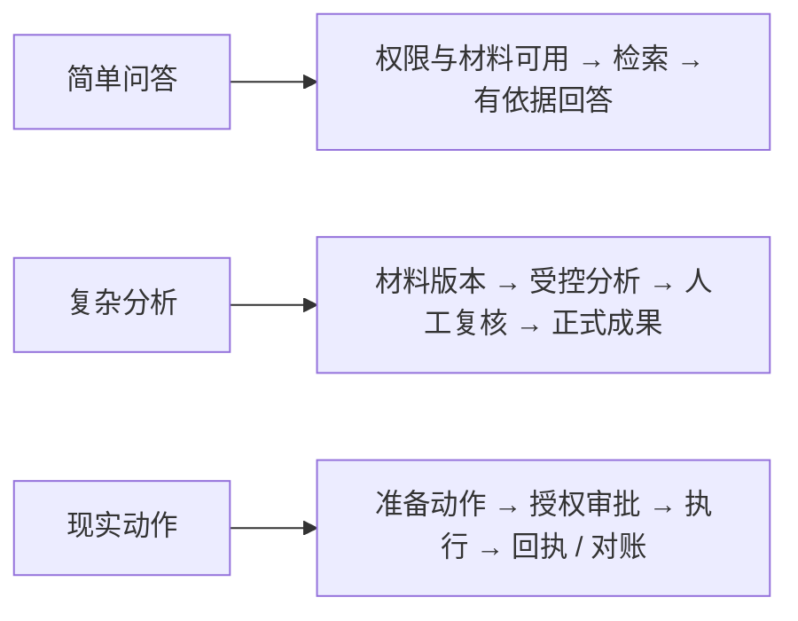
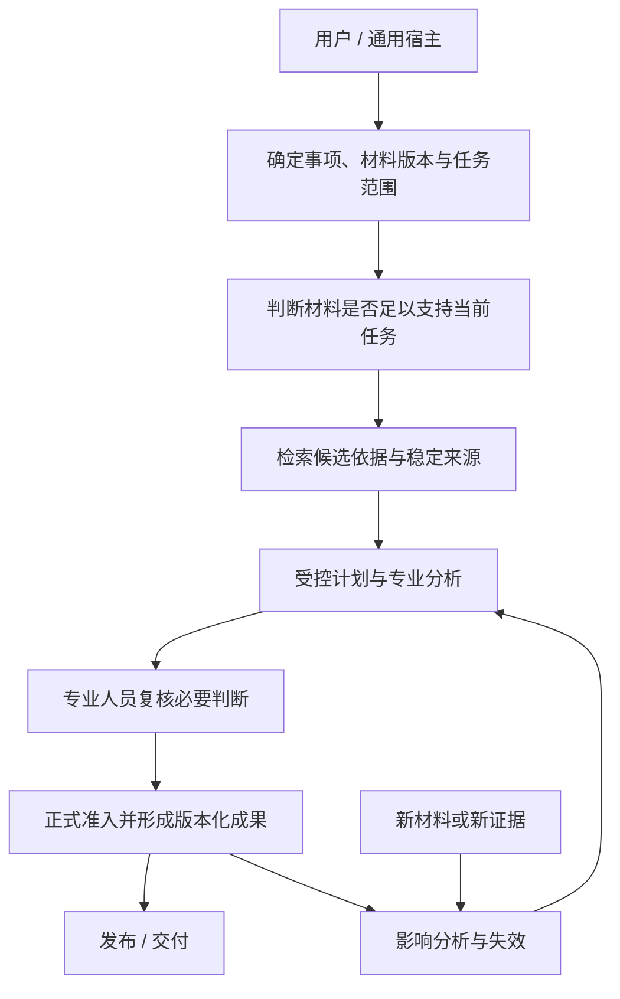
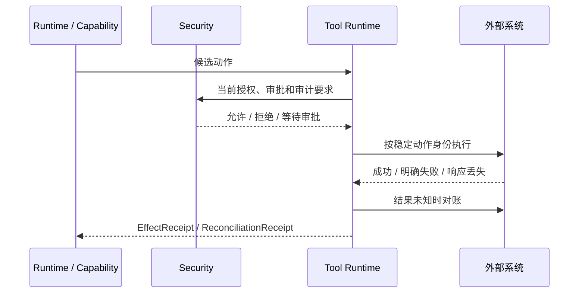
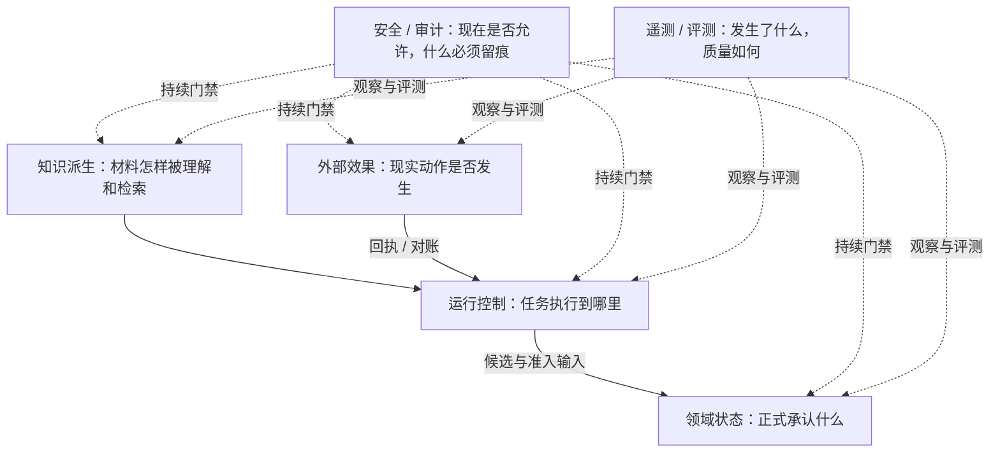
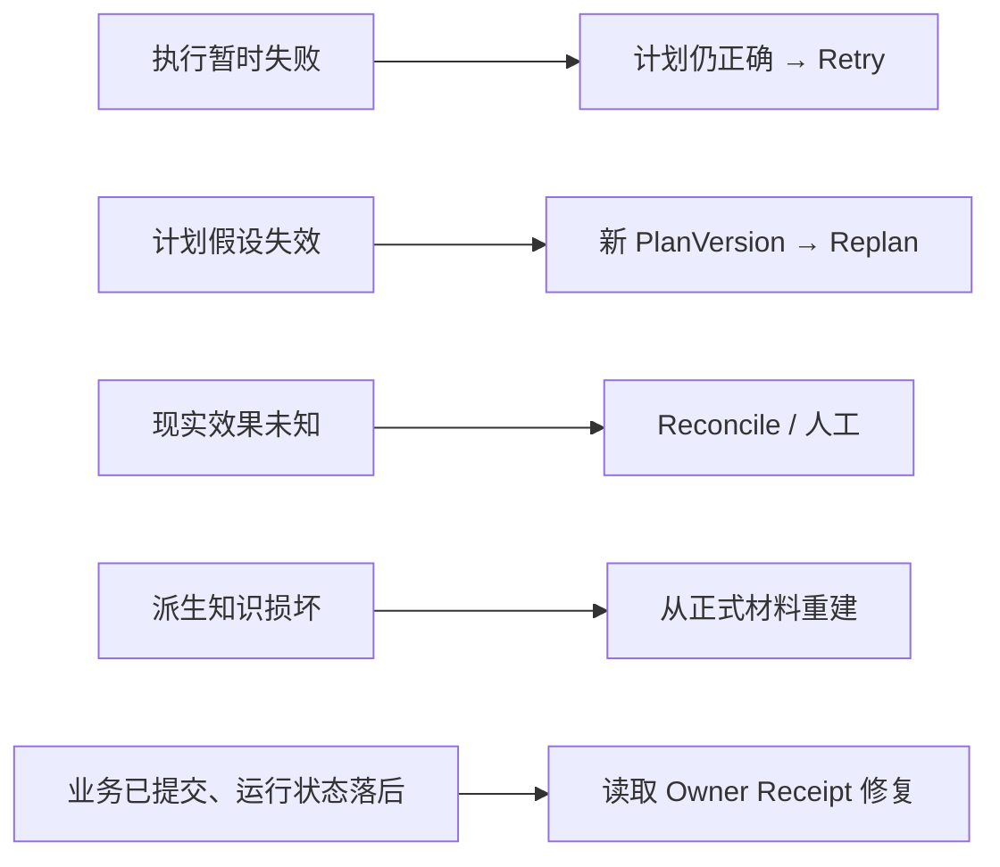

# Zuno 总体 Target 架构

Zuno 是南京大学软件学院 LIPLAB 智慧司法研究与工程化背景下的法律智能 Agent 平台，面向天津法院智慧平台相关场景。它的总体架构不是从“怎样把更多 Agent、模型和数据库接在一起”出发，而是从一条更实际的法律工作链出发：**一份材料怎样被确认、被理解、被引用，模型和算法怎样形成可审查的候选判断，专业人员怎样把其中一部分变成正式工作成果，以及新证据、系统故障或外部调用不确定时，这条链怎样仍然可解释、可恢复。**

如果用户只是问“合同第 8 条写了什么”，受控检索和一次有引用的生成就可能足够。Zuno 不要求所有请求都进入复杂运行时。只有当任务出现多材料版本、长期业务状态、人工复核、并行分析、现实副作用或恢复要求时，系统才逐步引入更重的机制。**复杂度必须由真实任务证明，而不是由架构图证明。**

从总体上看，Zuno 保护的不是某一个框架，而是几类长期责任：正式法律事实不能被模型直接写入；知识索引可以重建，但历史工作成果的依据不能漂移；运行检查点可以帮助恢复，但不能冒充业务提交；现实世界的动作如果结果未知，必须能够对账；权限、审批和审计必须贯穿长任务；新增的 GraphRAG、长期记忆、专家 Agent 或独立服务都必须经过测量后才能扩大使用。

本文记录 **Target（目标架构）**。项目为什么存在、怎样发展以及历史事实见 [`docs/project/project.md`](../project/project.md)；代码、Migration、Test、Trace、Eval 和真实运行状态见 [`docs/evidence/`](../evidence/)；九个责任域内部的字段、状态、失败和恢复见 [`docs/modules/`](../modules/README.md)。Part A 先把总体设计讲成人可以连续理解的技术故事；Part B 再把同一套设计精确化为 Ownership（事实所有权）、Contract（契约）、状态、恢复和持久化规则。

<!--
updated: 2026-08-16
status: normative-target
architecture_state: ACCEPTED_TARGET
architecture_revision: COMPLETED
architecture_revision_sha: 7ce987f5d747395d4926622f42ac4f0013bc53ed
canonical_revision_gate: PASS
overall_architecture_state: ROUND_02_FROZEN
target_logical_module_count: 9
final_module_count: 9
platform_infrastructure: RESPONSIBILITY_LAYER
context_provider: OPTIONAL
module_decomposition_gate: OPEN
module_design_baseline: AVAILABLE_V1
module_deep_design: AVAILABLE_V2
module_deep_design_coverage: 9/9
cross_module_consistency: AVAILABLE_V1
module_human_narrative: DEEPENED
module_detail_design_candidate: AVAILABLE_V1
module_detail_design_candidate_coverage: 9/9
module_detail_freeze: NOT_YET
implementation_authorization: NO
observability_architecture: OTEL_COMPATIBLE
langsmith_role: PREFERRED_AGENT_TRACE_AND_EVAL_PROVIDER
canonical_question: Zuno 如何把法律领域状态、证据、执行控制、安全和可验证交付组合成可恢复且可替换的 Target？
owner: Cross-cutting Architecture Owner
acceptance_scope: Round 02 Main Judgment 的 Canonical Revision；九模块已达到 Deep Design V2 / Cross-Module Consistency，并全部进入 Detail Design Candidate V1；Module Detail Freeze、实现、测量和外部资格尚未完成
readability_state: HUMAN_FIRST_PART_A_AND_PART_B
canonical_taxonomy: docs/architecture/ 仅保存总体架构四文件；模块设计由 docs/modules/ 负责；项目事实由 docs/project/ 负责
current_state_source: docs/project/project.md 和 docs/evidence/
review_history_source: docs/history/red-blue/
decision_sources: docs/decisions/0003-wave1-cross-module-contract-freeze.md、0005-official-langgraph-postgres-checkpointer.md、0007-reuse-first-provider-boundary.md、0008-legal-domain-kernel-and-host-boundary.md、0012-evidence-gated-physical-service-split.md、0013-round-02-responsibility-taxonomy.md、0014-round-02-cross-boundary-authority-and-recovery.md
-->

## Part A — Architecture Narrative

### 1. Zuno 要解决的到底是什么问题

先想象一条真实的法律工作链，而不是一张系统组件图。

一个工作人员正在处理付款争议。系统里已经有原告提交的合同、被告提交的补充协议、若干扫描件和沟通记录。上午，系统基于这些材料形成了一份争议分析草稿；下午，被告又补交了一份新的付款凭证。此时真正困难的问题不是“模型还能不能再回答一次”，而是：上午的分析依据的是哪几版材料？新的凭证是否已经完成解析、可以被当前任务可靠使用？它影响的是哪几个结论？旧成果要不要整体作废，还是只需要局部复核？专业人员之前确认过的判断是否仍然成立？

再进一步，假设系统需要把最终成果提交到外围法院系统。请求发出后连接超时。我们不知道请求根本没有到达，还是已经成功写入但响应丢失。此时“再 POST 一次”可能造成重复提交。又或者任务运行十分钟后，某个用户的材料访问权限被撤销；系统不能因为任务在十分钟前通过过一次权限检查，就继续使用旧授权。

这类问题共同指向 Zuno 的核心：**它需要把“模型算出了什么”升级为“系统为什么相信、什么被正式承认、什么仍然只是候选、失败以后根据什么继续”的工程体系。**

普通 RAG 主要解决“从材料中找到与问题相关的内容并生成回答”。Zuno 的目标范围更长：它要保护材料版本、知识可用性、证据来源、专业候选、人工判断、正式工作成果、外部效果以及它们之间的因果关系。只有这样，系统才有能力在新证据、长任务、故障恢复和现实副作用面前保持一致。

因此，Zuno 的总体架构首先是一套**责任和事实边界**，其次才是 LangGraph、PostgreSQL、向量库、图数据库、模型网关或 Worker 的组合方式。

### 2. 不是所有法律任务都需要同样复杂的系统

架构的第一条约束不是“所有任务都走同一条图”，而是**复杂度跟着任务走**。同一个产品可以同时存在非常轻的问答路径和非常重的长期任务路径，两者共享安全、材料和模型能力，但不需要共享完全相同的控制机制。

#### 简单问答：找到正确材料，给出有依据的回答

用户问“合同第 8 条约定的违约责任是什么”。系统需要确认用户有权访问这份材料，确认当前要用的材料版本已经能够被检索，找到原文和稳定位置，再生成一个带依据的回答。如果引用、权限和发布要求都满足，回答可以直接返回。

这类任务完全可能由 Generic Host（通用 Agent 宿主）加 Zuno 的受控检索和模型调用完成，不需要为了形式统一进入 Zuno Native Runtime（原生运行时），更不需要默认启用动态图规划、多 Agent、长期记忆或 GraphRAG。

#### 复杂法律分析：多材料、多步骤、长期状态

用户要求“结合双方材料分析付款争议，并形成可供专业人员复核的争议分析”。任务会先确定材料范围和版本，再确认知识是否完整可用；随后可能并行处理双方材料、抽取事件、比较事实、检索法条和类案、评估证据是否足够，最后把候选分析交给专业人员复核。

如果这类任务进入原生运行时，它一定拥有计划。很简单的运行也可以是 Deterministic Single-Step Plan（确定性单步计划）；真正复杂的任务使用 Dynamic DAG Plan（动态有向无环图计划）。统一有计划的目的不是追求“Agent 味”，而是让 Trace、Budget、结果资格、失败恢复和因果关系拥有同一套入口。

#### 带现实副作用的任务：分析正确还不够

当系统不仅回答问题，还要把结果提交到外围系统、触发通知、调用会改变现实状态的接口时，问题就从“算对没有”变成“动作到底发生没有”。这类任务必须把动作参数、工具版本、授权、必要审批、幂等身份和审计要求绑定在一起，并为结果未知准备对账路径。



这三条路径不是三套产品。它们共享同一套事实边界，只是在任务需要时逐步增加控制强度。

### 3. Zuno 的核心设计思想

如果只记住一件事，可以记住下面这条工作链：

```text
材料版本
→ 可用知识
→ 候选依据
→ 受控分析
→ 人工判断 / 正式准入
→ 版本化工作成果
→ 发布与交付
→ 新证据触发失效和重新评估
```

这条链里，每一步回答的问题都不一样。

材料版本回答“我们讨论的是哪一份原始材料”；知识处理回答“这一版材料现在能否被可靠检索和分析”；检索和专业能力回答“有哪些候选依据与候选判断”；运行控制回答“多步任务接下来应该怎样执行”；领域准入回答“业务上什么正式成立”；发布和交付回答“什么结果已经对外提供”；新证据则可能使过去成立的结论进入复核或失效状态。

把这些问题分开以后，很多长期不变量就自然出现了：模型只能提出候选，不能直接写正式事实；索引可以重建，正式成果不能跟着索引漂移；运行状态不能替代业务状态；外部动作结果未知不能盲重试；安全决定不能只在任务开始检查一次。

这也是为什么 Zuno 的架构不是“一个越来越大的 LangGraph”。图负责执行控制，数据库保存不同 Owner 的长期事实，知识系统维护可重建的派生视图，安全系统决定当前是否允许，观测系统解释发生了什么。它们需要协作，但不能互相冒充。

### 3.1 为什么按“事实谁负责”切架构，而不是按技术栈切

如果按照 FastAPI、PostgreSQL、LangGraph、Milvus、Neo4j、LLM、Worker 来画系统，很容易说明“用了什么技术”，却很难回答故障以后“谁说了算”。例如，运行时的 Checkpoint 和领域数据库都可能在 PostgreSQL 里，但前者只能说明任务执行到哪里，后者才说明业务上什么正式成立；同样是模型产生的文本，一个候选结论和一个已经经过人工复核、正式准入的 Finding，也不能拥有相同权威。

因此 Zuno 用 9 个 Target Logical Modules（目标逻辑责任域）划分长期责任。这里的模块首先是“事实所有权”，不是网络服务。一个 Python 进程可以同时承载多个责任域，只要它们的 Owner、事务和失败语义没有混淆；反过来，即使未来拆成多个服务，也不能因为物理拆分就改变谁拥有业务事实。

这个原则让架构能够跨越具体技术周期。向量库可以换，模型 Provider 可以换，Agent Host 可以换，Worker 也可以拆分；只要“什么是正式材料、谁判断知识就绪、谁控制运行、谁拥有现实效果、谁决定权限、谁发布结果”的答案没有漂移，系统仍然可解释。

### 3.2 先保护因果链，再谈智能化程度

法律工作最怕的是结果存在，但原因消失。一个工作成果如果只能保存最终文字，却说不清它依据哪一版材料、哪些证据、哪个人工判断和哪次正式准入，那么模型再强也只能提高生成质量，不能提高系统的可审计性。

Zuno 因此把“因果可追溯”放在“自主程度”之前。每个正式结果都要能够回到稳定材料和正式业务依赖；每次重要外部动作都要能够回到准备动作、授权、尝试和效果回执；每个长任务的关键执行结果都要能够回到运行、计划和步骤版本。

这并不意味着要建设事件溯源或巨型全局日志。相反，Zuno 倾向于让每个 Owner 在自己的耐久边界保存足够的事实，再通过稳定引用连接起来。恢复时读取这些权威事实，而不是依赖一个万能全局状态包。

### 4. 一次复杂法律任务怎样完整运行

继续用“付款争议分析”作为主线。用户提交任务时，系统不立即让模型开始阅读所有文字，而是先确定这次分析究竟针对哪个事项、哪些材料版本、什么结果类型，以及当前用户具有什么权限。



这张图表达的是业务因果链，不是固定调用顺序。安全会在多个边界反复出现，可观测性会横跨整个过程，简单问答也可能绕过其中大部分步骤。

#### 4.1 任务先绑定“正在处理什么”，而不是直接绑定索引

系统首先确定 Matter（事项）、任务目标和需要使用的 DocumentVersion（材料版本）。材料版本是长期业务身份：同一份文件重新上传、OCR 重跑、切分策略改变或向量索引重建，都不能悄悄把“这份正式材料”变成另一个语义对象。

这一步的价值在后面才真正显现。只有任务明确绑定材料版本，新证据进入时系统才知道它改变了什么；只有正式成果绑定稳定材料，未来索引重建以后才仍然能够解释当时依据的原文。

范围不清时，系统应该要求补充或显式缩小任务，而不是让模型猜“用户大概是指这些材料”。

#### 4.2 上传成功不等于这次任务已经具备足够知识

一份材料进入系统后，还可能经历解析、OCR、切分、向量化、关键词索引或图结构构建。这些都是围绕正式材料形成的可重建知识派生。Zuno 用 KnowledgeGeneration（知识生成版本）表达“一代知识派生”，而不把某个向量索引 ID 当作材料本身。

但“这一代知识已经构建完成”仍然不等于“当前任务已经可以安全开始”。假设事项有 100 份材料，98 份已经处理完，剩下两份恰好是付款凭证附件。一个只问合同主体名称的任务可能不受影响；一个要求完整判断是否已经付款的任务就不能把 98% 覆盖伪装成完整覆盖。

因此知识模块还要给出 task-level ReadinessDecision（任务级知识就绪判断）。它基于材料版本、当前可服务的知识版本、任务范围、最低处理要求和当前安全条件判断这一次任务是可继续、部分可用还是被阻塞。部分可用时可以显式缩小 Scope（范围），但不能静默输出完整范围结论。

#### 4.3 检索首先产生“候选依据”，不是正式证据

知识系统从当前允许的材料中找到相关段落、表格、事件或其他信息，并给出它们来自哪一版材料、什么稳定位置、经过什么检索过程被找到。工程上，这类结果可以表示为 EvidenceCandidate（证据候选）和 CitationLineage（检索引用链）。

这一步只说明“这里可能有值得使用的依据”，并不等于业务上已经正式承认它是 Evidence（证据）。正式证据属于法律领域状态，需要经过领域规则、专业判断或人工复核后才进入长期业务事实。

因此两个边界必须长期成立：

```text
EvidenceCandidate != Evidence
CitationLineage != WorkProductCitationBinding
```

前一个边界防止“检索到”被升级成“正式承认”；后一个边界防止历史工作成果的依据随着 Chunk、Embedding、Reranker 或 GraphRAG 重建而变化。

#### 4.4 复杂任务才进入受控运行，运行时负责“怎样继续”

如果任务只需要一次检索和一次回答，可以不进入原生运行时。如果任务需要多步骤依赖、并行分支、人工暂停、外部工具、故障恢复或 Replan（重规划），才由 Agent Runtime & Control（智能体运行与控制）承担长期执行。

Zuno 的目标形态是固定 AgentRunGraph（任务运行图）+ 动态 Plan DAG（计划图）+ 固定 StepExecutionGraph（步骤执行图）。计划层决定任务被拆成哪些步骤、它们的依赖和哪些步骤可以并行；步骤内部可以使用 ReAct（行动—观察循环）完成一次具体分析；Reflection（反思）只在证据冲突、验收失败、关键决策或重复失败等条件触发，而不是每一步都让模型“自我反思”。

并行也不是“依赖完成就全部一起跑”。两个步骤即使 DAG 上独立，只要会写同一资源、共享排他资源、产生不可逆副作用、竞争同一预算或在当前安全条件下不能同时执行，就应该串行。Zuno 追求的是**最大化安全并行**，不是最大化并发数。

运行时最终只回答“这次任务执行到了哪里、下一步怎样继续、结果是否通过运行层验收”。它不能因为某个 StepRun 标记 completed，就宣布新的法律业务事实已经正式成立。

#### 4.5 专业能力只负责提出可审查的专业结果

事件抽取、事件对齐、冲突检测、事实—法条对应、类案检索、法律适用性判断等能力属于 Capability & Skill（专业能力与技能）。这些能力可以由确定性算法、模型、外部 API、MCP 或其他 Provider 实现，但必须通过统一的版本、输入输出、符合性和资格约束被调用。

Planner 也必须知道这些能力的边界。一个执行器只能可靠处理某个材料规模，就不能让 Planner 生成“分析全部材料并给出最终结论”这种巨大步骤，再在失败后无限重试。好的 Step 应该有明确输入、明确依赖、可验收输出和可分类失败。

能力输出首先是 Proposal（候选方案）、Observation（观察）或其他候选结果。它们为专业人员和领域层提供判断材料，但不能直接修改正式业务数据库。

#### 4.6 人工判断和正式准入把“候选”变成“业务上成立”

复杂法律工作最终要区分“系统建议”和“组织正式承认”。模型可以提出 Finding Proposal（候选结论），专业人员可以接受、修改或拒绝。必要的 HumanDecision（人工业务决定）完成后，Legal Domain & Work Product（法律领域与工作成果）负责把满足条件的结果正式准入。

正式准入不是“把一行状态改成 approved”。系统需要留下能够证明因果的 AdmissionReceipt（正式准入回执）：是哪次运行、哪版计划、哪个步骤、哪个候选、哪个幂等身份，在什么前置领域版本上产生了什么新领域版本。领域变更和匹配回执必须位于同一个 PostgreSQL 事务耐久边界。

这条规则解决一个非常实际的崩溃问题：如果领域提交已经成功，但运行时还没来得及写 Checkpoint，恢复时可以根据正式准入回执修复运行状态，而不是再次提交同一个业务结果。

正式 WorkProduct（工作成果）还需要保存当时真正采用的材料版本和稳定位置。历史依据是业务事实的一部分，而不是以后可以从最新向量库里“重新搜一个差不多的段落”来补。

#### 4.7 发布和交付发生在正式结果之后，但不是同一个事实

“业务上已经正式成立”和“用户已经看到”是两件不同的事。Application & Integration（应用与集成）负责 Zuno 侧结果发布、WorkProduct 交付、失效通知和消费者确认观测；如果最终 UI 属于外部通用宿主，那么最终展示仍由宿主负责。

因此模型生成、运行完成、领域正式准入、Zuno 发布、外部消费者确认是五个不同层级的成功。任何一个更弱的成功都不能倒推出更强的成功。

这个区分也让离线消费者不再绑架业务状态：某个正式工作成果已经因为新证据失效，即使外围系统暂时离线，领域失效仍然立即成立；交付模块只负责之后怎样把这件事可靠通知出去。

### 5. 新证据出现以后，旧结果为什么会失效

法律工作不是一次性问答。正式成果发布以后，新的材料、证据或人工判断仍然可能进入同一个事项。因此，Zuno 不能只保存“最新答案”，还要保存“这个结论依赖了什么”。

假设 WorkProduct V5 中的一个 Finding 依赖 Evidence V1。后来新的 DocumentVersion 被正式接纳，形成 Evidence V2，并直接否定了 V1 的关键事实。系统首先改变的是领域中的依赖判断：受影响的 Finding 和 WorkProduct 进入 stale / review-required 类业务语义。旧 V5 不会被删除，因为它在历史上确实存在并可能已经交付；它只是不能再冒充当前有效版本。

如果依赖关系足够完整，系统可以进行 bounded re-evaluation（有界重新评估）：只重做受影响的争议点，而不是每次新材料到来都全案重跑。反过来，如果依赖关系不完整，系统就不应该假装知道局部影响范围，而应扩大复核范围或交给人工。

重新评估产生的仍然是候选结果。只有经过必要的人工判断和正式准入，才形成新的领域版本和工作成果版本。

这里还要把三个事实分开：02 拥有“这个成果已经失效”的 Domain invalidation truth（领域失效事实）；01 拥有“失效通知是否已经发送”的交付事实；01 还可以记录“是否观察到消费者确认”的 observation（观测）。消费者没有确认，不会让已经失效的成果重新变得有效。

### 6. 外部动作为什么需要另一套处理方式

只读查询失败时，重试通常比较安全；现实动作则不是。假设系统向外围法院系统提交正式成果，POST 超时后可能有三种情况：请求根本没有执行、已经成功执行但响应丢失、当前无法确认是否执行。把三种情况都记成 FAILED 并 Retry，会制造重复副作用。

因此 Tool Runtime & Effects（工具运行与外部效果）先把动作准备成一个稳定对象：明确工具版本、规范化参数、调用目标、授权、必要审批、幂等身份和审计要求。只有这些条件都满足，才跨越真正的 send boundary（发送边界）执行现实动作。

执行结果明确时保存 EffectReceipt（效果回执）。如果连接中断导致结果未知，进入 Reconciliation（对账恢复），通过远端操作号、幂等键、查询接口或其他稳定事实确认到底发生了什么。只有确认“没有执行”后，才可能在重新授权后安全重试；无法确认时应该进入人工处理，而不是靠概率赌一次。



这也是为什么专业 Capability 和 Tool Runtime 要分开：前者回答“应该做什么”，后者回答“现实动作怎样安全发生、是否已经发生”。即使它们今天运行在同一个进程里，也不能共享成功语义。

### 7. 为什么系统里的状态不能全部放在一起

很多恢复问题都来自一个过于简单的设计：把整个系统压成一个 `task.status`。当状态只有 running / completed / failed 时，系统无法表达“运行完成但领域提交失败”“索引构建完成但当前任务材料仍不完整”“外部动作可能已经发生但结果未知”“正式成果已经失效但通知还没送达”等现实情况。

Zuno 因此区分至少几类长期状态。

**领域状态**回答“业务世界正式承认什么”，包括事项、正式材料版本、证据、结论、人工业务判断和工作成果，由 02 负责。

**知识派生状态**回答“围绕正式材料建立了哪些可重建的知识视图”，包括解析、OCR、切分、索引、图和检索来源，由 03 负责。知识内部还要区分一代知识是否已经可 Serving（提供服务）和某个具体任务是否 Ready（就绪），两者不是同一个状态机。

**运行控制状态**回答“一次任务执行到哪里”，包括计划、步骤、并行分支、预算、暂停、Checkpoint 和 RunOutcome，由 04 负责。它用于恢复执行，但不能证明正式业务提交。

**外部效果状态**回答“一个现实动作准备到哪里、是否执行、结果是否确认”，由 06 负责。结果未知本身就是一种需要被保存和处理的状态。

**安全与审计事实**回答“为什么当前允许或拒绝某个动作、是否需要审批、哪些审计事实必须先耐久化”，政策由 08 负责，各执行边界保存自己的执行证明。

**遥测和评测投影**回答“系统发生了什么、质量怎样、复杂度值不值得”，由 09 负责。Trace 和 Dashboard 可以丢，正式业务事实不能因此消失。

可选 Context / Memory（上下文 / 记忆）只帮助任务工作，不成为业务权威。一个正式结论如果必须依赖“模型记得上次说过什么”才能恢复，说明领域事实边界设计错了。



于是几条看似严格、实际非常有用的结论成立：Checkpoint completed != Domain committed；Index write success != task READY；Telemetry != Durable Audit != Business Truth；Memory 不能成为正式领域事实。

### 8. 谁来负责这些不同事实

九个责任域可以用九个业务问题来理解，而不是先背对象名。

| 责任域 | 它必须长期回答的问题 |
| --- | --- |
| 01 Application & Integration（应用与集成） | 请求怎样进入 Zuno，执行路径怎样组合，什么结果已经由 Zuno 发布、交付或发送失效通知？ |
| 02 Legal Domain & Work Product（法律领域与工作成果） | 业务上什么材料、证据、结论、人工判断和工作成果被正式承认？哪些正式结果后来失效？ |
| 03 Knowledge & Evidence（知识与证据） | 哪一版材料已经被处理到什么程度？当前任务是否真的具备足够知识？候选依据从哪里来？ |
| 04 Agent Runtime & Control（智能体运行与控制） | 多步任务怎样计划、并行、暂停、重试、重规划、汇合和恢复？ |
| 05 Capability & Skill（专业能力与技能） | 研究算法和专业方法怎样成为版本化、可替换、可评测、可被 Planner 理解的能力？ |
| 06 Tool Runtime & Effects（工具运行与外部效果） | 现实动作怎样准备、授权、执行、去重、确认和对账？ |
| 07 Model Gateway（模型网关） | 不同模型角色怎样被路由到合适 Provider，并统一控制调用、配额、Usage、Cost 和失败升级？ |
| 08 Security & Governance（安全与治理） | 当前这个人、这个任务、这份数据、这个动作现在是否仍被允许？是否需要审批、审计或生命周期控制？ |
| 09 Observability & Evaluation（可观测性与评测） | 系统到底发生了什么？质量是否足够？新增复杂机制是否真的值得保留？ |

Platform / Infrastructure（平台与基础设施）不重新成为第十个业务模块。它提供 PostgreSQL、对象存储、Queue / Worker、Lease、CAS、Fencing、Checkpoint Adapter、Index Adapter、网络、Secret Delivery、Backup / Restore 等物理原语，但不重新定义业务事实所有权。

Context / Memory 也不自动成为一级模块。会话摘要、工作上下文或长期经验只有在真实任务和消融评测证明收益后才扩大使用；这些信息始终不能替代 02 的正式业务状态。

### 8.1 九个责任域不是九段必须依次经过的流水线

模块编号只是文档路由，不是请求的固定执行顺序。简单问答可能主要经过 01、08、03、07；知识构建主要围绕 02 的材料身份、03 的加工和 08 的安全；只有多步长期任务才需要 04；只有现实副作用才需要 06。

同一个责任域也可能在一次任务中出现多次。08 会在材料读取、模型外发、工具执行和正式准入前持续提供当前安全决定；03 可能在任务开始判断材料是否就绪，在运行中又因为新材料进入而返回 stale / blocked；02 既提供任务开始时的正式领域版本，也可能在任务结束时提交新的正式结果。

所以总体架构不是“01 → 02 → … → 09”的流水线，而是一组围绕权威事实协作的责任域。理解这一点以后，简单路径才能真的保持简单，复杂路径也不会因为多个模块参与就自然演化成九个微服务。

### 9. 一次系统故障以后怎样恢复

Zuno 的恢复原则不是“哪里报错就重跑哪里”，而是先判断**哪一种事实出了问题、计划假设是否仍成立、现实世界是否可能已经发生变化**。

**模型临时 503。** 输入、能力、权限和计划都没有变化，只是一次执行失败。这属于 Retry（重试）：可以在同一个步骤语义下再次执行，并继续受预算和调用次数限制。

**Capability 或 Tool Schema 已经升级。** 原计划引用的能力边界和参数假设已经失效。继续 Retry 只会重复错误，因此需要重新解析能力，必要时创建新的 PlanVersion 并 Replan。

**外部 POST 超时。** 系统不知道现实动作是否已经发生。此时不是 Retry，也不是 Replan，而是 Reconcile：先用稳定动作身份和远端事实确认结果。

**领域提交成功，但 Checkpoint 写入失败。** 业务事实已经存在。恢复时应该读取 AdmissionReceipt 修复 Runtime Control State，而不是再次提交领域结果。

**Checkpoint 显示步骤完成，但没有匹配的正式准入回执。** 运行层不能自己宣布业务提交成功。它需要查询领域事实并重新判断，而不是把 Checkpoint 当成最终真相。

**知识 generation 只写了一部分索引。** 03 不应该把这一代切到 Serving。它可以根据正式 DocumentVersion 和处理规格重试或重建派生视图，直到 manifest 完整；索引写入成功本身不等于任务可以开始。

**新材料进入时旧任务还在运行。** 03 先判断旧知识是否仍有资格支持当前步骤；04 再决定继续、重规划还是等待。只有正式依赖发生变化，02 才改变既有 Finding / WorkProduct 的业务有效性。

**权限中途被撤销。** 后续新的受保护读取、模型外发、Secret 使用、工具执行或正式准入都必须重新消费当前安全决定。旧任务上下文不能让已经撤销的权限继续生效。

**旧并行分支晚到。** 它仍然携带原 PlanVersion、输入和材料版本回来。运行时重新验收它是否还能被新计划使用；现实 Effect 即使属于旧计划也不能被“丢弃”，因为真实世界已经可能发生变化。



这套恢复方式刻意不使用跨 Store 2PC，也不建设一个拥有所有事实的超级 Checkpoint。每个责任域保存自己的权威事实，恢复时按照事实强度和因果关系修复较弱的 projection（投影）或 control state（控制状态）。

### 10. 安全、审批、人工复核和审计如何贯穿任务

法律场景里的安全问题很少只发生在“登录”这一刻。一个任务可能先读取本地材料，随后把部分内容发送到外部模型，再调用工具，最后提交正式工作成果。每一步的数据范围、风险和权限都可能不同，长任务中政策还可能发生变化。

因此 08 Security & Governance（安全与治理）提供的是持续门禁，而不是入口票。读取受保护材料、执行检索、模型外发、Secret 使用、现实工具调用、Resume / Retry / Replan 后的新访问、正式准入和发布，都需要在各自边界消费当前适用的安全决定。

这里有两个“人工决定”必须明确分开。HumanDecision 是专业人员对业务内容的判断，例如确认某个事实或结论是否进入正式成果；ApprovalDecision 是安全或治理意义上的审批，例如某个高风险外部动作是否被允许。前者改变“业务上承认什么”，后者只改变“这个动作能不能做”。

数据生命周期也遵循同样原则。Retention、Deletion、Legal Hold 等政策由 08 决定，各 Store 执行。因为 Legal Hold 继续保留字节，不代表这些数据仍然允许被未来检索或 Memory recall；反过来，一个 Memory 副本被禁止未来召回，也不代表依法保留的审计记录必须瞬间物理消失。

强制审计和普通遥测同样不能混用。高风险 Effect 如果要求审计事实在动作前已经耐久化，那么审计落盘失败就应该阻止动作或按明确政策处理。OpenTelemetry、LangSmith 和普通日志只能帮助观察，不能在事后“补”一个原本不存在的审批、正式准入或 EffectReceipt。

### 11. 哪些能力应该自己建设，哪些能力应该复用

Zuno 不需要因为要成为“完整平台”就自己建设 UI、会话、通用 Workflow、所有模型 SDK、所有工具协议和所有基础设施。Generic Host 可以承担入口、会话、普通问答和通用编排；MCP 可以承担工具互操作；LangGraph 提供持久执行、Checkpoint、interrupt / resume、Send / reducer 等运行原语；PostgreSQL 提供事务耐久；OpenTelemetry 提供 Provider-neutral 遥测契约；LangSmith 可以作为首选 Agent Trace / Eval Provider；关键词、向量和图检索都可以是可替换知识 Provider。

Zuno 真正应该长期自己保护的是通用平台不会替法律项目负责的部分：正式材料和领域状态、任务级知识就绪、候选与正式证据的边界、工作成果的历史依据、新证据失效、人工业务判断、现实效果恢复，以及把这些事实连接起来的因果和安全规则。

物理部署默认从**模块化 Python 后端**开始，并在确有必要的地方使用独立 Worker。只有反复出现独立扩缩容、故障隔离、安全 / Secret 隔离、不同可用性目标、独立发布生命周期、稳定跨主机 Contract 或独立运营责任时，才考虑拆成**独立网络服务**。

每次服务拆分都必须回答两个问题：为什么必须独立服务？为什么**不是库或 Worker**就能解决？“以后用户会变多”不是足够证据，九个逻辑模块已经分开也不是足够证据。

### 11.1 一项复杂机制什么时候应该主动删除

架构质量不取决于拥有多少高级名词，而取决于能否主动删除没有收益的复杂度。Native Runtime、GraphRAG、Long-term Memory、Specialist / Multi-Agent 和独立微服务都不是 Zuno 的身份象征，它们只是候选手段。

Native Runtime 要与“Generic Host + Legal Backend”做对照，证明自己在长期状态、恢复、人机协作或质量上确有收益；GraphRAG 要按具体 Query Class 与更简单的 Hybrid Retrieval 比较，而不是因为已经有图数据库就默认走图；Long-term Memory 要做消融；Specialist / Multi-Agent 要与 Single Controller + 并行 Step / Subgraph 比；物理拆分也要证明隔离或运营价值。

如果实验显示更简单的方案质量相当、恢复足够、安全边界更清楚，而且成本更低，就应该缩小、外置或删除复杂机制。09 的 Eval 因此不仅是 Release Gate，还承担“复杂度淘汰”的职责。

### 12. 当前哪些能力仍然没有证明

Round 02 已经冻结 Overall Target Architecture（总体目标架构）和 9 个 Target Logical Modules。九篇模块已经达到 Deep Design V2 / Cross-Module Consistency，并全部进入 **Detail Design Candidate V1（9/9）**。Candidate 表示字段语义、版本、新鲜度、幂等、事务、Crash Window、Migration 和 Failure Injection 已经细化到可以逐项盘问的目标设计粒度；**它仍然不是 Module Detail Freeze，也不是实现事实。**

目前还没有足够工程证据把以下能力写成已经完成：Formal Admission + AdmissionReceipt 的完整 PostgreSQL 并发与崩溃恢复；KnowledgeGeneration manifest / Serving 切换与真实任务级 Readiness；新证据失效到局部重评再到新 WorkProduct 的完整 E2E；真实外部 Tool 的幂等和 Reconciliation；长任务 Security Epoch 漂移；Runtime HA / fencing / takeover；完整生产容量、Backup / Restore 和 DR。

同样没有测量证明 Native Runtime 必然优于 Generic Host + Legal Backend，GraphRAG 必然优于更简单的混合检索，Long-term Memory 一定提升法律任务，或者 Specialist / Multi-Agent 一定优于单控制器与并行 Subgraph。这些仍然是 measurement-gated 能力。

因此当前最准确的结论不是“架构已经 production ready”，而是：**总体责任边界已经稳定，九模块已经形成可审查的详细设计候选；接下来应该用代码、Migration、故障注入、E2E 和真实 Eval 决定哪些 Target 可以升级为 Current，哪些复杂机制应该被削减。**

## Target Status Boundary

以下状态描述 Target 设计成熟度，不证明实现或生产资格。

| 项目 | 当前状态 |
| --- | --- |
| Canonical Revision | `COMPLETED` |
| Overall Architecture | `ROUND_02_FROZEN` |
| Logical Responsibility | 9 个 Target Logical Modules，已冻结 |
| Module Design Baseline | `AVAILABLE_V1` |
| Module Deep Design | `AVAILABLE_V2`，9/9 |
| Cross-Module Consistency | `AVAILABLE_V1` |
| Human-first Module Narrative | `DEEPENED` |
| Module Detail Design Candidate | `AVAILABLE_V1`，9/9 |
| Module Detail Freeze | `NOT_YET` |
| Implementation Authorization | `NO` |
| Platform / Infrastructure | Responsibility Layer，不是第 10 个逻辑业务模块 |
| Context Provider | Optional，不是一级逻辑模块 |
| Native Runtime | Conditional / Measurement-gated |
| Long-term Memory | Optional / Measurement-gated |
| GraphRAG | Query-class / Evidence-gated |
| Production Readiness | Not established |
| Module Decomposition Gate | Open for design / review only |

## Part B — Detailed Architecture Specification

Part B 是 Part A 的工程参考。它不能增加 Part A 没有解释过的重大决策；模块内部字段、ORM、表和最终 enum 继续由 `docs/modules/` 的逐模块 Detail Design / Freeze Review 冻结。

### B1 Scope and Global Invariants

1. Logical Responsibility 不等于 Process、Container、Database、Worker、Network Service 或 Team。
2. Domain State、Runtime Control State、Knowledge Projection、Optional Context、External Effect State、Security / Audit Fact 和 Telemetry Projection 拥有不同 Owner。
3. Model、Capability、Retrieval、Memory、Specialist 和 Runtime 只能产生 Proposal / Candidate / Observation / Reference；不能直接提交 Canonical Domain State。
4. Simple QA 可以由 Generic Host / direct path 完成，不强制进入 Zuno Native Agent Runtime。
5. 进入 Native Runtime 的任务必须有 Plan：Deterministic Single-Step Plan 或 Dynamic DAG Plan；不得通过 direct_answer 绕过 Plan / Trace / Budget / AnswerPolicy / RunOutcome。
6. `Retry != Replan != Reconcile`；外部 Outcome Unknown 禁止 Blind Retry。
7. Formal Admission 的完成必须有匹配 AdmissionReceipt；Checkpoint 不能单独证明 Domain Commit。
8. `EvidenceCandidate != Evidence`；`CitationLineage != WorkProductCitationBinding`。
9. `KnowledgeGeneration lifecycle != task-level ReadinessDecision`；Index write success != Serving activation != task READY。
10. Current 只能由代码、Migration、Test、Trace、Eval 或真实运行证据证明；文档完整度不是 Current 证据。
11. Network Service Split 必须由 Evidence Gate 门控；默认物理起点是 Modular Python Backend + Independent Workers where justified。
12. Telemetry 不能替代 Durable Audit、Domain Receipt、Security Decision 或 Tool Effect Receipt。

### B2 Responsibility / Ownership Map

| Fact / State | Authoritative Owner | 其他边界只能怎样消费 |
| --- | --- | --- |
| Matter、DocumentVersion、Claim、Evidence、Finding、HumanDecision、WorkProduct | 02 Legal Domain & Work Product | Snapshot、Reference、Admission Input |
| Formal Admission、AdmissionReceipt、WorkProductCitationBinding、Domain invalidation truth | 02 | 04 用 Receipt 恢复；01 负责通知 |
| KnowledgeGeneration、processing / manifest / serving semantics | 03 Knowledge & Evidence | 读取 generation / coverage references |
| task-level ReadinessDecision、EvidenceCandidate、RetrievalResult、CitationLineage | 03 | 01 / 04 / 05 / 02 消费，不重算 Owner fact |
| AgentRun、PlanVersion、StepRun、Dispatch / Join、Budget、Interrupt、Checkpoint、RunOutcome | 04 Agent Runtime & Control | 其他模块返回事实 / Receipt，不接管 Control State |
| CapabilityRequirement、CapabilityVersion、ProviderConformance、专业 Proposal | 05 Capability & Skill | 04 选择 / 调度；02 决定正式接纳 |
| PreparedAction、ToolAttempt、EffectReceipt、ReconciliationReceipt | 06 Tool Runtime & Effects | 08 决定 policy；Runtime / Domain 消费 confirmed outcome |
| Model role routing、attempt、Quota、Usage / Cost | 07 Model Gateway | 09 评测；08 控制 egress / credential policy |
| AuthorizationDecision、SecurityEpoch、ApprovalDecision、EffectiveLifecycleDecision、Audit Requirement | 08 Security & Governance | 各边界执行并保存自己的 enforcement fact |
| Durable Audit Persistence Fact | 对应耐久执行边界，在 08 requirement 下 | 以 AuditPersistenceReceipt 被消费 |
| Trace、Metric、Eval Dataset、Evaluation Result、Release Evaluation | 09 Observability & Evaluation | 诊断 / 评测，不改变业务 Truth |
| External task composition、Zuno-side answer publication、delivery、invalidation delivery、consumer ack observation | 01 Application & Integration | 不重算 Domain / Security / Knowledge facts |
| Physical durability primitive | Platform / Infrastructure | Storage / Queue / Worker / lease 等 primitive receipt |

### B3 Cross-boundary Contracts

本节只记录总体层真正跨责任域的 Contract。模块内部私有 DTO、helper、ORM 字段和最终表结构不在这里冻结。

#### InvocationDecision

- Purpose：组合当前请求是否允许进入 Zuno 某条执行路径。
- Producer / Owner：01 Application & Integration。
- Consumer：Host、direct QA path、04 Runtime。
- Input / Output：request + Scope + AuthorizationDecision + ReadinessDecision + applicable capability / model eligibility + optional runtime gate → allow / wait / reject / review 类决定。
- Versioning：绑定 request identity、相关 Domain / Knowledge / Security refs。
- Validation：01 只组合 Owner facts，不重新计算它们。
- Failure Semantics：底层事实缺失或冲突时 fail closed / wait / review。
- Idempotency / Replay：同一 invocation identity 可识别重放。
- Security Requirements：消费当前 Security Epoch。
- Persistence Requirement：保存足以解释组合决定的引用或 Receipt；具体形态由 01 Deep Design 冻结。
- Observability Requirement：记录决定来源，不把组合结果伪装成底层 Truth。
- Evidence：Host / invocation integration tests。

#### AnswerPublicationDecision

- Purpose：判断普通回答是否具备发布资格。
- Producer / Owner：Zuno 自己发布时为 01；外部 Host 最终展示时，Host 拥有最终 UI / publication truth。
- Consumer：Zuno response surface / external Host。
- Input / Output：typed result + citation / eligibility evidence + policy refs → publish / draft / review / reject 类决定。
- Versioning：绑定 answer / source / policy refs。
- Validation：引用、资格和当前发布权限可检查。
- Failure Semantics：不满足要求时不静默发布正式答案。
- Idempotency / Replay：Delivery 使用独立 delivery identity。
- Security Requirements：遵守当前 publication / redaction policy。
- Persistence Requirement：Zuno-side publication / delivery fact 可恢复。
- Observability Requirement：区分 Zuno decision 与外部 Host display。
- Evidence：Publication / Host Integration Tests。

#### ReadinessDecision

- Purpose：回答某次任务能否基于指定 DocumentVersion、Serving KnowledgeGeneration 和当前要求安全工作。
- Producer / Owner：03 Knowledge & Evidence。
- Consumer：01 / 04；必要时 02 admission eligibility 消费引用。
- Input / Output：DocumentVersion refs + serving generation + task Scope + minimum processing / retrieval requirements + current Authorization / Security refs → READY / PARTIAL / BLOCKED 类语义 + coverage / missing refs。
- Versioning：绑定 generation、scope、requirements 和 policy refs。
- Validation：source version、generation eligibility、coverage、required capability、security 均可追溯。
- Failure Semantics：PARTIAL 必须显式携带覆盖范围；不能冒充 full-scope READY。
- Idempotency / Replay：相同输入可重算；generation / policy / scope 变化后重新评估。
- Security Requirements：当前授权是输入。
- Persistence Requirement：关键 generation / serving facts耐久；decision 本身持久策略由 03 详细设计冻结。
- Observability Requirement：记录 decision identity / coverage / missing reason，敏感正文最小化。
- Evidence：Partial Knowledge / stale generation / security revocation tests。

#### EvidenceCandidate / CitationLineage

- Purpose：把当前允许范围中的证据候选及其检索来源送到 01 / 02 / 04 / 05。
- Producer / Owner：03 Knowledge & Evidence。
- Consumer：direct QA、02 Domain Admission、04 Runtime、05 Capability。
- Input / Output：task query / scope + serving generation → candidate refs + stable source DocumentVersion / location + retrieval lineage。
- Versioning：绑定 DocumentVersion、KnowledgeGeneration、retrieval identity。
- Validation：stale generation、scope mismatch、unauthorized source 不得静默作为合法候选。
- Failure Semantics：zero evidence、insufficient evidence、partial coverage、provider failure 必须区分。
- Idempotency / Replay：检索可重放，但重放结果不改写过去正式引用。
- Security Requirements：检索和外发遵守当前授权 / egress policy。
- Persistence Requirement：必要 lineage / source refs 可耐久保存；不把完整 ranking trace 自动升级为 Domain fact。
- Observability Requirement：记录策略、candidate count、lineage completeness。
- Evidence：Citation Provenance / retrieval integration tests。

#### WorkProductCitationBinding

- Purpose：保存正式 WorkProductVersion 当时实际采用的不可变材料位置。
- Producer / Owner：02 Legal Domain & Work Product。
- Consumer：Review、Audit、01 Delivery、后续 staleness analysis。
- Input / Output：DocumentVersion + immutable source reference / hash + stable location / span + source representation identity / hash + necessary excerpt / evidence hash + optional CitationLineage ref → durable binding。
- Versioning：绑定 WorkProductVersion，不被新 Index / Chunk / Graph 覆盖。
- Validation：能够回到原始不可变表示。
- Failure Semantics：正式成果需要的 binding 不完整时不得 Formal Admit。
- Idempotency / Replay：同一 WorkProductVersion + binding identity 幂等。
- Security Requirements：按材料访问 / redaction policy 展示。
- Persistence Requirement：Domain durable boundary。
- Observability Requirement：Trace 只记录 binding identity / completeness，不导出敏感全文。
- Evidence：Source replacement / historical citation tests。

#### AdmissionReceipt

- Purpose：证明 `StepRun → Proposal → Formal Admission → resulting DomainVersion` 的因果链。
- Producer / Owner：02 Domain Admission boundary。
- Consumer：04 Runtime、Recovery、Audit / Review。
- Input / Output：run identity + PlanVersion + StepRun identity + proposal / admission identity + idempotency identity + expected prior DomainVersion → resulting DomainVersion receipt。
- Versioning：绑定唯一 resulting DomainVersion 和预期前置版本。
- Validation：Domain mutation 与 Receipt 在同一 Domain transactional durability boundary。
- Failure Semantics：缺匹配 Receipt 时，04 不能宣布要求 Formal Admission 的 Step 完成。
- Idempotency / Replay：同一 identity 重放返回既有合法结果；同 key 不同输入冲突失败。
- Security Requirements：提交时消费当前 AuthorizationDecision 和必要 HumanDecision / Approval refs。
- Persistence Requirement：Domain durable boundary，不得只在 Checkpoint / Trace。
- Observability Requirement：Trace 引用 Receipt，不替代 Receipt。
- Evidence：Admission causation / crash recovery tests。

#### WorkProductInvalidationFact / InvalidationDeliveryFact / ConsumerAcknowledgementObservation

- Purpose：分别表示正式成果失效、失效通知交付和消费者确认观测。
- Producer / Owner：WorkProductInvalidationFact 归 02；DeliveryFact 与 AckObservation 归 01。
- Consumer：Host、法院系统、Review、current-validity query、04 targeted reevaluation。
- Input / Output：canonical dependency change → invalidation；delivery attempt → delivery fact；consumer response → acknowledgement observation。
- Versioning：每个 WorkProductVersion / delivery identity 独立。
- Validation：不能用单个 `WorkProduct.status` 代替三类事实。
- Failure Semantics：Domain stale 不等待 Consumer 在线；delivery 可重试；Ack unknown 不代表远端已知。
- Idempotency / Replay：invalidations / delivery identity 幂等。
- Security Requirements：通知遵守当前 consumer scope / redaction。
- Persistence Requirement：各 Owner 在自己的 durable boundary 持久化。
- Observability Requirement：Telemetry 清楚区分 Truth、Delivery 和 Observation。
- Evidence：Invalidation / delivery / offline consumer fault tests。

#### AuthorizationDecision / ApprovalDecision / EffectiveLifecycleDecision

- Purpose：分别回答当前访问是否允许、高风险动作是否获批、数据生命周期政策是什么。
- Producer / Owner：08 Security & Governance。
- Consumer：01、02、03、04、06、07、Context Provider、Platform Stores。
- Input / Output：principal + tenant / Matter / Scope + Policy Epoch + action / data risk → typed security / approval / lifecycle decision。
- Versioning：绑定 Security Epoch / policy version / action identity when applicable。
- Validation：新的受保护访问重新消费当前决定；Approval 必须绑定具体 action hash / scope。
- Failure Semantics：deny / pause / review；policy unknown 时 fail closed。
- Idempotency / Replay：稳定 decision identity；Retry / Resume / Replan 不能沿用已失效决定。
- Security Requirements：Secret 和敏感 policy material 不进入普通 Prompt / Trace。
- Persistence Requirement：高风险 Approval、Lifecycle policy refs 和必要 Audit facts 可审计。
- Observability Requirement：只输出脱敏 reason / identity refs。
- Evidence：Revoked Permission、Approval binding、Lifecycle tests。

#### PreparedAction / ToolAttempt / EffectReceipt / ReconciliationReceipt

- Purpose：绑定现实动作、记录执行尝试、保存确认结果，并在结果未知时对账。
- Producer / Owner：06 Tool Runtime & Effects；External System 仍拥有其内部最终现实事实。
- Consumer：04、01、02、08 Audit / Review。
- Input / Output：tool definition + args + Authorization / Approval + idempotency → ToolAttempt → EffectReceipt 或 OUTCOME_UNKNOWN → ReconciliationReceipt。
- Versioning：绑定 action identity / hash、run / StepRun causation 和 idempotency identity。
- Validation：调用前校验 schema、semantics、tool / capability version 和当前安全决定。
- Failure Semantics：明确 transient failure 可 Retry；Outcome Unknown 必须 Reconcile；无法安全确认则 Human Review。
- Idempotency / Replay：副作用必须具备 external idempotency 或 reconciliation path。
- Security Requirements：执行时重新授权，敏感参数不进入普通日志。
- Persistence Requirement：Attempt / Effect / Reconciliation 必须耐久到可恢复。
- Observability Requirement：Telemetry 只引用这些事实。
- Evidence：Duplicate Effect、Timeout、Provider Drift、Reconciliation tests。

#### AuditPersistenceReceipt

- Purpose：证明被 Security policy 要求耐久化的 Audit Fact 已经落盘。
- Producer / Owner：执行该审计耐久化的 persistence boundary；Audit Requirement policy Owner 仍为 08。
- Consumer：08、06、02、09。
- Input / Output：Audit Requirement + source event identity + policy ref → committed / failed Receipt。
- Versioning：绑定 source event / requirement version。
- Validation：`MANDATORY_BEFORE_EFFECT` 类要求在高风险 Effect 前必须 committed。
- Failure Semantics：要求耐久但持久化失败时阻止或按明确 policy 降级；不能用 Telemetry 补齐。
- Idempotency / Replay：按 source event identity 去重。
- Security Requirements：redaction / minimization；Secret NEVER EXPORT。
- Persistence Requirement：Receipt 自身位于 durable boundary。
- Observability Requirement：Trace 可引用但不能替代。
- Evidence：Audit durability / audit-loss tests。

### B4 Domain / Control Objects

**Canonical Domain Kernel（正式领域内核）**第一阶段仅包括：Matter、DocumentVersion、Claim、Evidence、Finding、HumanDecision、WorkProduct。Event、Conflict、Dispute、LegalIssue、StatuteVersion、LegalElement、ApplicableLaw、SimilarCase 默认是 Proposal / Projection / Derived View / Capability Output。

**Knowledge objects / facts**：KnowledgeGeneration、ProcessingItem / Projection、IndexManifest、Serving Watermark / ServingGeneration、ReadinessDecision、EvidenceCandidate、RetrievalResult、CitationLineage。KnowledgeView 可以作为派生视图概念；是否需要独立持久对象由 03 Deep Design 决定。

**Runtime control objects**：AgentRun、PlanVersion、StepRun、DispatchGroup / DispatchItem 或等价 LangGraph Send / branch identity、BranchResultRef、Budget、Join、Interrupt、Checkpoint、RunOutcome。具体自定义对象只有在 LangGraph 原生 primitive 不足时才引入。

**Tool effect objects**：PreparedAction、ToolAttempt、EffectReceipt、ReconciliationReceipt。

**Optional Context objects**：Session / Working Context、Summary、Preference、Experience Candidate 等，只属于 Context Provider，不得冒充 Domain Object。

### B5 State Machines

#### Formal Admission

```text
Proposal / EvidenceCandidate
→ EligibilityCheck
→ HumanDecision when required
→ Domain Admission
→ Domain mutation + AdmissionReceipt
→ Canonical DomainVersion / WorkProductVersion
```

历史 WorkProductVersion 不 destructive overwrite；新依赖变化通过 review-required / stale + new version 表达。

#### KnowledgeGeneration Lifecycle

```text
DECLARED
→ PROCESSING
→ STAGED / BUILT
→ SERVING
→ STALE / SUPERSEDED
→ REBUILDING when needed

any non-terminal stage → FAILED / PARTIAL_BUILD
```

这里描述一代可重建知识派生。`STAGED / BUILT != SERVING`。

#### Task-level ReadinessDecision

```text
(DocumentVersion refs
 + eligible serving KnowledgeGeneration
 + task Scope
 + minimum processing / retrieval requirements
 + current Security refs)
→ READY / PARTIAL / BLOCKED
```

PARTIAL 必须携带 covered scope / missing requirements。调用方缩小 Scope 后重新计算新的 ReadinessDecision，不能把原 PARTIAL 直接重命名成 READY。

#### Agent Runtime

```text
AgentRun
→ PlanVersion ACTIVE (immutable)
→ READY StepRun(s)
→ Action / Observation / Evaluation
→ Step Acceptance
→ Join / next steps
→ Final Gate / Final Reflection when required
→ RunOutcome
```

Plan assumption invalid → Replan Barrier → new PlanVersion。Late branch result 仍绑定旧 PlanVersion，不能污染新计划或越过 Domain Admission。

#### External Effect

```text
PreparedAction
→ AUTHORIZATION / APPROVAL / mandatory audit when required
→ ToolAttempt
→ SUCCEEDED / FAILED / OUTCOME_UNKNOWN
→ OUTCOME_UNKNOWN: Reconcile
→ CONFIRMED / NOT_EXECUTED / MANUAL_RECONCILIATION
```

### B6 Retry / Replan / Reconcile

| 控制 | 允许条件 | 结果 / 恢复锚点 |
| --- | --- | --- |
| Retry | 执行失败，但计划、依赖、能力、安全和输入假设仍成立 | 同一 Step / item / attempt identity 重试，保留 budget / idempotency |
| Replan | 计划结构、依赖、能力、权限或事实假设失效 | Replan Barrier 后创建新的 immutable PlanVersion |
| Reconcile | External Effect outcome unknown | 查询 operation id、idempotency key、EffectReceipt 或外部事实；禁止 Blind Retry |
| Recovery | Domain / Runtime / Knowledge 等持久边界不一致 | 使用对应 Owner 的 durable facts / Receipt 修复自己的 projection / control state |
| Staleness | canonical evidence / dependency change | 02 标记 formal result stale / review-required，并进行 bounded reevaluation |
| Knowledge rebuild | derived index / generation corruption | 从 DocumentVersion + processing spec + manifest 重建，不改写 historical citation |

### B7 Failure Semantics

统一原则是：**Provider 成功不等于业务成功；Provider 降级也不等于结果仍然有正式资格。**

- Model 503：计划仍正确时 Retry；重复失败可升级模型或由 Critic 判断 Retry / Replan / Abstain。
- Zero evidence / insufficient evidence：03 返回明确知识事实；04 / 05 决定 query rewrite、补检索、Replan 或 Abstain，不能由 Model 编造证据。
- Partial Knowledge：只能缩小 Scope、等待或 BLOCK；不能生成完整 Scope 的正式结果。
- Capability / Tool schema drift：重新解析 capability / tool semantics；计划假设失效则 Replan。
- DomainVersion conflict：02 不覆盖写；调用方读取最新版本后决定 Replan / Human Review。
- Security revoked：后续新的受保护访问 fail closed / pause。
- Audit persistence required but failed：在政策要求下阻止 Effect / Admission 或显式降级；Telemetry 不能补位。
- Consumer offline：不影响 Domain invalidation truth；01 保存 Delivery state 并重试。
- Memory unavailable：不依赖长期 Memory 的任务可以降级；关键业务事实不能依赖 Memory 才能恢复。

### B8 Security / Approval / Audit

所有跨边界受保护操作绑定 tenant、Matter / Scope、principal、Policy / Security Epoch、必要 idempotency / action identity 和 trace correlation ref。

08 是 Authorization、Approval、Model Egress、Tool Permission、Secret / Credential 和 Effective Lifecycle Policy 的唯一政策 Owner。各模块执行当前决定并保存自己的 enforcement fact，不自行放宽 policy。

HumanDecision 属于 02 Domain；ApprovalDecision 属于 08 Security。Approval for Effect 绑定 PreparedAction / action hash，不能用“这个人曾经批准过类似事情”作为重放授权。

Durable Audit 与 Telemetry 分离。OpenTelemetry / LangSmith / 日志丢失不能使 Domain、Approval、Effect、Admission 或 Mandatory Audit Fact 消失。Secret Material 不写入普通 Prompt、普通 Trace、普通 Audit payload、普通 Domain payload 或可被检索的 Knowledge metadata。

### B9 Recovery and Idempotency

恢复使用“各 Owner 的耐久事实”，而不是一个巨大的全局 checkpoint。

关键场景：

1. **Domain Commit + AdmissionReceipt success；Checkpoint fail**：04 查询匹配 Receipt，修复 Runtime Control State，不重复 Domain commit。
2. **Checkpoint completed；AdmissionReceipt missing**：Formal Admission 未被证明；不能把更高 DomainVersion 自动归因于当前 StepRun。
3. **Knowledge generation partial write**：03 不移动 Serving Watermark；按 generation / processing item identity 重试或重建。
4. **Serving pointer lost / drift**：03 从 durable generation / manifest 恢复合法 Serving；无法确认时 fail closed。
5. **External Effect unknown**：06 使用 action / operation / idempotency identity + Effect / ReconciliationReceipt 对账，不盲 Retry。
6. **Invalidation delivery failed**：01 重试 delivery；02 stale truth 保持不变。
7. **Late branch result**：04 根据 PlanVersion / StepRun causation 丢弃、重评或交 Human；不能覆盖新计划。

幂等原则：同一个稳定 identity + 同一规范化输入重放返回既有合法结果；同 identity 不同输入必须冲突失败。不同模块拥有不同幂等域，不能用一个 request_id 假装解决所有 Domain / Tool / Delivery / Knowledge idempotency。

### B10 Persistence Boundaries

- 02 Domain Store（默认 PostgreSQL）：Canonical Domain State、version、dependency、HumanDecision、WorkProductCitationBinding、AdmissionReceipt。
- 04 Runtime Checkpointer：Graph control / execution state；LangGraph 官方 PostgreSQL Checkpointer 是当前 Target provider 选择之一，但不拥有 Domain truth。
- 03 Knowledge Store / Providers：generation metadata、processing status、manifest、serving pointer、necessary lineage、rebuildable index / graph projection。
- Optional Context Provider：policy-scoped working / session / long-term context。
- 06 Tool persistence：PreparedAction / ToolAttempt / EffectReceipt / ReconciliationReceipt。
- 08 / audit boundaries：Security decision refs、Approval、Lifecycle policy refs、required AuditPersistenceReceipt。
- 09 Observability Store：Trace / Metric / Eval projection。
- Platform / Infrastructure：提供 object store、queue、lease、CAS、clock、backup / restore、network、secret delivery 等物理耐久与运行原语。

关键事务：

```text
expected DomainVersion check
+ canonical Domain mutation
+ matching AdmissionReceipt
+ admission-critical dependency / citation facts when required
= one Domain transactional durability boundary
```

Knowledge Serving activation 是 03 自己的 manifest / pointer 可恢复切换；它不和 02 Domain transaction 或 04 Runtime Checkpoint 做跨 Store 2PC。Queue ACK、Index write、HTTP 2xx、Checkpoint commit 都不能冒充 Domain Success。

### B11 Observability / Evaluation

跨层使用 OTel-compatible Telemetry Contract，至少贯通 request / task、run、PlanVersion、StepRun、knowledge generation、domain version、action identity 和 security epoch 的 correlation refs。09 负责 Projection 和 Evaluation，不拥有业务 truth。

评测至少分两类：

**运行 / 产品复杂度 A/B/C：**

- A：Generic Host + Legal Skills；
- B：Generic Host + Zuno Legal Backend；
- C：Zuno Native Runtime + first-class Domain State。

比较 Citation Correctness、Evidence Sufficiency、Unsupported Claim Rate、Reviewer Acceptance、Applicability Accuracy、Task Completion、Latency、Token、Cost、Model Calls、Retrieval Rounds、Tool Calls、Domain State Reuse Rate 和 recovery / safety behavior。

**模块内部评测：**

- 02：provenance completeness、formal admission correctness、human review、staleness propagation、recovery；
- 03：processing coverage、Readiness correctness、retrieval quality、citation lineage completeness、serving switch / rebuild、GraphRAG query-class gain；
- 04：plan success、retry / replan correctness、parallel join、late branch、budget；
- 06：duplicate effect / timeout / reconciliation；
- 08：revocation、egress、approval binding、lifecycle；
- 09：telemetry loss tolerance、eval reproducibility。

Offline Release Eval 不等于单次任务 Formal Admission 或 Answer Publication eligibility。

### B12 Current / Target / Gap

| 能力 | 架构状态 | Current / Gap 说明 |
| --- | --- | --- |
| 9-module Responsibility Taxonomy | `FROZEN TARGET` | Round 02 已冻结；不等于九模块都已完整实现 |
| 9 Module Design Baseline V1 | `AVAILABLE` | 九篇模块正文已建立 |
| 9 Module Deep Design V2 | `AVAILABLE` | 9/9 完成；Cross-Module Consistency V1 已建立 |
| 9 Module Detail Design Candidate V1 | `AVAILABLE` | 9/9 完成；B14.1–B14.8 已进入字段 / Guard / Crash / Migration / Failure Injection 候选；仍非 Freeze |
| Legal Domain minimal kernel | `ACCEPTED TARGET` | Current 只有有限 mutation / provenance evidence |
| AdmissionReceipt | `ACCEPTED TARGET` | 语义已冻结；完整 DB / fault-recovery 仍未证明 |
| WorkProductCitationBinding | `ACCEPTED TARGET` | 与 Index identity 分离；完整历史替换测试待补 |
| KnowledgeGeneration + task ReadinessDecision | `TARGET / DETAIL CANDIDATE` | Current 有 ingestion / provenance / index 表面；完整 serving / readiness E2E 待证明 |
| Simple QA outside Native Runtime | `ACCEPTED TARGET` | Host / direct integration 仍需可重复验证 |
| Native Runtime | `CONDITIONAL / MEASUREMENT-GATED` | 未证明优于 Generic Host + Legal Backend |
| Long-term Memory | `OPTIONAL / MEASUREMENT-GATED` | 可外置或删除 |
| Specialist / Multi-Agent | `OPTIONAL / MEASUREMENT-GATED` | 默认 Single Controller；优先 parallel steps / subgraphs |
| GraphRAG | `QUERY-CLASS / EVIDENCE-GATED` | 不能因图存储存在就视为默认能力 |
| Security / Tool Effect / Audit full closure | `TARGET WITH PARTIAL CURRENT FOUNDATION` | 需故障注入、E2E 和资格证明 |
| Production Readiness | `NOT ESTABLISHED` | 正式 Benchmark、生产负载、DR / HA / security / operational attestation 未闭合 |

Detail Design Candidate 的存在意味着可以进入逐模块 Freeze Review；它不授权 Codex 自动实现所有 Target。

### B13 Evidence / Verification

Target 进入 Current 前，按风险需要代码、Migration、Unit / Integration Test、Fault Injection、E2E、Trace / Eval 和真实运行证据。当前可复核入口见 [`docs/evidence/`](../evidence/README.md)。

跨层重点证据包括：

- Simple QA Host Integration；
- Simple RAG vs Legal Backend；
- A/B/C Runtime Kill Test；
- Domain admission causation / crash recovery；
- real PostgreSQL concurrency / CAS；
- Partial Knowledge / Serving switch / stale generation；
- Citation lineage / historical citation replacement；
- new evidence → stale / bounded reevaluation；
- Dynamic Permission Revocation；
- Tool Duplicate Effect / Timeout / Reconciliation；
- Invalidation Delivery with offline Consumer；
- Graph / Memory / Multi-Agent ablation；
- Evidence-gated Service Split。

Architecture Revision、Module Deep Design 或 Detail Design Candidate 本身都不是这些实验的结果。

### B14 Code / Database / Migration Constraints

当前总体架构和九模块 Detail Design Candidate 已建立，但 **implementation_authorization: NO**。本阶段不因为文档深化自动授权新增 AdmissionReceipt table、完整 Lifecycle Engine、Invalidation Outbox、Tool Runtime 重构、数据库大迁移、Kafka、Kubernetes、Event Sourcing、跨 Store 2PC 或九个网络服务。

`docs/modules/01-*.md` 到 `09-*.md` 是当前模块设计正文。后续实现必须读取总体 Part A / B、目标模块 Part A / B / C、相关 ADR 和 Current Evidence。九篇模块 B14.1–B14.8 已经形成冻结前 Detail Design Candidate，但最终字段、enum、transaction、API / schema 和 Migration 只有在 Module Detail Freeze Review 通过后才成为冻结约束。

如果模块深化发现必须改变九模块 Owner、Canonical Kernel、Formal Admission causation、Knowledge / Domain authority、Retry / Replan / Reconcile、安全政策 Owner 或物理拆分原则，应停止局部设计并记录 Architecture Gap，而不是在模块文档或代码里悄悄改变 Overall Architecture。

## Architecture Freeze Boundary

当前状态是 `ROUND_02_FROZEN`：Overall Target Architecture 和九个 Logical Responsibility Modules 已冻结；九模块 Design Baseline V1、Deep Design V2 / Cross-Module Consistency V1 与 **Detail Design Candidate V1（9/9）** 已存在。Module Detail Freeze 仍未完成，`implementation_authorization: NO`。实现、Measurement 和 Production Readiness 继续需要独立授权与工程证据。
