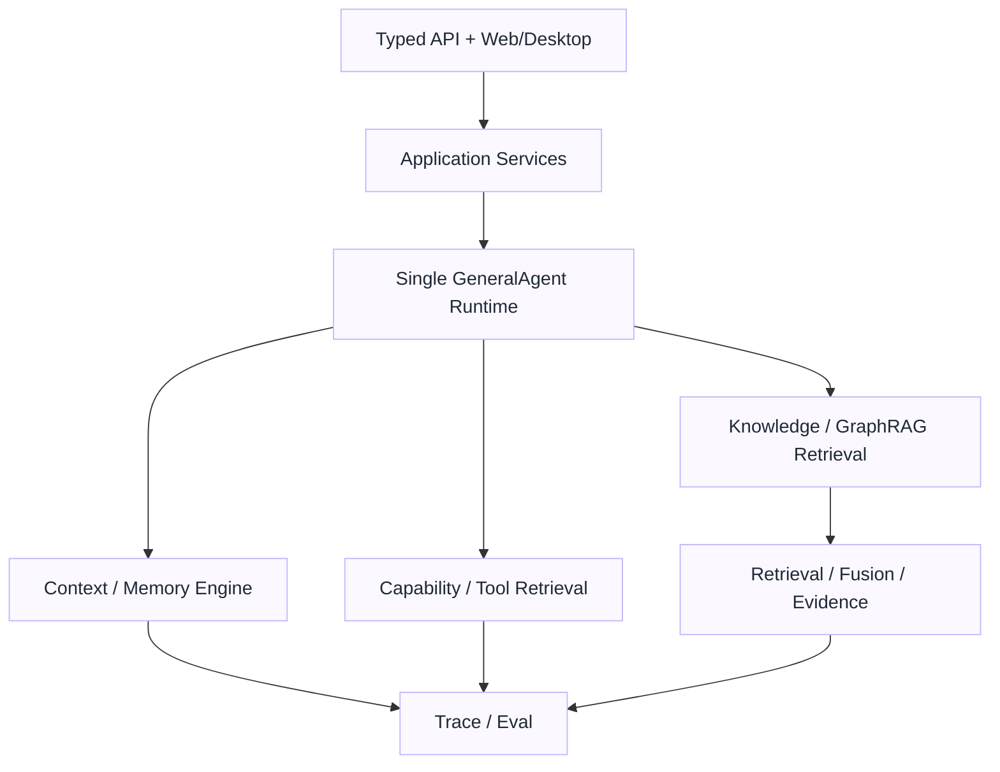
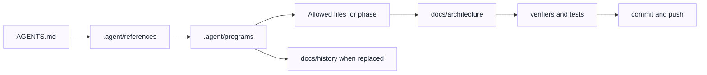

# 架构图

## 用途

这份文档只放少节点、可渲染的 Mermaid 图。它帮助第一次阅读的人快速区分 Current、Target 和维护工作流，不替代 `current-architecture.md`、`target-architecture.md` 和 `roadmap.md`。

## Current Runtime

当前图只表达已经由代码和测试证明的主线。

## Target Runtime

目标图表达近期目标，不代表当前已经全部实现。

## Maintenance Workflow

维护图表达本仓库当前文档和执行计划边界。

## 边界

- Current Runtime 只写当前真实调用链。
- Target Runtime 可以写成熟目标，但必须保持目标语气。
- Maintenance Workflow 只表达如何维护文档、program、验证和历史归档。
- Domain Pack 只允许作为历史或兼容语境出现，不进入 Current 或 Target 主线图。
