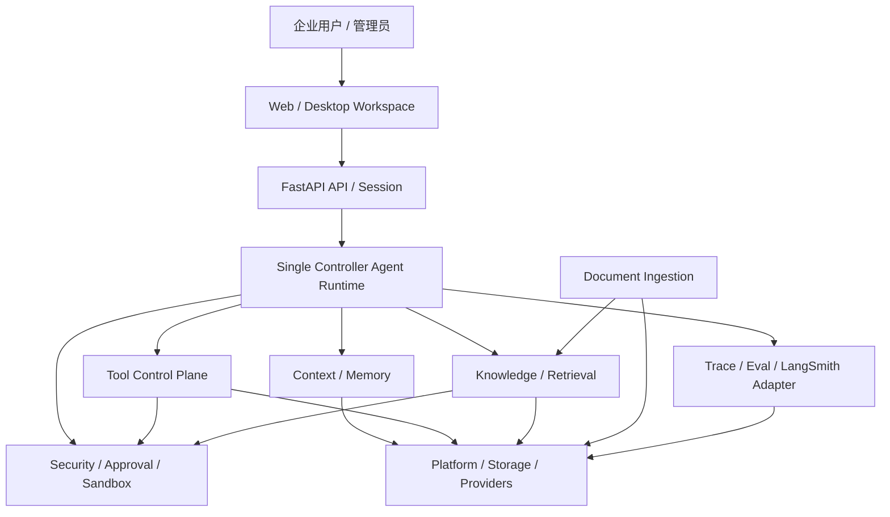

# 总架构文档

## 用途

这是 Zuno 的正式总架构文档。它回答“Zuno 现在是什么、目标要长成什么、为什么这样分层、下一步如何实施”这四个问题。

本文偏文字说明，Mermaid 图只作为辅助。完整图形展示以 [架构图源](architecture.md) 和生成页 [架构 HTML](architecture.html) 为准。Agent 维护侧的对应文档是 [.agent/architecture/overall-architecture.md](../../.agent/architecture/overall-architecture.md)，两者必须一起维护。

Canonical paths：

- `docs/architecture/overall-architecture.md`：正式文字总架构文档。
- `.agent/architecture/overall-architecture.md`：Agent 侧总架构维护文档。
- `docs/architecture/architecture.md`：十类 Mermaid 架构图源。
- `docs/architecture/architecture.html`：由图源生成的架构 HTML。

## 核心判断

Zuno 的主叙事是**本地优先的企业私有知识库与多功能 Agent 助手**，不是普通 RAG 问答 demo，也不是默认多 Agent 平台。它面向企业内部文档、合同、制度、项目资料、技术文档、HR / 简历资料和个人项目证据，提供可引用问答、文档分析、报告生成和受控工具调用。

当前仓库已经完成的是架构治理、文档系统、六层后端边界、`GeneralAgent` 单循环主线、Query Router foundation、Context / Memory foundation、ToolCard foundation、GraphRAG query contract、Evidence / Citation / Trace / Eval foundation。它还没有完成生产级 LangGraph runtime、成熟 Memory DB、完整动态工具编排、统一 Parse Gateway、LangSmith 产品化、安全沙箱闭环和前端 trace 面板。

因此总判断是：

```text
Zuno current
  = monorepo
  + FastAPI backend
  + Single GeneralAgent single loop
  + Knowledge / GraphRAG query path
  + evidence / citation / trace foundation

Zuno target
  = Local-first Enterprise Private Knowledge Agent Workspace
  + Single Controller Agent Runtime
  + Document Ingestion / Parse Gateway
  + Context / Memory write-manage-read
  + Tool Control Plane
  + Agentic RAG + GraphRAG
  + Security / Approval / Sandbox
  + LangSmith-compatible Trace / Eval
  + Workspace / Artifact / Event Flow
```

## 当前架构事实

当前事实以 [current-architecture.md](current-architecture.md) 为准。总架构层面只保留会影响判断的事实：

- 当前是 monorepo，主要边界是 `apps/web`、`apps/desktop`、`src/backend/zuno`、`tools`、`tests`、`docs` 和 `.agent`。
- 当前 Python 后端 runtime 边界是 `src/backend/zuno`。
- 当前后端目标层已经收口为 `api / agent / memory / capability / knowledge / platform` 六层。
- 当前主线是 `GeneralAgent` single loop，不是完整产品级 LangGraph runtime，也不是默认多 Agent runtime。
- 当前知识问答链路是 `Completion API -> CompletionService -> GeneralAgent -> search_knowledge_base -> KnowledgeQueryService -> GraphRAGQueryService -> RetrievalPlanner / RetrievalOrchestrator -> Evidence / Citation / Trace -> answer`。
- 当前已证明 `product_mode = normal | enhanced | auto` 和 `query_method = auto | basic | local | global | drift` 的请求、路由和 trace foundation；`auto` 是 router，不是第五种最终检索方法。
- 当前 Memory、Tool、Hooks、GraphRAG 和 Runtime Upgrade 都是 foundation slice，不是成熟产品能力。

## 目标架构分层

目标分层以 [target-architecture.md](target-architecture.md) 为准。总架构按十个平面理解：

| 平面 | 目标职责 | 当前边界 |
| --- | --- | --- |
| Presentation / Workspace | Web、Desktop、会话、上传、产物、trace 面板和用户反馈。 | 当前已有 Web / Desktop 工作区，但完整产品闭环仍是 Target。 |
| API / Session | FastAPI routes、DTO、Auth、task / session、SSE / WebSocket、upload / download。 | 当前 API 基础存在；完整 task/session/event flow 仍是 Target。 |
| Agent Core Runtime | `prepare_context -> plan -> ReAct -> observe -> reflect -> replan -> post_turn_commit`。 | 当前是 `GeneralAgent` single loop + 最小 ledger，不是完整 LangGraph runtime。 |
| Context / Memory | Raw Event Log、recent window、task summary、structured memory、Context Pack、review / promotion / decay。 | 当前是 foundation contracts 和轻量 readback。 |
| Capability / Tool | ToolCard / manifest、capability retrieval、policy、approval、executor adapter、sandbox、result normalization。 | 当前已有 ToolCard foundation；动态编排和审批闭环仍是 Target。 |
| Knowledge / Retrieval | Basic RAG、GraphRAG local/global/drift、retrieval fusion、evidence、citation。 | 当前已有 GraphRAG query contract；生产级 extraction / RRF / rerank 仍是 Target。 |
| Document Ingestion | 多格式解析、OCR/VLM、chunk metadata、ACL 继承、BM25/vector/graph index handoff。 | 统一 Parse Gateway 和 Parser Capability Matrix 仍是下一阶段重点。 |
| Security / Governance | 输入检查、PII / 商业秘密脱敏、prompt injection 防护、权限、审批、输出 DLP、审计。 | 当前不能声称成熟沙箱系统；完整治理仍是 Target / Future。 |
| Trace / Eval | runtime trace、LangSmith 映射、dataset、offline / online eval、retrieval / answer / tool / security 指标。 | 当前有本地 trace/eval foundation；LangSmith 产品化仍是 Target。 |
| Platform | PostgreSQL、Redis、RabbitMQ、MinIO、Vector / Graph store、model gateway、background jobs、observability。 | 近期保持模块化单体，不写成微服务 Current。 |

## 总体关系图



这张图只说明总关系；十类细化图仍维护在 [architecture.md](architecture.md)，并生成到 [architecture.html](architecture.html)。

## 主链路

企业知识库场景的目标主链路是：

```text
upload / sync enterprise docs
  -> format detection
  -> Parse Gateway
  -> OCR / table / code / metadata extraction
  -> chunk + provenance + ACL
  -> BM25 / vector / graph index
  -> user query
  -> Context Builder
  -> Single Controller Agent
  -> product mode policy: normal / enhanced / auto
  -> query method: basic / local / global / drift
  -> evidence and citation check
  -> answer / report / artifact
  -> trace / eval / memory candidate
  -> review / promotion / durable memory
```

这条链路解释为什么 Document Ingestion 不能继续隐含在工具层里：企业知识库的质量首先取决于解析、metadata、ACL、chunk 和 provenance，而不只是检索算法。

## 规划模块与 runtime 边界

Planning 不是独立于 Agent 外部的第五个业务系统，而是 Agent Core Runtime 内部的控制能力。Zuno 目标 runtime 应把 Plan-and-Execute、ReAct、Reflection、Replan 和 Reflexion 收束成一个可追踪状态机。

LangGraph 的角色不是“规划模块本身”，而是承载 state graph、checkpoint、durable execution、streaming、interrupt / human-in-the-loop 和 resume 的工程化 runtime 候选。当前仓库只证明了最小 evidence chain，不能把完整 LangGraph runtime 写成 Current。

## 工具层边界

工具层按能力语义治理，不按 API / SDK / CLI / MCP 拆顶层业务分类。邮件、文件、数据库、搜索、知识库、代码执行和 SSH 是 capability domain；local function、SDK、API、CLI、SSH、MCP stdio、MCP HTTP 是 execution adapter。

高副作用工具，例如 `send_email`、外部写操作、SSH、删除或覆盖类命令，目标上必须经过 approval / interrupt / audit trace。当前只能说有 ToolCard / MCP policy foundation，不能声称已有完整工具审批和沙箱。

## 文档解析边界

下一阶段必须把文档解析正式成层。目标 Parser Capability Matrix 至少覆盖：

- PDF：页码、span、图片、表格和 OCR metadata。
- DOCX / PPTX / XLSX：heading、slide、sheet、table 和结构信息。
- TXT / MD / CSV / JSON / HTML：行号、标题、row id、DOM section。
- 图片 / 扫描件：OCR 文本、bbox、confidence、视觉描述。
- 代码文件：语言、路径、symbol、line range 和代码感知切块。

这些能力进入 `Document Ingestion / Parse Gateway` program，而不是在当前文档里伪装成已经完成。

## 安全与评测

企业私有知识场景里，安全和评测不是附加功能，而是产品可信度的一部分。

安全目标分四道闸：

1. 输入闸门：鉴权、限流、文件校验、PII / 商业秘密识别、prompt injection 检测。
2. 检索闸门：chunk 级 ACL、workspace / project scope、document trust label、检索结果净化。
3. 工具闸门：side effect 分级、permission decision、approval gate、timeout、cwd / host allowlist。
4. 输出闸门：DLP scan、citation coverage、format validation、敏感字段脱敏。

评测目标分四类：

- Retrieval eval：Recall@k、MRR、nDCG、retrieval relevance、citation coverage。
- Answer eval：correctness、faithfulness / groundedness、answer relevance、format validity。
- Agent eval：tool selection、argument correctness、trajectory quality、approval rate、fallback rate。
- Security eval：prompt injection block rate、redaction miss rate、sandbox violation、越权访问阻断率。

LangSmith 目标是统一 trace / span / dataset / evaluator / experiment 的外部适配层；本地 pytest 和 eval runner 仍保留为 release gate。

## 实施落点

当前 active program 仍只做架构文档、架构图、HTML 和执行计划收口，不实施 runtime feature。下一轮实现应拆成四个 program：

1. `zuno-document-ingestion-v1`：多格式解析、Canonical Document IR、chunk / provenance、BM25 / vector / graph indexing。
2. `zuno-runtime-memory-tool-plane-v1`：Context Pack、summary compression、structured extraction、ToolCard manifest、executor registry、approval flow。
3. `zuno-eval-observability-v1`：LangSmith trace 映射、dataset、RAGAS / DeepEval 指标、citation coverage 和 CI regression gate。
4. `zuno-security-enterprise-scenarios-v1`：PII / 商业秘密脱敏、prompt injection 防护、ACL、输出 DLP、四层 sandbox、企业知识库 / HR 简历库场景。

这四条线必须从 `PHASE01` 开始打开新 program；不能在当前架构文档 program 里直接改 runtime。

## 文档一致性规则

本文是 `docs/architecture/` 的总架构正文。维护规则如下：

- 改总架构文字时，必须同步 [.agent/architecture/overall-architecture.md](../../.agent/architecture/overall-architecture.md)。
- 改图形总览时，必须先改 [architecture.md](architecture.md)，再运行 `python tools/agent/render_architecture.py --write` 更新 [architecture.html](architecture.html)。
- 改 Current 事实时，必须优先改 [current-architecture.md](current-architecture.md)，不能只改本文。
- 改 Target 边界时，必须优先改 [target-architecture.md](target-architecture.md)，再让本文吸收摘要。
- 改执行顺序时，必须优先改 [roadmap.md](roadmap.md) 和 `.agent/programs/`，不能把 phase 细节堆进本文。
- 改安全或沙箱边界时，必须同步 [security-and-sandbox.md](security-and-sandbox.md)。
- 改企业知识库主叙事时，必须同步 [product-scenario-enterprise-kb.md](product-scenario-enterprise-kb.md)。

验证入口：

```powershell
git diff --check
python tools/agent/render_architecture.py --check
python tools/scripts/verify_docs_entrypoints.py
python tools/scripts/verify_repo_structure.py
python .agent/scripts/verify_agent_system.py
python .agent/scripts/verify_doc_boundaries.py
pytest -q tests/repo/test_docs_entrypoints.py tests/repo/test_repo_structure_consistency.py tests/repo/test_agent_system.py -p no:cacheprovider
```
