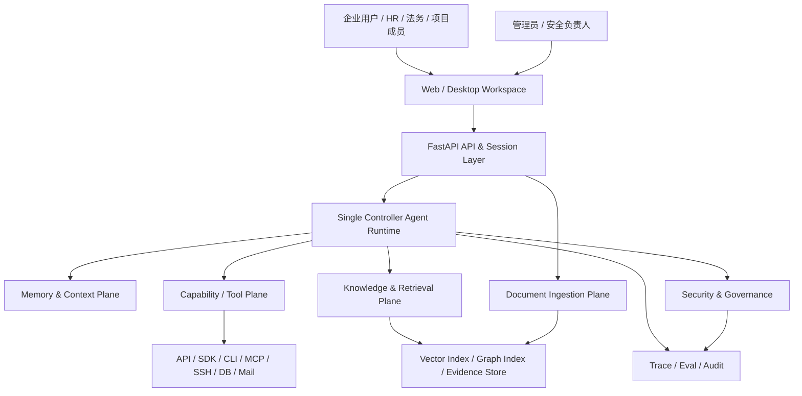
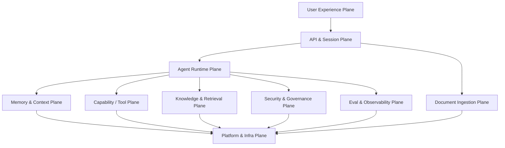
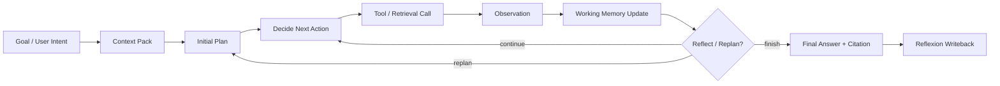
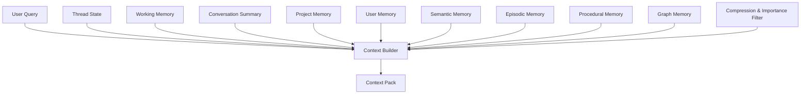
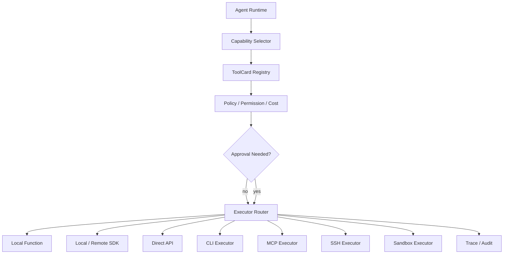
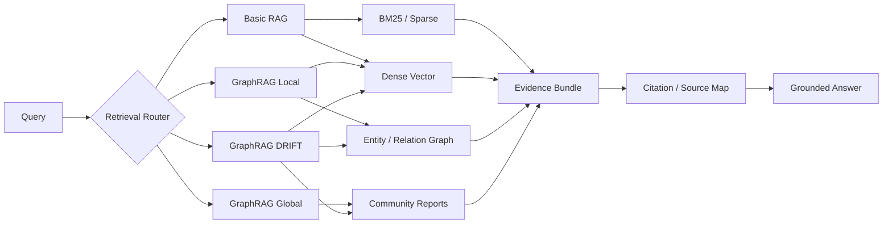
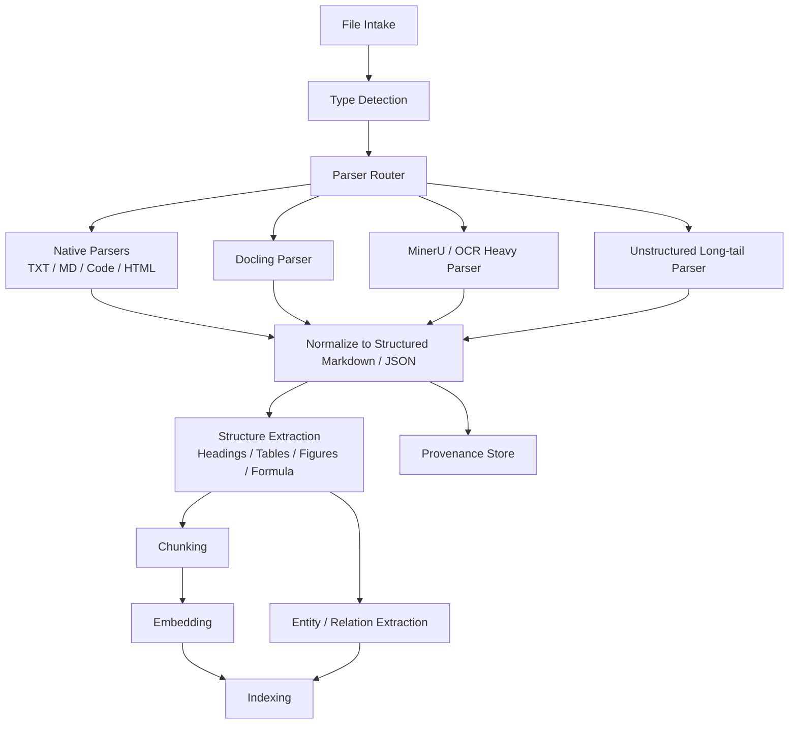
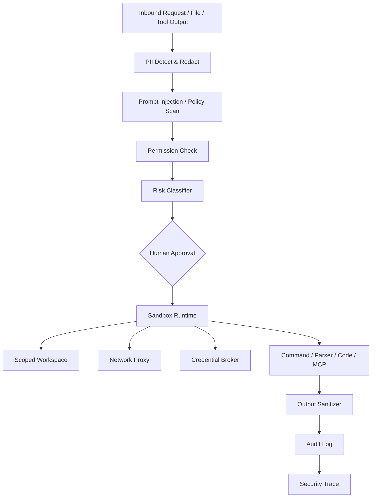
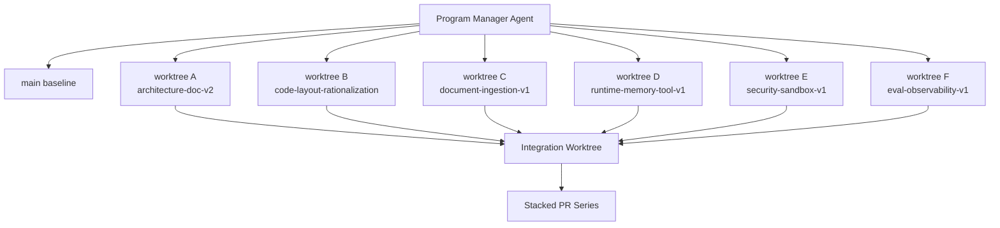

# Zuno 目标架构深度研究与实施蓝图

## 现状判断与主叙事

从公开仓库当前 `main` 分支可见，Zuno 现在已经把自己的产品叙事收束为“本地优先的企业私有知识库与多功能 Agent 助手”，并明确把 `src/backend/zuno` 作为当前唯一 Python 后端 runtime truth；公开 README 还把当前主线描述为 `Completion API -> CompletionService -> GeneralAgent single loop -> search_knowledge_base -> KnowledgeQueryService -> GraphRAGQueryService -> RetrievalPlanner / RetrievalOrchestrator -> Evidence / Citation / Trace -> GeneralAgent answer`，同时承认当前只有 Query Router、Context / Memory、ToolCard、GraphRAG、Evidence / Citation / Trace / Eval 的基础骨架。公开 `architecture.html` 里最显眼的一张图仍然是“Frontend → Backend API → Single Controller Agent → Memory / Tool / Knowledge → Evidence / Citation / Trace / Eval”的高层逻辑图，这说明 Zuno 的“概念骨架”已经成形，但“操作级细节图”和“实现层级分解图”还不够厚。citeturn3view0turn3view1turn2view0turn3view4turn3view5

更重要的是，公开 README 目前仍写着 active program 是 `zuno-architecture-detail-and-execution-plan-v1`，阶段还是 `PHASE04_execution-roadmap-from-architecture`，并且明确这个 program 只做文档和执行计划，不实现 runtime feature。也就是说，如果你本地已经完成了 PHASE10 closure，但公开 `main` 仍显示 PHASE04，那么当前 GitHub 前台对外呈现仍然存在“program 状态漂移”。这不是小问题：它会直接影响别人对仓库成熟度的判断，也会让“八类交付物”的第一类和第八类——工作流系统与一致性验证——在门面上看起来没有闭环。citeturn3view2turn3view3

所以，针对你最关心的几个问题，结论应该说得很直白。**现在的公开主线还不能宣称已经实现“成熟的 GraphRAG / Agentic RAG / LangGraph 深度运行时 / 成熟企业后端”**。原因不是你没有方向，而是仓库自己已经把 Current 与 Target 边界写得很清楚：公开 Current 不能写完整 LangGraph runtime、不能写 production-grade memory consolidation、不能写 product-level dynamic capability orchestration、不能写产品级多 Agent runtime。换句话说，**公开仓库已经有基础设施、有架构骨架、有术语、有图、有 verifiers，但还没有足够证据支持“成熟生产级”这四个字。**citeturn1view0turn3view1

这也恰恰决定了 Zuno 最稳、最强、最适合写进简历和继续落地的主叙事：**企业内部文档知识库 + 多功能 Agent 助手**。GraphRAG 官方文档明确把 private dataset、企业私有文档、复杂语义结构理解视为典型应用场景；Zuno README 现在也已经把自己定义为 enterprise private knowledge assistant，而不是普通 RAG demo。你的“简历知识库、候选人资料、项目证据、HR 文档”都完全可以被归入这个大叙事：它们本质上都是企业或个人私有知识资产，只是场景规模不同而已。citeturn16search0turn17search0turn17search1turn3view0

## 完整目标架构

Zuno 的完整目标架构，最适合被定义成一个**本地优先的企业私有知识 Agent Workspace**。它的核心不是“聊天框 + RAG”，而是一个把文档解析、知识检索、Agent 运行时、工具治理、安全隔离、Trace / Eval 和前端工作区整合在同一套控制面里的系统。LangGraph 的官方定位是“构建长生命周期、可持久化、有记忆、可人机协同的状态型 agent 工作流”；GraphRAG 的官方定位则是“用知识图谱、社区摘要和多种 query mode 对私有语料做结构化增强检索”。这两者正适合成为 Zuno 的运行时语义和知识层语义。citeturn19search4turn19search0turn19search10turn16search0turn17search0turn17search1turn4search0

在这个目标架构里，Zuno 应该被拆成九个清晰平面。第一层是 **User Experience Plane**，也就是 Web / Desktop 界面、文件上传、知识库管理、会话与任务 UI、Trace / Citation / Eval 面板。第二层是 **API & Session Plane**，负责会话、线程、任务、文件、实时流式事件和鉴权边界。第三层是 **Agent Runtime Plane**，默认保持单控制器架构：Goal Understanding、Context Pack、Plan、ReAct、Observation、Working Memory、Reflection、Dynamic Replan、Reflexion Writeback。第四层是 **Memory & Context Plane**，区分短期 thread state、working memory、conversation summary、project memory、user memory、semantic / episodic / procedural memory、graph memory。第五层是 **Capability / Tool Plane**，管理 ToolCard、Registry、Selector、Policy、Approval、Executors，以及 API / SDK / CLI / MCP / SSH / Sandbox 等连接器。第六层是 **Knowledge & Retrieval Plane**，管理 Basic RAG、GraphRAG local / global / drift、BM25、dense vectors、rerank、evidence bundle、citation。第七层是 **Document Ingestion Plane**，把 PDF / DOCX / PPTX / HTML / images / code / md / txt 变成统一的结构化资产。第八层是 **Security & Governance Plane**，做权限、审批、脱敏、prompt injection 防御、knowledge poisoning 防御、sandbox、audit。第九层是 **Eval & Observability Plane**，把 OTel spans、LangSmith tracing、offline / online eval、CI regression gate 串起来。这个分层同时与当前 Zuno 已有的 `agent / memory / capability / knowledge / platform` 边界兼容，只是会把“security / observability / ingestion”从概念上明确独立出来。citeturn3view1turn2view0turn3view4turn3view5turn19search4turn19search0turn23search0turn5search0

这个目标架构还要解决一个你一直追问的问题：**规划模块到底是不是 Single Controller Agent 本体**。答案是：是。规划模块不应该被画成 Agent 外部一个“Planner 小盒子”，而应该是 Agent Runtime 的内部控制语义。最合理的做法，是把 `Plan + ReAct + Reflection + Replan + Reflexion` 组合成一个层次化控制环：Plan 负责全局步骤草案，ReAct 负责每一步动作选择和观察更新，Reflection 负责局部质量检查，Replan 在计划失效时重写剩余计划，Reflexion 把失败经验沉淀成程序性记忆。LangGraph 的 checkpointer、store、interrupt、time-travel 和 thread/thread-scoped state 特别适合承载这一套控制语义；GraphRAG 的 local / global / drift 则适合成为 Agent 在不同问题类型上调用的知识能力，而不是另一个独立 agent。citeturn19search10turn19search7turn19search2turn19search0turn17search0turn17search1turn4search0turn16search0

工具层也需要从“函数集合”升级成**Tool / Capability Control Plane**。MCP 官方文档把 Tools 定义为 schema-defined interfaces；工具本身应该具有名称、输入输出 schema、描述、授权要求、用户同意约束，以及执行前后的明确反馈机制。Zuno 因此不应该继续把“邮件、文件、数据库、代码执行、知识库”与“API / CLI / SDK / MCP / SSH”混在一个维度里。前者是能力域，后者是执行连接器。最终模型应该是：**Capability Domain + Executor / Connector + Governance**。例如 `send_email` 属于 communication capability，底层可以由 Gmail API、SMTP SDK、CLI 或 MCP 执行；`read_file` 属于 file/artifact capability，底层由 filesystem executor 实现；`run_python_sandbox` 属于 code-execution capability，底层由 sandbox/container/SSH executor 实现。这样设计后，工具选择、权限审计、预算控制、沙箱策略和 trace 才能真正统一。citeturn24search0turn24search5turn24search2turn24search3

还有一个关键的目标边界：**运行时应该继续坚持 Single Controller Agent，交付流程则可以大规模使用 Multi-Agent / Multi-Worktree。** 这是两个不同层面。产品运行时默认仍应是 single controller，因为当前公开仓库自己就把多 Agent runtime 排除在 Current 之外；但在工程实施上，Git 官方文档已经明确 `git worktree` 支持同一仓库同时挂多个 working trees，每个工作树可以独立 checkout 不同分支，因此非常适合给多个代码 agent 并行“粗粒度”施工。你要的“主线程只负责开线程，各个线程跑几个小时而不是几分钟”更适合在**交付流程**里做，而不是强行把产品 runtime 改成多智能体。citeturn1view0turn3view2turn10search0turn10search6

## 十类架构图

公开 `architecture.html` 已经开始向“十类图”方向靠拢，但其中一张最核心的图仍以“Single Controller Agent + Memory / Tool / Knowledge / Evidence”这样的高层抽象为主。下一版应该保留这种清晰度，同时把**控制面、数据面、风险边界和可观测性边界**画出来。下面这十张 Mermaid，是更接近你想要复杂度的候选版本。它们不是为了“画得花”，而是为了让面试官、评审和未来的 Codex 都能看清对象、流程和边界。citeturn2view0turn3view0

**图一：系统上下文图**



这张图把用户、前端、Agent、本地知识库、工具连接器、安全与可观测性放到同一上下文里；它对应的是你现在的主叙事“企业内部文档知识库 + 多功能 Agent 助手”，也和公开 README 当前的 workspace 边界一致。citeturn3view0turn3view1

**图二：逻辑分层图**



这张图是你下一版 `docs/architecture/overview.md` 的总图，目的是把“架构不是一个 agent 盒子”表达清楚：它是多个 plane 组合出来的控制系统。citeturn3view0turn19search4turn23search5

**图三：Agent Runtime 控制环**



这张图把 `Plan + ReAct + Reflection + Replan + Reflexion` 放进同一个控制环中，体现“规划模块就是 Agent Runtime 的控制语义”这一点。LangGraph 的 persistence、interrupt、time-travel 和 short-term / long-term memory 模型正适合支撑这类状态机。citeturn19search4turn19search0turn19search10turn19search7

**图四：Memory 与 Context Builder 图**



这张图展示的是“上下文不是原始聊天记录，而是构造出的 Context Pack”。LangGraph 官方把 checkpointer 与 store 明确区分为 thread-scoped memory 与 cross-thread memory，这正好对应 Zuno 里短期状态和长期记忆的分层。citeturn19search0turn19search6

**图五：Tool / Capability Control Plane 图**



MCP 规范把 tools 定义为 schema 驱动、可发现、可调用的操作接口，并明确要求对高风险工具保留 human-in-the-loop；这意味着 Zuno 的 tool plane 必须天然带上 policy 和 approval，而不是“LLM 选完直接跑”。citeturn24search0turn24search2turn24search5turn24search15

**图六：Knowledge / Retrieval 图**



GraphRAG 官方把 query mode 清楚拆成 Basic、Local、Global、DRIFT；其中 Local 适合实体问题，Global 适合全局主题，DRIFT 则把社区信息和 local reasoning 结合起来。Zuno 的知识层应当直接按这个语言建模，让 `auto` 只是 router，而不是第五种 mode。citeturn16search0turn17search0turn17search1turn4search0turn4search18

**图七：Document Ingestion 图**



这张图非常关键，因为 **GraphRAG 本身并不负责吃掉复杂办公文档**。微软 GraphRAG 文档的 API overview 甚至明确写了 indexing API 当前支持的是 plaintext `.txt` 和 `.csv`，这意味着 Zuno 必须自己先把 PDF、DOCX、PPTX、图片、HTML 等资产转成统一的、机器可检索的中间表示。Docling 擅长统一表示和复杂 PDF 布局；MinerU 与 PaddleOCR-VL 类方案更适合高难 OCR / 公式 / 图表重场景；Unstructured 则适合补齐长尾文件类型。citeturn16search1turn7search4turn8search0turn7search5turn8search17turn7search18turn8search11

**图八：Security 与 Sandbox 图**



OWASP、NCSC、MCP 官方安全文档和 Docker Sandboxes 文档几乎指向同一件事：prompt injection 不能被当成“能一次性修好的 bug”，而应该被当成**系统级残余风险**；解决办法是减少影响面，把高风险动作放进 approval、sandbox、network policy、credential isolation 和审计边界里。对 Zuno 来说，这张图应该成为安全章节的中心图。citeturn11search0turn11search3turn14search0turn14search1turn24search1turn12search2turn12search1turn12search3turn12search15

**图九：Observability 与 Evaluation 图**

```mermaid
flowchart LR
    APP[Zuno App]
    OSPAN[OTel / LangSmith-compatible Spans]
    COL[OTel Collector + Redaction]
    LS[LangSmith]
    OBD[OTel-native Backend]
    DS[Eval Dataset Store]
    OFF[Offline Eval]
    ONL[Online Eval]
    MET[Metrics\nRecall@n / MRR / nDCG / Faithfulness / Citation Coverage]
    GATE[CI Regression Gate]

    APP --> OSPAN --> COL
    COL --> LS
    COL --> OBD
    DS --> OFF
    APP --> ONL
    LS --> OFF
    LS --> ONL
    OFF --> MET --> GATE
    ONL --> MET --> GATE
```

LangSmith 官方已经把观测和评测分成 offline 与 online 两条主线，并明确支持 OpenTelemetry tracing、OTel-based evaluation，以及通过 OTel Collector 做 trace redaction。OpenTelemetry GenAI 社区也正在把 agent、task、memory、artifact 等语义标准化。因此，Zuno 最合理的路线不是“LangSmith only”，而是“**OTel 作为内部标准遥测层，LangSmith 作为第一接收端**”。这样你既能做 LangSmith，又不会把数据结构锁死在单一厂商。citeturn5search0turn5search6turn23search0turn23search1turn23search3turn23search5turn22search0turn22search4

**图十：大粒度并行实施图**



这张图不是产品架构，而是**交付架构**。Git 官方 `worktree` 文档已经给了你这种并行模式的底座：同一仓库可以挂多个 linked worktrees，分别 checkout 不同分支并行开发；如果仓库大，还可以用 sparse-checkout 缩小每个工作树的文件集合。对于 AI 代码 agent，这是目前最稳的“并发不互踩”基础设施。citeturn10search0turn10search1turn10search7

## 文档体系与代码布局

现在的公开 README 已经把 `apps / src/backend/zuno / tools / tests / infra / examples / docs` 这些顶层边界讲清楚了，这说明**仓库最上层并不算乱**；真正的问题，是你截图与描述里提到的中层和内层：`platform/services` 过胖、`capability` 内部零碎、`compatibility` 既承担别名又承担 vendor，视觉噪音大，语义也不纯。再加上公开 `main` 的 program 状态还停在 PHASE04，这会进一步放大“目录混乱”的感受。citeturn3view2turn3view3

对于 Python 项目，PyPA 官方一直强调 `src` layout 的价值：可导入代码应和仓库根目录下的文档、脚本、配置文件分离，从而避免“工作目录优先导入”造成的误导性成功；pytest 文档也直接把 `src layout` 视为 good practice；FastAPI 官方则鼓励用 `APIRouter` 和多文件结构组织更大应用。这意味着 Zuno 不需要推倒重来，而应该在**保留 `src/backend/zuno` 作为唯一 runtime package** 的前提下，把内部再拆干净。citeturn21search0turn20search2turn20search1

最推荐的目标代码树如下：

```text
src/backend/zuno/
├── app/
│   ├── main.py
│   ├── config.py
│   ├── lifespan.py
│   └── dependencies.py
├── api/
│   ├── routers/
│   │   ├── chat.py
│   │   ├── files.py
│   │   ├── tasks.py
│   │   ├── eval.py
│   │   └── admin.py
│   ├── schemas/
│   └── ws/
├── runtime/
│   ├── controller/
│   ├── planning/
│   ├── execution/
│   ├── state/
│   └── prompts/
├── memory/
│   ├── short_term/
│   ├── long_term/
│   ├── graph_memory/
│   ├── compression/
│   └── context_builder/
├── capability/
│   ├── contracts/
│   ├── registry/
│   ├── selector/
│   ├── policy/
│   ├── approval/
│   ├── executors/
│   │   ├── local_function.py
│   │   ├── sdk.py
│   │   ├── api.py
│   │   ├── cli.py
│   │   ├── ssh.py
│   │   ├── mcp.py
│   │   └── sandbox.py
│   └── providers/
│       ├── filesystem/
│       ├── communication/
│       ├── database/
│       ├── browser/
│       ├── code_execution/
│       └── workflow/
├── knowledge/
│   ├── ingestion/
│   │   ├── intake/
│   │   ├── parsers/
│   │   ├── normalize/
│   │   ├── chunking/
│   │   └── provenance/
│   ├── indexing/
│   ├── retrieval/
│   ├── graphrag/
│   ├── evidence/
│   └── citation/
├── security/
│   ├── input_guard/
│   ├── redaction/
│   ├── trust/
│   ├── sandbox/
│   ├── authz/
│   └── audit/
├── observability/
│   ├── tracing/
│   ├── metrics/
│   ├── eval/
│   └── exporters/
├── platform/
│   ├── model_gateway/
│   ├── storage/
│   ├── queue/
│   ├── db/
│   └── vendor/
├── compat/
│   ├── imports.py
│   └── README.md
└── __init__.py
```

这套结构的核心思想，是**让“业务语义拥有代码”，让 `platform` 只托管真正跨层基础设施**。也就是说，GraphRAG 代码归 `knowledge/graphrag`，Tool runtime 归 `capability/executors`，Memory orchestration 归 `memory/context_builder`，不要再把它们长期漂浮在 `platform/services` 里。`platform` 只剩 model gateway、storage、queue、db、vendor 五类真正基础设施。这样做以后，`platform/services` 这类爆炸目录就会自然瘦身。citeturn21search0turn20search1turn9search2

`compatibility` 也不应该继续做一个“看不出边界的大杂烩”。更合理的策略是把它收缩为两个小角色：一是 `compat/imports.py`，专门维护旧 public import 到新路径的 alias registry；二是 `platform/vendor/`，显式承接 vendored 依赖。除此之外，所有真正业务代码都不准新写进 compat。这样可以保住历史导入兼容，同时防止 compat 继续成为“任何不想整理的东西都丢进去”的黑洞。公开仓库文档已经非常强调 Current / History 边界，这个原则也应该同步到代码目录里。citeturn3view0turn3view2

文档体系也应该同时升级。建议把 `docs/architecture/` 明确成“总架构 + 十张图源 + 各平面设计 + ADR + 实施 program”的组合，而不是只靠一个总文档顶全部内容。更合理的文档树大致如下：

```text
docs/architecture/
├── 00-overview.md
├── 01-scenario-enterprise-private-knowledge.md
├── 02-runtime-single-controller-agent.md
├── 03-memory-context-plane.md
├── 04-capability-tool-plane.md
├── 05-knowledge-retrieval-plane.md
├── 06-document-ingestion-plane.md
├── 07-security-sandbox-governance.md
├── 08-observability-eval-plane.md
├── 09-deployment-and-ops.md
├── 10-code-layout-and-module-ownership.md
├── adr/
├── diagrams/
│   ├── system-context.mmd
│   ├── runtime-loop.mmd
│   ├── memory-plane.mmd
│   ├── tool-plane.mmd
│   ├── retrieval-plane.mmd
│   ├── ingestion-plane.mmd
│   ├── security-plane.mmd
│   ├── observability-plane.mmd
│   ├── deployment.mmd
│   └── delivery-worktrees.mmd
└── architecture.html
```

这样 `architecture.html` 就不再是“唯一大型文件”，而是图形化入口；文字权威性则回到各平面文档和 ADR。公开 README 已经把“总架构文档”和“架构 HTML”都列为首读入口，下一版只需要把它们的粒度拉开。citeturn3view0turn3view1

## 自动化评测、文档解析与安全基线

先说自动化评测。LangSmith 官方已经把评测路线讲得很清楚：**Offline Evaluation** 用数据集、目标函数、评估器、实验对比做“发版前评测”；**Online Evaluation** 用真实生产 traces 做实时质量监控、异常检测和反馈回流。LangSmith 现在也明确支持 OpenTelemetry-based tracing、OpenTelemetry-based evaluation、通过 OTel Collector 先做 redaction 再转发到 LangSmith，并支持 self-hosted 模式；不过 self-hosted LangSmith 是 Enterprise 路线，这意味着如果你想坚持完全本地、组织内闭环，最好把**OTel 作为内部标准**，再把 LangSmith 作为一个可插拔 sink，而不是唯一遥测来源。citeturn5search0turn5search2turn5search6turn23search0turn23search1turn23search3turn5search4turn5search7

所以 Zuno 的可观测与评测架构，建议按四层落地。第一层是**标准化 Trace Schema**：无论是 Python SDK 直接埋点还是 OTel 手动埋点，都统一记录 `trace_id / thread_id / session_id / user_id / model / tokens / latency / cost / tool_name / query_mode / evidence_count / citation_count / approval_required / sandbox_required / failure_reason`。第二层是**实验与数据集层**：把回灌的用户案例、合成 case、合同审查 case、企业制度问答 case、简历匹配 case 组织成有版本的数据集。第三层是**评测器层**：结合 LangSmith evaluators、Ragas、DeepEval 与人工审查，分别对检索、回答、安全、工具执行做评分。第四层是**回归门禁层**：在 PR 和 release 流水线里执行 repo tests、unit tests、retrieval evaluation、answer quality evaluation、security regression 和 redaction regression；如果关键指标下降，就阻断合并。Ragas 官方文档本来就是围绕系统化 AI 评测循环设计，原始论文又正是为 reference-free RAG 评测提出框架；DeepEval 则更适合把 LLM 指标直接写进 CI 风格测试。citeturn6search3turn6search14turn6search15turn6search18turn5search1

具体指标也不要只停留在一个 “RAGAS score”。更适合写进 Zuno 的，是一套分层指标。检索层看 `Recall@k`、`MRR`、`nDCG`、entity recall、context precision / recall；回答层看 `faithfulness`、`answer relevancy`、`citation coverage`、`unsupported claim rate`；工具层看 `tool success rate`、`approval latency`、`sandbox denial rate`、`retry rate`；业务层再看合同条款命中率、制度依据覆盖率、简历与 JD 关键项匹配率这种 task-specific 指标。LangSmith 的 offline/online flow、Ragas 的 retrieval/generation metrics、DeepEval 的 local/CI 用法，正好能拼成这套体系。citeturn5search0turn6search3turn6search14turn6search15turn6search17

再说文档解析。这里最容易犯的错误，就是把“GraphRAG 很强”误解成“GraphRAG 可以直接吃掉所有复杂文档”。微软 GraphRAG 文档实际上清楚写着 indexing API 当前支持 plaintext `.txt` 与 `.csv` 输入，因此你必须先做一层 **Document Ingestion Plane**。如果你的目标是“尽可能多地支持文档”，最稳的方案不是押宝单一 parser，而是建立**分层 parser router**：
轻量文本类如 `txt / md / rst / code / html` 走 native parsers；
复杂办公文档与高质量 PDF 默认走 Docling；
扫描件、图表密集、公式密集或复杂版式重文档走 MinerU / PaddleOCR-VL 一类重解析器；
长尾格式和部分特殊输入走 Unstructured 兜底。Docling 官方文档列出的支持面已覆盖 PDF、DOCX、PPTX、XLSX、HTML、EPUB、图片、音视频字幕、邮件和纯文本，并突出 page layout、reading order、table structure、code、formula 等结构理解；MinerU 官方说明则聚焦 PDF、images、DOCX、PPTX、XLSX 输出到 Markdown / JSON，适合 Agent 与 RAG；Unstructured 官方支持的长尾文件类型则非常多。citeturn16search1turn7search4turn8search0turn7search5turn8search17turn7search18

因此，Zuno 的 ingestion 最佳中间表示不应该是“裸文本”，而应该是**带 provenance 的结构化 Markdown / JSON**。每个 block 都要能回指原文件、页码、坐标、表格单元、图像、公式、章节层级和解析器来源。这样后续 chunking、embedding、entity extraction、GraphRAG indexing 和 citation 才有根。对于代码文件，根本没必要走 OCR 或复杂 parser，直接做 language-aware split；对图片则先做 OCR / layout / captioning，再进入结构化表示。这样一来，GraphRAG 的“结构化增强检索”和 Doc parsing 的“结构化资产清洗”就连上了。citeturn17search0turn17search1turn7search11turn8search11

最后说安全。这里最重要的研究结论，其实不是某一个新组件，而是三份官方材料共同得出的同一条原则：**prompt injection 不要被当作可被彻底消灭的输入漏洞，而要被当作一个必须通过系统边界去控损的“inherently confusable deputy”问题**。OWASP 把 prompt injection 和 insecure output handling 放在 LLM 风险最前列；NCSC 进一步指出这类风险不像 SQL injection 那样可以靠数据/指令分离彻底消除，而更合理的思路是降低后果和影响；MCP 官方安全文档则把用户确认、输入清洗、输出清洗、授权和 sandbox/network isolation 都拉进了同一张防御网。citeturn11search0turn11search3turn14search0turn14search1turn14search2turn24search1turn24search2turn24search17

这意味着 Zuno 的安全基线至少要有四层。**第一层是 Policy Sandbox**：ToolCard 自带 `risk_level / side_effect_level / approval_required / sandbox_required / network_policy / credential_policy / audit_required`。**第二层是 Workspace Sandbox**：把原始知识库、上传文件、临时目录、生成目录、只读源码区和可写 artifact 区硬分开。**第三层是 Execution Sandbox**：代码执行、CLI、SSH、local MCP server、重文档解析都必须进入独立执行边界，至少有 timeout、resource limits、allowlist、cwd scope、secret redaction 和 audit。**第四层是 Network / Credential Sandbox**：默认 deny，HTTP/HTTPS 通过代理出站，allowed domains 明确列白名单，原始 secrets 不进入 prompt 和 sandbox 文件系统，而是用主机侧 credential broker 注入。Docker Sandboxes 的官方安全模型已经完整实现了 microVM、workspace isolation、network proxy、credential proxy 和 clone mode，这恰好可以作为 Zuno 的 Target / Future 参考；Firecracker 则代表更进一步的 microVM 隔离方向。citeturn12search5turn12search2turn12search1turn12search0turn12search3turn12search14turn12search15turn11search2turn11search5

如果你考虑本地部署模型，确实会提升**数据驻留与出域风险**的控制能力，但这并不能代替上述四层安全边界。NIST 的 GenAI Risk Management Profile与 NCSC 的安全材料都在提醒一件事：模型本地化只解决“发不发到第三方云”的问题，不解决“系统是否会被提示攻击、知识污染、越权工具调用、敏感信息外发”的问题。Zuno 的正确表述应该是：**本地模型是数据边界，sandbox + tool governance 是执行边界，trace + eval 是检测边界。三者缺一不可。**citeturn13search0turn13search3turn14search1turn14search4

## 实施路线与 Codex 提示词

如果按你希望的“不是几分钟的小修小补，而是每个线程都能独立干几个小时”的方式推进，最合理的做法不是把一个 agent 开成几十个碎任务，而是把整个项目拆成**六个粗粒度 program**，每个 program 再拆成 2–4 个 phase。公开仓库 README 目前已经把接下来的优先级写成 document ingestion、runtime memory tool plane、eval observability、security enterprise scenarios，这个排序本身就是合理的；你只需要再补上一个 code-layout-rationalization program，并把 architecture-doc-v2 作为真正的 closure / refresh workstream。citeturn3view2

最推荐的并行施工图是这样的。
**A 线：`zuno-architecture-doc-refresh-v2`**，交付新版总架构、十张图、HTML、ADR、README 同步。
**B 线：`zuno-code-layout-rationalization-v1`**，交付 ownership matrix、compat 收缩、platform/services 瘦身、目录规则 verifier。
**C 线：`zuno-document-ingestion-v1`**，交付 parser router、类型探测、Docling 接入、OCR fallback、provenance model。
**D 线：`zuno-runtime-memory-tool-plane-v1`**，交付 Context Builder、ToolCard Registry、selector / policy / approval、runtime loop state machine。
**E 线：`zuno-security-sandbox-v1`**，交付 risk classifier、approval gate、local sandbox executor、network / credential policy。
**F 线：`zuno-eval-observability-v1`**，交付 OTel span schema、LangSmith export、offline/online eval、CI regression gate。
每条线都可以跑成一个独立 worktree，会比“多线程改同一目录”安全得多。Git 官方说明 `git worktree` 本来就是为一个仓库同时 checkout 多个分支而准备的；若某条线只想处理局部目录，还可以额外启用 sparse-checkout。citeturn10search0turn10search1turn10search7

可以直接交给 Codex 的 program 编排提示词如下：

```text
你现在是 Zuno monorepo 的 program manager agent。

目标：
把“企业私有知识库 + 多功能 Agent 助手”的目标架构落地为并行 program。
本轮不要一次性乱改所有东西，而是生成一个可执行的多-worktree program 方案，
并把每个 worktree 的目录所有权、交付物、验证项、PR 依赖关系写清楚。

必须遵守：
1. Current / Target / Future / History 边界不能漂移。
2. public main 若仍显示旧 active program，需要先修正文档状态与前台入口。
3. 所有代码改动都必须更新 docs/architecture、architecture.html、README、verifiers 的对应事实来源。
4. 不允许在一个 phase 中同时重写多个高耦合平面并跨目录无约束移动。
5. 任何兼容层收缩都必须先建立 import compatibility matrix 和 tests。
6. 高风险工具、CLI、SSH、MCP、代码执行、文档解析必须进入 security / sandbox 方案，不得裸跑。
7. Observability 统一以 OTel-compatible span schema 作为内部标准，LangSmith 作为 sink 之一。
8. 所有 phase 都必须定义：目标、边界、文件所有权、执行步骤、验证命令、回滚策略、PR 说明模板。

请输出：
A. 新 program 名称与总目标
B. 6 个 workstreams，每个 workstream 对应一个 worktree 分支
C. 每个 workstream 的 phase 列表（每个 phase 预计数小时工作量，不要切成几分钟的小 task）
D. worktree/branch 命名方案
E. 目录 ownership matrix
F. stacked PR 依赖图
G. 必跑验证命令
H. closure 条件
I. repo 前台入口需要同步的文件列表

建议 workstreams：
- architecture-doc-refresh-v2
- code-layout-rationalization-v1
- document-ingestion-v1
- runtime-memory-tool-plane-v1
- security-sandbox-v1
- eval-observability-v1
```

如果你想直接进入“多 worktree 并行模式”，可以把主控会话只做 orchestration，不直接写业务代码；每个执行会话绑定一个 linked worktree 和一个 program 分支。一个典型的工作树创建方案如下：

```bash
git worktree add ../zuno-arch codex/zuno-architecture-doc-refresh-v2
git worktree add ../zuno-layout codex/zuno-code-layout-rationalization-v1
git worktree add ../zuno-ingest codex/zuno-document-ingestion-v1
git worktree add ../zuno-runtime codex/zuno-runtime-memory-tool-plane-v1
git worktree add ../zuno-security codex/zuno-security-sandbox-v1
git worktree add ../zuno-eval codex/zuno-eval-observability-v1
```

如果某个 worktree 只需处理局部目录，还可以在该目录上增加 sparse-checkout，避免 agent 每次扫描整个 monorepo：

```bash
git sparse-checkout init --cone
git sparse-checkout set src/backend/zuno docs/architecture tests tools
```

这种模式最大的好处，是每个 agent 都在**独立 branch + 独立文件系统视图**里工作，避免互相覆盖本地改动；但要注意，你不应该让多条线同时重写同一个热点目录。最好的 ownership 划分是：A 线只碰 `docs/` 和少量入口文件，B 线主要碰 `src/backend/zuno/**` 的结构与 tests，C 线集中在 `knowledge/ingestion` 与 tests，D 线集中在 `runtime / memory / capability`，E 线集中在 `security / sandbox / policy`，F 线集中在 `observability / eval / CI`。主控线程只负责收集各线进展、维护 stacked PR 依赖、处理冲突和最终 integration worktree。citeturn10search0turn10search6

把这一切收束成一句最适合对外表达的话，就是：

**Zuno 的下一阶段目标，不是把一个现有 RAG 项目继续堆功能，而是把它演进为一个本地优先、面向企业私有知识的 Agent Workspace：有单控制器运行时，有多层记忆，有受治理的工具平面，有可扩展的文档解析，有基于 GraphRAG 的知识层，有可审计的安全边界，也有能进 CI 的自动化评测与全链路追踪。** 这条路线和仓库已公开的主叙事一致，也和 LangGraph、GraphRAG、LangSmith、MCP、安全沙箱与文档解析生态的主流能力边界一致。citeturn3view0turn19search4turn16search0turn23search0turn24search0turn12search5turn7search4
