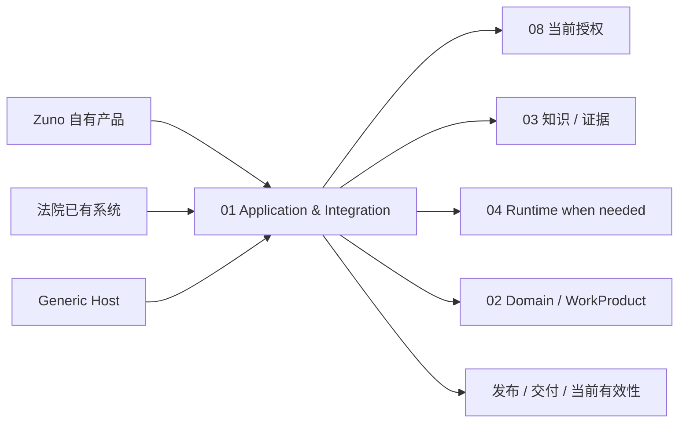
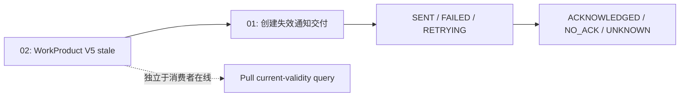

# 01 Application & Integration（应用与集成）

<!-- status: design-baseline-v1; implementation: not-authorized; deepening: all-modules-v1 -->

## Part A — Human Narrative

### 这个模块解决的是“Zuno 怎样进入真实产品”，不是再造一个万能业务层

Zuno 可能有自己的用户入口，也可能被法院已有系统、WorkBuddy、Dify 或其他 `Generic Host（通用 Agent 宿主）` 调用。不同入口可以拥有不同 UI、会话和产品体验，但不能因此出现几套互相冲突的法律事实、安全规则和知识状态。

应用与集成模块负责把外部请求转成 Zuno 可以理解的任务上下文，消费其他责任域已经给出的权威决定，再把结果以正确的资格、版本和交付语义返回给调用方。

它最重要的原则是：**负责组合，不负责重新发明事实。**

它可以组合授权、知识就绪、运行结果、领域版本和发布策略；但不能自己重新判断权限、把“索引完成”改写成“材料就绪”、把 Runtime completed 改写成“工作成果已正式成立”，也不能因为 HTTP 200 就声称外部消费者已经看到结果。

### 用三个入口理解它的边界

同一套 Zuno 法律能力可能被三种产品形态使用。

第一种是 Zuno 自己的 Web / Desktop 产品。01 接收用户请求并拥有 Zuno 侧最终 Answer Publication（答案发布）决定。

第二种是法院已有业务系统。Zuno 作为后端能力返回 typed result（类型化结果）、引用、资格、WorkProduct version 和当前有效性；法院系统拥有自己的页面和最终展示事实。

第三种是 WorkBuddy / Dify 等通用 Agent 宿主。对于简单问答，宿主甚至可以直接完成对话和基础编排，Zuno 只提供受控的法律知识 / 后端能力；对于复杂任务，宿主把任务交给 Zuno Runtime 或 Legal Backend，之后再展示返回结果。



无论入口是谁，02 / 03 / 06 / 08 等模块的 Owner 不随 Host 改变。

### 请求进入以后，01 首先要弄清楚什么

外部请求不能只是一段自由文本。至少需要解析或绑定：主体、tenant / matter、任务目标、材料 Scope（范围）、Agent Definition / Version、期望结果类型、调用来源和必要的安全 / trace context。

如果用户说“分析这份案子”，但事项、材料范围或目标不清楚，01 应要求补充或明确缩小 Scope，而不是把缺失信息交给模型猜。

之后 01 调用其他责任域取得当前决定：08 的 Authorization、03 的 Knowledge Readiness、适用时的 05 / 07 Provider eligibility、复杂任务的 04 Runtime decision 等。

01 把这些已经存在的事实组合成 `InvocationDecision（调用决定）`：现在允许执行、等待、拒绝还是需要人工补充。

### 简单问答为什么不应该被迫经过完整 Native Runtime

对“合同第 8 条规定了什么”这类问题，典型链路是：

```text
request + scope
→ current authorization
→ task-level knowledge readiness
→ retrieval
→ grounded model answer
→ citation / answer eligibility check
→ publication
```

只要通用宿主或应用层可以可靠承担这条短链，就没有必要为了“所有任务统一”启动 Dynamic Plan、Multi-Agent、长期 Memory 和复杂 Runtime。

01 是允许这种简单路径存在的关键边界：它可以根据任务和产品形态选择直接回答路径或 Runtime 路径，但两条路径仍然消费相同的安全、知识和发布资格事实。

### 复杂任务进入 Runtime 以后，01 还负责什么

复杂任务交给 04 后，01 不再控制内部 Step。但 Runtime 返回 `RunOutcome（运行结果）` 以后，任务仍然不一定可以发布。

01 需要消费：RunOutcome、相关 Domain Version / WorkProduct、引用、Result Eligibility（结果资格）、当前安全 / 发布策略，再形成 `AnswerPublicationDecision（答案发布决定）` 或工作成果交付动作。

这意味着：

```text
Run completed
!=
Domain admitted
!=
Answer publishable
!=
Consumer displayed
```

四个事实不能合并。

### 普通答案发布和正式 WorkProduct（工作成果）发布为什么是两条链

普通问答只需要满足 AnswerPolicy、证据、引用和当前发布权限即可返回。

正式 WorkProduct 则必须先由 02 经过 Formal Admission（正式准入），必要时包含 HumanDecision（人工业务决定）和历史引用绑定。01 只能交付已经具备相应领域资格的版本，不能把一个 Runtime Draft 当成正式工作成果发布。

因此 01 的“发布决定”只决定 Zuno 现在是否把某个结果交给调用者；它不创造 Formal Admission。

### 外部 Host 的最终页面为什么不归 Zuno

如果调用发生在法院系统或通用 Host 中，Zuno 能确认的是：自己返回了哪个 typed result / WorkProduct version、带了什么 eligibility / citation / policy refs，以及交付是否成功。

Zuno 不能声称“用户已经看到”“外部 UI 已经正确更新”“对方内部系统已经采用”，除非远端有明确 Ack /业务接口证明，而且即便如此也只是对远端反馈的 Observation（观察）。

把 UI 展示事实留给 Host，可以避免 Zuno 为不受自己控制的产品行为背书。

### Agent Definition / Version 和 PlanVersion 为什么一定要分开

01 拥有 Product-side Agent Definition / Version：一个产品 Agent 对外叫什么、允许哪些 Capability、默认策略、面向哪个使用场景。

04 拥有某一次运行内部的 PlanVersion：这次任务具体分成哪些 Step、当前激活哪一版计划。

产品 Agent 升级不能原地修改已经激活的 PlanVersion；Runtime Replan 也不能反向改写产品 Agent Definition。

```text
Agent Version = 产品能力 / 配置版本
PlanVersion   = 某次运行的控制版本
```

两种版本都需要被追溯，但属于不同 Owner。

### 一个已经交付的工作成果失效以后发生什么

假设昨天法院系统收到了 WorkProduct V5。今天新 Evidence 进入 02，领域判断 V5 已经 `STALE / REVIEW_REQUIRED`。

第一件事——V5 已失效——由 02 立即成立，不等待外部消费者在线。

第二件事——失效通知有没有成功发送——由 01 保存 InvalidationDeliveryFact（失效交付事实）。

第三件事——消费者是否确认收到——由 01 保存 ConsumerAcknowledgementObservation（消费者确认观察）。



Consumer 离线不会让领域结果重新变有效；通知发送成功也不代表消费者真的更新了自己的内部业务状态。

### Push Invalidation（主动失效通知）和 Pull Validity（按需有效性查询）为什么要同时存在

只做 push 有一个问题：消费者离线、队列积压或接口故障时，旧结果可能长期留在外部系统。

只做 pull 也有问题：消费者如果从不查询，就不会知道已有结果已经失效。

目标形态同时提供 push invalidation 和 pull current-validity query。前者降低失效传播延迟，后者让消费者在关键使用点主动确认当前版本仍有效。

两条机制都由 01 负责集成，但有效性真相仍来自 02。

### 交付失败什么时候可以 Retry，什么时候必须交给 06 Reconcile

如果只是一个可幂等的消息投递，远端明确没有处理，可以用稳定 delivery identity Retry。

如果交付本身会产生现实副作用，而且响应丢失后无法确认远端是否已经执行，就不能在 Application 层直接重发。01 应把动作交给 06 Tool Runtime & Effects，用 PreparedAction / EffectReceipt / Reconciliation 语义处理。

这防止“为了让通知送达”在 Application adapter 里偷偷实现第二套外部副作用恢复逻辑。

### Host Contract drift（宿主契约漂移）怎样处理

法院系统、WorkBuddy 或其他 Host 的 API / payload 版本可能变化。Adapter 可以支持明确版本、兼容转换或拒绝不兼容请求，但不能为了兼容外部字段变化偷偷改变内部 Domain / Security / Knowledge Contract。

外部适配成本应该停留在 01：

```text
Host payload V1 / V2
→ Adapter normalize
→ stable internal contract
```

如果外部变化使业务语义本身变了，则升级为 Architecture / Contract change，而不是继续堆字段映射。

### Session / Conversation 为什么不是 01 必须拥有的核心事实

自有产品可以有会话，通用 Host 也可能自己管理会话。01 可以接收 session / conversation refs，但不因为它是入口层就必须建立一套新的全局 Conversation Domain。

业务上长期需要负责的正式法律状态仍在 02；Working / Session Context 可以由 Host、04 Runtime 或 Optional Context Provider 管理。

这允许 Zuno 既作为完整产品运行，也作为法律后端嵌入现有系统。

### 出现故障以后 01 怎样恢复

常见故障可以分开处理：

- Scope 缺失：要求补充，不 Retry；
- Authorization / Readiness 不满足：等待、拒绝或缩小 Scope；
- Runtime 已完成但 Publication evidence 不完整：保持 Draft / Review，不发布；
- Delivery 明确未执行：按稳定 delivery identity Retry；
- Delivery outcome unknown 且有副作用：交 06 Reconcile；
- Consumer offline：保持 Delivery pending / failed，不回滚 Domain invalidation；
- Host contract incompatible：明确拒绝或使用兼容 Adapter；
- 重复请求：使用 request / invocation / delivery identities 去重，避免重复启动或重复交付。

01 的恢复目标不是“所有请求最终返回 200”，而是让每一种外部状态都有正确含义。

### 当前、目标与缺口

Current Evidence 已能证明 Product API 存在分离的 Application Owner，例如 `ProductService`、`ProductIngestionService`、`AgentRunApplicationService` 和 `ProductArtifactService`，说明入口组合和运行机制不是一个单一 Facade。

Target 是完整 External Task Intake、InvocationDecision、AnswerPublicationDecision、Agent Definition / Version、WorkProduct Delivery、Invalidation Delivery、Consumer Ack Observation 和多 Host compatibility。

Gap 包括简单问答完整 Host E2E、Invocation / Publication qualification、幂等交付、push + pull invalidation、Consumer offline fault test、Host contract versioning、AgentVersion / PlanVersion compatibility，以及外部动作 outcome unknown 向 06 的完整移交。

## Part B — Engineering / Agent Reference

### B1 Scope / Global Invariants

1. 01 负责 external intake / composition / Zuno-side publication / delivery，不重新计算其他模块权威事实。
2. Simple QA 不因统一入口被强制进入 Native Runtime。
3. InvocationDecision consumption != Authorization / Readiness ownership。
4. RunOutcome != Domain Admission != AnswerPublication != Consumer Display。
5. WorkProduct 正式资格来自 02，01 只发布 / 交付符合资格的版本。
6. 外部 Host 拥有自己的 UI / final display truth。
7. Domain invalidation、Invalidation delivery、Consumer acknowledgement 是三类不同事实。
8. AgentDefinitionVersion != PlanVersion。
9. Delivery outcome unknown 且有现实副作用时交 06 Reconcile，01 不盲目重发。
10. Host compatibility adapter 不得改变内部 Authority / Contract semantics。

### B2 Responsibility / Ownership

**Owns**：ExternalTaskIntake、request / scope normalization、Agent Definition / Version surface、InvocationDecision composition、Zuno-side AnswerPublicationDecision、WorkProduct Delivery、InvalidationDeliveryFact、ConsumerAcknowledgementObservation、Host / Court integration adapters、current-validity query surface。

**Does not own**：08 Authorization / Approval；03 Knowledge Readiness / CitationLineage；04 Runtime control / PlanVersion；02 Canonical Domain / AdmissionReceipt；06 Effect truth；07 model qualification truth；外部 Host final display / internal adoption truth。

### B3 Upstream / Downstream

上游：用户、自有 UI、法院系统、通用 Host、batch / API clients。

下游主要消费：

- 08 current Authorization / publication / delivery decisions；
- 03 Readiness / evidence / citations；
- 07 model result / eligibility for simple path；
- 04 RunOutcome for complex path；
- 02 DomainVersion / WorkProduct / invalidation / historical citation refs；
- 06 EffectReceipt / ReconciliationReceipt for side-effecting integration；
- 09 trace / eval refs only for diagnosis / release evidence。

输出给外部：typed result、eligibility evidence、citation refs、WorkProduct version、delivery status、current-validity response 和必要 policy / trace refs。

### B4 Authoritative Facts / Core Objects

核心对象族：ExternalRequestIdentity、Task / Scope Context、AgentDefinition / AgentVersion、InvocationDecision、AnswerPublicationDecision、DeliveryIdentity、DeliveryState、InvalidationDeliveryFact、ConsumerAcknowledgementObservation、HostContractVersion / AdapterRef。

PlanVersion、DomainVersion、AuthorizationDecision、ReadinessDecision、EffectReceipt 都只是跨边界 refs，不复制成 01 的第二套 truth。

### B5 Cross-boundary Contracts

#### InvocationDecision

组合当前 request / scope 与 AuthorizationDecision、ReadinessDecision、Capability / Model eligibility、必要 Runtime routing facts，产生 allow / wait / reject / review / route-to-runtime 等调用层决定。01 不重算底层事实。

#### AnswerPublicationDecision

Zuno 自己发布时由 01 拥有；外部 Host 最终展示时，Zuno 返回 publication eligibility inputs，Host 拥有 final UI decision。

#### WorkProduct Invalidity Consumption

01 消费 02 `WorkProductInvalidationFact`，不得改写 Domain invalidation truth。

#### InvalidationDeliveryFact / ConsumerAcknowledgementObservation

01 拥有通知尝试、状态、retry identity 和对远端 Ack 的观察。Ack observation 不等于远端内部 truth。

#### Agent Definition / Version Reference

产品 Agent 配置向 04 提供稳定 ref；运行中 PlanVersion 不被产品版本原地修改。

### B6 Normal Flow

**Simple QA**

```text
external request
→ normalize principal / matter / scope / desired result
→ consume current Authorization
→ consume task-level Readiness
→ retrieval / model via 03 / 07 or Host-controlled equivalent
→ consume citation / eligibility evidence
→ AnswerPublicationDecision
→ return typed response
```

**Complex task**

```text
external request
→ InvocationDecision
→ start / route 04 Runtime
→ consume RunOutcome
→ consume 02 Domain / WorkProduct / evidence refs
→ publication decision
→ deliver typed result / WorkProduct
→ later invalidation push + pull validity
```

### B7 State / Lifecycle

最终 enum 未冻结，但至少表达：

```text
Request / Invocation:
RECEIVED → NORMALIZED → ALLOWED / WAITING / REJECTED / ROUTED

Answer Publication:
DRAFT → ELIGIBLE → PUBLISHED
      ↘ REVIEW_REQUIRED / REJECTED

Delivery:
PENDING → IN_FLIGHT → SENT / FAILED / RETRYING

Invalidation Delivery:
PENDING → SENT / FAILED / RETRYING

Consumer Observation:
UNKNOWN → ACKNOWLEDGED / NO_ACK
```

Domain `STALE` 不属于这里的 Delivery lifecycle。

### B8 Failure Taxonomy

| 失败 | Detection owner | 01 默认处理 | Recovery anchor |
| --- | --- | --- | --- |
| principal / matter / scope missing | 01 / 08 | reject / request clarification | normalized request identity |
| authorization denied / expired | 08 | reject / wait | AuthorizationDecision |
| knowledge not ready | 03 | wait / narrow scope / reject formal run | ReadinessDecision |
| model / provider unavailable on simple path | 07 | approved fallback / review / fail | routing / attempt refs |
| runtime failed / abstained | 04 | typed failure / review | RunOutcome |
| WorkProduct not formally admitted | 02 | do not publish as formal | DomainVersion / AdmissionReceipt absence |
| publication evidence incomplete | 01 | Draft / ReviewRequired | result + eligibility refs |
| Host contract drift | 01 | adapter compatibility / explicit reject | HostContractVersion |
| delivery explicitly failed before effect | 01 / 06 when needed | idempotent Retry | delivery identity |
| side-effecting delivery outcome unknown | 06 | Reconcile | PreparedAction / EffectReceipt refs |
| Consumer offline | 01 | keep pending / failed; retry policy | delivery identity |
| invalidation notification failed | 01 | retry independently | InvalidationDeliveryFact |
| duplicate external request | 01 | dedupe / return prior invocation if safe | request / invocation identity |

### B9 Retry / Replan / Reconcile / Recovery / Idempotency

Scope / semantic ambiguity 不 Retry，要求补充或形成新 request scope。

普通 Delivery 明确未执行且具备幂等语义时按 stable delivery identity Retry。重复请求必须通过 request / invocation identity 防止重复启动复杂 Run 或重复正式交付。

Replan 属于 04；01 可以因为 Host / product requirement 变化发起新的 task / request，但不直接改运行中 PlanVersion。

具有现实 Effect 的 Delivery outcome unknown 交 06 Reconcile。01 消费 Reconciliation outcome 后更新自己的 delivery observation。

Consumer offline 不回滚 02 Domain invalidation；恢复时先读取 Domain current validity，再恢复 delivery queue / retry state。

### B10 Security / Approval / Audit

Intake、受保护结果发布、跨系统交付、current-validity query 都消费当前 08 决定。

01 不长期持有 Secret；Host credential / API secret 通过受控 references / adapters 使用。

高风险外部交付的 Approval / Mandatory Audit / Effect control 由 08 + 06 负责。01 不能在 Adapter 中绕过。

对外响应执行最小化 / 脱敏；不能因为外部 Host 要求某字段就泄露内部 Secret、未授权 evidence 或 chain-of-thought。

### B11 Persistence / Transaction Boundaries

哪些 request / publication facts 需要耐久化取决于恢复要求；Delivery、InvalidationDelivery 和 Ack Observation 需要支持崩溃恢复和幂等。

02 Domain transaction 不等待远端 Consumer。Target 可以使用 Outbox / queue，但 Outbox 只是交付机制，不拥有 Domain invalidation truth。

01 与外部 Host 不做默认分布式事务。WorkProduct admitted 后 delivery 失败，通过 durable delivery identity 重试，不回滚正式 Domain fact。

### B12 Observability / Evaluation

至少观测：intake latency、scope clarification rate、Invocation decision outcome、simple vs runtime routing、publication outcome、delivery attempts / retries、consumer ack lag、Host contract rejection、stale-result delivery prevented、current-validity query latency、duplicate suppression。

Trace 关联 request / invocation / run / WorkProduct / delivery identity，但不替代 Publication / Delivery facts。

E2E Eval 至少覆盖：Simple QA、Complex WorkProduct、new-evidence invalidation、Consumer offline、Host version drift、duplicate requests、side-effecting delivery outcome unknown。

### B13 Current / Target / Gap / Evidence

**Current**：Product API 与 `ProductService`、`ProductIngestionService`、`AgentRunApplicationService`、`ProductArtifactService` 等证明入口 / application owner 已有分离基础；具体 Current 以 `docs/evidence/current-runtime-baseline.md`、代码和测试为准。

**Target**：External Task Intake + Invocation Composition + Publication + WorkProduct Delivery + Invalidation / Ack + Multi-Host Integration 的完整边界。

**Gap**：Simple QA Host E2E、Invocation / Publication qualification、push + pull invalidation、idempotent delivery、Consumer offline fault test、Host contract versioning、AgentVersion / PlanVersion compatibility、side-effect handoff to 06。

**状态**：design available；production integration not established。

### B14 Code / Database / Migration Constraints

- 不建立 Application God Service；保持 intake / publication / delivery / adapter 责任可测试。
- 通过 typed ports 消费 02 / 03 / 04 / 06 / 07 / 08 的权威 facts，不复制底层规则。
- 不要求 Zuno 自己拥有 UI / Login / Session / Conversation；外部 Host 可以承担这些产品能力。
- 不把 AgentDefinitionVersion 与 PlanVersion 放进同一生命周期。
- Outbox / delivery queue 只有在交付恢复需要时引入，且不能成为第二套 Domain truth。
- Host adapter 只处理 transport / payload compatibility，不修改内部业务语义。
- 数据库表、API path、outbox schema、delivery retry policy 和独立 Integration Service 在 detail freeze 后决定；物理拆分受 ADR-0012 证据门控。