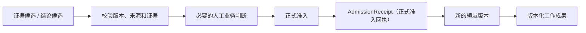

# 02 Legal Domain & Work Product（法律领域与工作成果）

<!-- status: design-baseline-v1; implementation: not-authorized; deepening: domain-knowledge-v1 -->

## Part A — Human Narrative

### 这个模块真正要保护的是什么

法律智能系统最危险的误解之一，是把“模型这次生成了什么”当成“业务上已经正式成立了什么”。模型可以反复生成事实摘要、争议点、适用法条和结论候选，但正式法律工作需要长期回答另一组问题：这次处理的是哪个事项，依据的是哪一版材料，哪些证据被正式采用，最终形成了哪一版结论，谁做了人工业务判断，以及交付出去的工作成果以后还能不能被解释和复核。

法律领域与工作成果模块就是这条长期业务事实边界。运行框架可以替换，检索索引可以重建，模型可以升级，甚至外部宿主也可以变化；已经正式形成的法律业务结果不能因此丢掉身份、版本、依据和人工判断。

这里保存的不是“模型思考过程”，而是经过正式准入后，Zuno 对法律业务世界愿意长期负责的结果。

### 用一个争议分析场景看它怎样工作

假设用户要求分析一份合同争议。系统先确认当前事项使用的是合同 V1、补充协议 V2 和一组沟通记录。知识与证据模块从这些材料中找到若干证据候选，专业能力再提出“某一付款义务可能已经被补充协议改变”的结论候选。

到这里仍然没有新的正式法律结论。系统还要确认：候选引用的确实是当前材料版本；来源位置稳定；证据足够；当前权限仍有效；需要人工复核的地方已经由专业人员处理；这次提交没有和其他并发修改发生版本冲突。

只有这些条件成立后，候选结果才进入 Formal Admission（正式准入），形成新的正式领域版本和必要的工作成果版本。



这条链的关键不是“多走几个步骤”，而是把候选计算和正式业务事实分开。任何模型、检索器、专业能力或智能体都只能把结果送到准入边界，不能越过它直接写成长期事实。

### 哪些东西值得成为正式领域对象

第一阶段只保留七类 Canonical Object（正式领域对象）：Matter（事项）、DocumentVersion（材料版本）、Claim（主张）、Evidence（正式证据）、Finding（正式结论）、HumanDecision（人工业务决定）和 WorkProduct（工作成果）。

这七类对象不是一套完整法律本体，而是最小业务内核。它们之所以进入正式边界，是因为长期工作需要明确它们的身份、版本、来源、权限、依赖、失效、人工判断和审计关系。

Event（事件）、Conflict（冲突）、Dispute（争议点）、LegalIssue（法律问题）、ApplicableLaw（适用法律）、SimilarCase（类案）等同样可能很重要，但默认先作为候选、派生视图或专业能力输出。只有未来证明某一概念确实需要独立身份和长期生命周期，才考虑把它升级为正式领域对象。

这条规则防止数据库随着模型能抽取的概念不断膨胀。**模型能识别一个概念，不等于业务必须为它建立新的正式状态机。**

### 为什么 DocumentVersion 归领域，而知识索引不归领域

DocumentVersion（材料版本）回答“法律业务正在引用哪一份不可变材料”。这是长期业务身份，因此归法律领域。

OCR 结果、切分、关键词索引、向量索引、图视图和 KnowledgeGeneration（知识生成版本）回答“系统怎样把这份材料加工成可检索视图”。这些都可以重新生成，因此归知识与证据模块。

这两个边界必须同时存在。没有正式材料版本，知识模块无法证明自己处理的是哪份业务材料；如果把索引身份反过来当作正式材料身份，未来重建索引时又会让过去的法律结果失去稳定依据。

### 证据候选怎样变成正式证据

知识与证据模块返回 EvidenceCandidate（证据候选）和 CitationLineage（检索引用链），表示“系统在当前范围内找到了什么，以及当时怎样找到它”。这还不是正式 Evidence（证据）。

正式 Evidence 需要由领域边界接纳。它至少必须能够回到明确的 DocumentVersion 和稳定来源位置，并满足当前事项、权限、来源和业务关联要求。必要时，它还要和 Claim、Finding 或 WorkProduct 建立明确依赖。

因此：

```text
EvidenceCandidate（证据候选）
    ≠
Evidence（正式证据）
```

前者属于知识派生结果，后者属于长期业务事实。知识模块可以说明“怎么找到”，领域模块决定“业务上正式采用什么”。

### 候选结论为什么不能只靠置信度写入

模型给出 0.95 的置信度，也不能替代正式准入。一个候选结论能否进入领域，取决于材料版本、证据充分性、来源稳定性、当前授权、必要人工决定、幂等身份和并发版本，而不是某个模型自己报告的 confidence。

正式提交必须留下 AdmissionReceipt（正式准入回执）。它证明是哪一次运行、哪一版计划、哪个步骤、哪个候选结果和哪个幂等身份导致了哪个新的领域版本。

领域变更和匹配的准入回执必须位于同一个 PostgreSQL 事务耐久边界。这样，系统崩溃以后不需要猜“模型是不是已经写过”，而是可以用正式领域事实恢复。

### HumanDecision（人工业务决定）和 ApprovalDecision（安全审批决定）为什么必须分开

两种决定都可能由人点击按钮完成，但它们回答的问题完全不同。

HumanDecision（人工业务决定）回答的是：“专业人员是否接受、修改或拒绝这个法律业务结果？”它会影响正式业务状态，因此属于法律领域。

ApprovalDecision（安全审批决定）回答的是：“这个高风险动作现在是否允许执行？”它属于 Security & Governance（安全与治理）。

例如，法官或业务人员可以先修改一个结论，然后再批准把结果提交到外围系统。前一个动作改变业务上承认的内容；后一个动作只允许某个外部副作用发生。它们不能因为都需要人工参与，就共用一个状态或一张“审批表”来替代语义区分。

### 为什么正式工作成果需要自己的历史引用

知识模块保存 CitationLineage（检索引用链），它说明当时怎样检索、排序和找到候选内容。但一份正式工作成果形成以后，还必须回答：“当时最终采用的是哪一版材料的哪一处？”

因此领域侧保存 WorkProductCitationBinding（工作成果历史引用绑定）。它绑定不可变 DocumentVersion、稳定位置 / span、来源表示或 hash，以及必要的摘录或证据 hash。当前 Chunk ID、Vector ID、Graph Node ID 或索引版本都不能单独成为长期引用权威，因为这些派生身份以后可能被重建。

可以把两者理解为：

- CitationLineage（检索引用链）：解释“候选是怎样被找到的”；
- WorkProductCitationBinding（工作成果历史引用绑定）：证明“正式成果当时实际采用了什么”。

### 新证据来了以后，为什么不能覆盖旧结果

假设昨天 Evidence V1 支持 Finding V3，并形成 WorkProduct V5。今天补充材料形成新的 DocumentVersion 或正式 Evidence V2，系统发现它会影响 V3 的依据。

正确处理不是直接把 V5 的正文覆盖成新内容，而是沿正式依赖关系找到受影响的 Finding 和 WorkProduct，把旧版本标记为需要复核或失效，再对受影响部分执行 bounded re-evaluation（有界重新评估）。新的候选结果经过必要复核和正式准入后，再形成新的版本。

旧 V5 仍然保留，因为它曾经是真实存在、可能已经交付过的历史版本。它只是不能继续冒充当前有效结果。

这里还要区分三件事：领域已经判定 V5 失效；失效通知是否已经送达；外部消费者是否确认收到。第一件事归本模块，后两件事归应用与集成。外部系统离线不能阻止领域失效成立。

### 系统崩溃以后，怎样知道正式提交到底发生没有

一个典型故障是：领域事务已经成功提交新的 WorkProduct 和 AdmissionReceipt，但运行时还没来得及更新 Checkpoint（检查点）就崩溃了。

恢复时应查询匹配的正式准入回执，再修复运行控制状态。不能因为检查点落后，就再次提交同一个业务结果。

反过来，如果运行检查点写着 completed，但找不到匹配的 AdmissionReceipt，就不能说正式提交已经成功。更高的 DomainVersion（领域版本）也不能自动证明当前步骤完成，因为那个版本可能来自另一条运行链。

恢复必须匹配 run、PlanVersion、StepRun、proposal / admission identity 和 idempotency identity 等因果身份，而不是只看“版本号是不是变大了”。

### 它和知识与证据模块到底怎样分工

两者最容易混淆，但边界其实可以用四句话说明：

1. 法律领域拥有 **DocumentVersion（正式材料版本）**；知识模块围绕它建立可重建的 KnowledgeGeneration（知识生成版本）。
2. 知识模块产生 **EvidenceCandidate（证据候选）**；法律领域决定它是否成为正式 Evidence（证据）。
3. 知识模块拥有 **CitationLineage（检索引用链）**；法律领域拥有正式 WorkProduct 的历史引用绑定。
4. 知识模块判断某一任务能不能基于当前知识安全工作；法律领域判断哪些结果已经正式成为业务事实，以及哪些正式结果因为新证据而失效。

这条边界使索引、OCR、向量库和 GraphRAG 可以演进，而不会让正式法律结果随着检索实现一起漂移。

### 为什么它值得成为独立责任域

如果把领域事实放进 Agent Runtime（智能体运行时），业务真相就会和某个执行框架的检查点绑死；如果把它放进知识库，索引和检索系统就会获得不该拥有的正式业务权威；如果允许模型直接写正式状态，不确定输出会绕过版本、证据、人审和安全门禁。

独立领域边界保护的是“长期业务权威”。它让模型、知识、专业能力、运行框架和宿主都可以替换，同时保持正式法律对象、版本、引用、人工决定和恢复语义稳定。

### 当前、目标与缺口

Current Evidence（当前证据）已经证明有限的 Canonical Domain Mutation（正式领域变更）能力：领域准入边界、CAS 版本冲突、幂等 mutation、事务失败不推进版本和 SQLAlchemy 持久化路径；Citation Provenance Guard（引用来源校验）还验证了 Claim→Evidence→SourceSpan→DocumentVersion 的部分关系。

这些证据不能证明完整领域模块已经实现。真实 PostgreSQL 并发、完整 AdmissionReceipt、HumanDecision 端到端、WorkProduct 生命周期、跨运行失效传播、新证据局部重评和生命周期执行仍然是 Gap（缺口）。目标状态仍然是 design available，而不是 production ready。

## Part B — Engineering / Agent Reference

### B1 Scope / Global Invariants

本模块是正式法律业务状态的唯一权威边界，遵守以下全局不变量：

1. 第一阶段 Canonical Kernel 仅包含 Matter、DocumentVersion、Claim、Evidence、Finding、HumanDecision、WorkProduct；扩张必须另有架构依据。
2. Model、Knowledge、Capability、Specialist 和 Runtime 只产生 Proposal、Candidate、Observation、Reference 或 Receipt，不直接写 Canonical Domain State。
3. EvidenceCandidate != Evidence；CitationLineage != WorkProductCitationBinding。
4. Formal Admission 只有在持久化 Domain mutation 与匹配 AdmissionReceipt 成功后才成立。
5. 历史版本不可被静默覆盖；新证据通过依赖关系导致 review-required / stale 和新版本，而不是 destructive rewrite。
6. Runtime Checkpoint、Index write、Queue ACK、HTTP 2xx 和 Telemetry 都不能单独证明 Domain Success。
7. Domain Commit + AdmissionReceipt 与 Runtime Checkpoint 之间默认不使用跨 Store 2PC。

### B2 Responsibility / Ownership

| 责任 / 事实 | 本模块权限 | 其他边界权限 |
| --- | --- | --- |
| Matter / DocumentVersion identity | 创建、版本化、失效 / 生命周期执行 | 读取稳定引用，不自行创建替代身份 |
| Claim / Evidence / Finding | 正式准入、变更、依赖与失效 | 产生候选或读取快照 |
| HumanDecision | 保存正式人工业务决定 | UI / Host 可以采集输入，但不能拥有业务语义 |
| WorkProduct | 正式版本、有效性、历史保留 | 01 负责交付，不重算正式有效性 |
| AdmissionReceipt | 创建并与领域变更同事务提交 | 04 读取用于恢复，不修改 |
| WorkProductCitationBinding | 创建、验证、长期持久化 | 03 提供 CitationLineage / source refs，不拥有正式历史绑定 |
| Domain invalidation truth | 创建 / 变更 | 01 负责通知 Delivery / Ack observation |
| Retention / Deletion / Legal Hold policy | 不拥有政策，只执行本 Store 义务 | 08 是政策 Owner |
| Recovery truth | 领域版本 + AdmissionReceipt 是正式准入恢复锚点 | 04 修复 Runtime Control State |

**Does not own**：KnowledgeGeneration、ReadinessDecision、CitationLineage、Runtime Plan / Checkpoint、Authorization / Approval policy、Tool Effect truth、Delivery / Ack state、Telemetry projection。

### B3 Upstream / Downstream

| 方向 | 责任域 | 本模块接收 / 输出 | 边界规则 |
| --- | --- | --- | --- |
| 上游 | 03 Knowledge & Evidence | EvidenceCandidate、CitationLineage、source / generation refs | 候选不能自动升级为正式 Evidence |
| 上游 | 05 Capability & Skill | Finding / analysis proposal | 只接受候选，不接受 Provider 自称“已正式提交” |
| 上游 | 04 Agent Runtime & Control | run / PlanVersion / StepRun causation、proposal identity | Runtime 只能请求 Admission |
| 上游 | 08 Security & Governance | AuthorizationDecision、ApprovalDecision / policy refs | Domain 消费，不重算安全政策 |
| 上游 | Human / 01 Application | Human review input | 采集边界与领域决定语义分开 |
| 下游 | 04 Agent Runtime & Control | AdmissionReceipt、resulting DomainVersion | 用于完成条件和恢复 |
| 下游 | 01 Application & Integration | WorkProductVersion、WorkProductInvalidationFact | 01 负责发布 / 交付 / 通知 |
| 下游 | 09 Observability & Evaluation | 脱敏 domain/version/review refs | Telemetry 不成为业务权威 |

### B4 Authoritative Facts / Core Objects

七对象最小内核的职责语义如下；这里冻结语义，不冻结 ORM 字段或表：

| 对象 | 业务身份 | 关键依赖 / 生命周期 |
| --- | --- | --- |
| Matter | 一次长期法律业务事项 | 约束材料、主张、证据、结论和成果的业务范围 |
| DocumentVersion | 不可变材料业务版本 | 是知识派生和历史引用的稳定来源锚点 |
| Claim | 被正式记录的主张 | 可被 Evidence 支持 / 反驳，并影响 Finding |
| Evidence | 正式采用的证据 | 来源于稳定 DocumentVersion / span，可建立 Claim / Finding 依赖 |
| Finding | 正式结论 | 依赖 Claim / Evidence / HumanDecision，可能因新证据失效 |
| HumanDecision | 人工业务判断 | 接受、修改、拒绝或要求补充；不同于 Security Approval |
| WorkProduct | 对外或对内长期工作成果 | 版本化、绑定 Finding / Evidence / citation、支持 stale / review-required |

`WorkProductVersion` 是 WorkProduct 的版本化表达，不因为需要版本号就自动创建新的一级聚合。Event、Conflict、Dispute、LegalIssue、ApplicableLaw、SimilarCase 等默认保持 Proposal / Projection / Derived View，除非后续独立评审证明需要正式身份和生命周期。

### B5 Cross-boundary Contracts

#### EvidenceCandidate + CitationLineage（消费）

- Purpose：把 03 找到的证据候选及其检索来源送入正式领域判断。
- Producer：03 Knowledge & Evidence。
- Consumer：02 Legal Domain & Work Product。
- Authoritative Owner：EvidenceCandidate / CitationLineage 归 03；正式 Evidence 归 02。
- Input / Output：DocumentVersion ref、KnowledgeGeneration ref、source location、candidate payload / refs、CitationLineage → admission input。
- Versioning：必须能绑定明确 DocumentVersion / generation / scope；字段未冻结。
- Validation：来源可定位、版本未漂移、当前 Scope / Security 可用。
- Failure Semantics：来源不稳定、版本不匹配或 evidence insufficient 时不得自动准入。
- Idempotency / Replay：候选可重放；正式 Admission 由领域 idempotency identity 去重。
- Security Requirements：消费当前授权，不因候选已缓存而绕过权限。
- Persistence Requirement：候选可以是派生事实；正式采用后必须保存领域侧稳定引用。
- Observability Requirement：记录 candidate / lineage identity，不导出敏感正文。
- Evidence：Citation Provenance Guard、后续真实 lineage lookup tests。

#### AdmissionReceipt（生产）

- Purpose：证明某次运行请求导致了哪一个正式领域版本。
- Producer / Authoritative Owner：02 Domain Admission boundary。
- Consumer：04 Runtime、Recovery、Audit / Review。
- Input / Output：run identity、PlanVersion、StepRun identity、proposal / admission identity、idempotency identity、expected prior DomainVersion → resulting DomainVersion receipt。
- Versioning：绑定唯一 resulting DomainVersion 与预期前置版本。
- Validation：Domain mutation 与 Receipt 必须同一 PostgreSQL transaction durability boundary。
- Failure Semantics：无匹配 Receipt 时，不得宣布要求 Formal Admission 的 Step 正式完成。
- Idempotency / Replay：同一 admission / idempotency identity 重放返回既有合法结果；同 key 不同输入拒绝。
- Security Requirements：提交时重新消费当前授权和必要 HumanDecision / Approval references。
- Persistence Requirement：durable Domain boundary；不能只存在 Checkpoint / Trace。
- Observability Requirement：Trace 只引用 Receipt identity。
- Evidence：当前 mutation evidence + 后续 admission causation fault tests。

#### WorkProductCitationBinding（生产）

- Purpose：保存正式 WorkProductVersion 当时实际使用的不可变材料位置。
- Producer / Authoritative Owner：02，在正式准入时建立或验证。
- Consumer：Review、Audit、01 Delivery、后续 staleness analysis。
- Input / Output：DocumentVersion、immutable source ref / hash、stable location / span、source representation identity / hash、必要 excerpt / evidence hash、可选 CitationLineage ref → durable binding。
- Versioning：绑定 WorkProductVersion；不能被新 Index / Graph / Chunk 替换。
- Validation：必须回到原始不可变表示；索引内部 ID 不可作为唯一长期权威。
- Failure Semantics：正式成果要求的绑定不完整时，不得 Formal Admit 该成果。
- Idempotency / Replay：同一 WorkProductVersion + binding identity 幂等。
- Security Requirements：引用最小化、按权限展示，必要正文不写普通 Trace。
- Persistence Requirement：Domain durable boundary。
- Observability Requirement：只暴露稳定 identity / completeness 结果。
- Evidence：后续 source replacement / historical citation tests。

#### WorkProductInvalidationFact（生产）

- Purpose：声明某个已存在 WorkProductVersion 因正式依赖变化而失效或需要复核。
- Producer / Authoritative Owner：02。
- Consumer：01 Delivery、04 targeted reevaluation、Review / current-validity query。
- Input / Output：new DocumentVersion / Evidence / dependency change → affected WorkProductVersion + invalidation reason / dependency refs。
- Versioning：绑定被影响的正式版本，不覆盖历史版本。
- Validation：必须能说明由哪个已接纳依赖变化触发；不能由一次检索排名变化直接改正式状态。
- Failure Semantics：依赖图不足时扩大复核范围或进入人工复核，不能假装局部影响已知。
- Idempotency / Replay：同一 invalidation cause 对同一版本幂等。
- Security Requirements：通知内容由 01 按当前权限最小化。
- Persistence Requirement：Domain durable fact。
- Observability Requirement：Telemetry 只记录失效 identity / reason code refs。
- Evidence：后续 new-evidence staleness / invalidation tests。

### B6 Normal Flow

**新正式结果：**

```text
EvidenceCandidate / proposal
→ validate DocumentVersion + source + dependency
→ consume current AuthorizationDecision
→ evaluate required HumanDecision
→ compare expected prior DomainVersion
→ idempotency check
→ atomic domain mutation + AdmissionReceipt
→ create / validate WorkProductCitationBinding when applicable
→ expose resulting DomainVersion / WorkProductVersion
```

如果 WorkProduct 的合法性依赖历史引用绑定，则准入事务不能先把成果标为正式有效，再异步“以后补引用”；要么引用绑定已经存在并被验证，要么作为同一领域提交所依赖的耐久事实一起成立。

**新证据导致失效：**

```text
new canonical DocumentVersion / Evidence
→ dependency lookup
→ mark affected Finding / WorkProduct review-required or stale
→ emit WorkProductInvalidationFact
→ request bounded reevaluation when safe
→ new proposal
→ HumanDecision when required
→ new Formal Admission / new version
```

### B7 State / Lifecycle

这里冻结状态语义族，不冻结最终 enum 名称。

**正式结果版本语义：**

```text
candidate（领域外）
→ admitted / current
→ review-required or stale  [依赖变化]
→ superseded by newer admitted version
```

旧版本即使被 superseded，也继续作为历史事实存在；默认不通过覆盖或删除消除过去发生过的正式结果。

**HumanDecision 语义族：** 接受、修改、拒绝、要求补充。是否需要更多状态由后续详细评审决定，但必须与 Security Approval 分开。

**WorkProduct 生命周期至少区分：** 已正式形成、当前有效、需要复核 / stale、存在更新版本但保留历史。Domain invalidation、01 的 Delivery state 和 Consumer acknowledgement 不允许压成一个 `WorkProduct.status`。

### B8 Failure Taxonomy

| 失败 | 检测 Owner | 正式事实 / 立即动作 | 是否可 Retry | 是否需要 Replan / Human |
| --- | --- | --- | --- | --- |
| expected DomainVersion 冲突 | 02 | 不覆盖写；返回 version conflict | 原请求不可盲重试 | 调用方重新读取后 Replan 或人工 |
| EvidenceCandidate 来源不稳定 | 02 + 03 refs | 不准入正式 Evidence / WorkProduct | 03 可修复派生处理 | 证据无法恢复时人工 |
| 证据不足 | 02 eligibility | 不创建正式 Finding | 单纯重复同输入无意义 | 补证据 / Replan / Abstain |
| Authorization 已失效 | 08 决定，02 执行 | fail closed / pause | 重新授权后才可继续 | 可能人工 |
| 缺必要 HumanDecision | 02 | 保持 proposal / review-required | N/A | Human required |
| 同一幂等 key 不同输入 | 02 | reject conflict | No | 调用方修正 |
| Domain transaction 失败 | 02 Store | DomainVersion 不推进 | 同输入可安全 Retry | 否，除非重复失败 |
| Domain commit 成功、Checkpoint 失败 | 04 检测 + 02 Receipt | 使用 Receipt 修复 Runtime | 不重复 Domain commit | Recovery |
| Checkpoint completed、Receipt 缺失 | 04 / 02 query | 不承认 Formal Admission | 不能以 checkpoint 重放提交 | Review / causation check |
| 新证据影响范围不确定 | 02 dependency | 扩大 review-required 范围 | N/A | bounded reevaluation 或 Human |

### B9 Retry / Replan / Reconcile / Recovery / Idempotency

- **Retry（重试）**：仅用于领域事务在提交前失败、且输入、前置版本、授权和准入条件仍成立的情况；同一幂等身份不得产生第二个正式结果。
- **Replan（重规划）**：DomainVersion 冲突、依赖结构改变、证据条件变化使原计划不再正确时，由 04 读取最新领域快照后决定新 PlanVersion；02 不自行规划任务。
- **Reconcile（对账）**：外部现实副作用由 06 负责。本模块只消费已经确认的 EffectReceipt / ReconciliationReceipt，不自行猜外部结果。
- **Recovery（恢复）**：正式准入恢复锚点是 DomainVersion + matching AdmissionReceipt + 必要 WorkProductCitationBinding，而不是 Runtime Checkpoint。
- **Idempotency（幂等）**：同一 idempotency identity + 同一规范化输入返回既有合法结果；同 identity 不同输入必须冲突失败。

### B10 Security / Approval / Audit

02 在正式读取 / 准入边界消费 08 的 AuthorizationDecision、Security Epoch 和必要 Approval reference，但不拥有授权政策。

HumanDecision 是业务事实；ApprovalDecision 是高风险动作是否允许执行的安全事实。两者可以引用同一 human principal，但不能共用状态语义。

Effective Lifecycle Policy（有效生命周期政策）由 08 拥有。本模块负责执行自己 Store 中的 retention、deletion、legal hold 和必要 purge / retention obligation，并保存执行事实；执行结果不能反向改变政策。

关键领域变更需要可审计，但普通 Telemetry 不能替代要求耐久化的 Audit Fact / AuditPersistenceReceipt。Secret 不进入普通 Domain payload。

### B11 Persistence / Transaction Boundaries

PostgreSQL 是第一阶段 Canonical Domain State 的默认耐久边界。至少需要保存正式对象版本、依赖、HumanDecision、WorkProductCitationBinding 和 AdmissionReceipt；具体表结构和 Migration 尚未冻结。

关键事务边界：

```text
expected DomainVersion check
+ canonical domain mutation
+ matching AdmissionReceipt
+ admission-critical citation binding / dependency facts when required
= one Domain transactional durability boundary
```

不在该事务中等待 LangGraph Checkpointer、远端 Consumer acknowledgement 或其他远端服务提交，因此默认不引入跨 Store 2PC。

Knowledge index、Runtime checkpoint、Telemetry、Delivery state 都可以在各自边界稍后恢复，但不得被解释成已经替代 Domain commit。

### B12 Observability / Evaluation

Telemetry 需要关联 Matter、DocumentVersion、DomainVersion、Claim / Evidence / Finding / WorkProduct refs、AdmissionReceipt identity、human review outcome 和 invalidation event，但默认不导出敏感正文。

评测至少覆盖：

- provenance completeness / citation binding correctness；
- unsupported formal admission rate；
- Human review acceptance / modification / rejection；
- stale / review-required propagation correctness；
- bounded reevaluation correctness；
- admission idempotency / version conflict；
- Domain commit vs Runtime checkpoint fault recovery。

这些测量证明模块行为，不等于整个产品 production ready。

### B13 Current / Target / Gap / Evidence

**Current**：[`implementation-wave-001.md`](../evidence/implementation-wave-001.md) 证明有限 Domain mutation、CAS、幂等、事务失败保护和 Citation Provenance Guard；真实 PostgreSQL race、完整正式准入链仍未证明。

**Target**：完整七对象最小领域内核、Formal Admission + AdmissionReceipt、正式 Evidence、历史引用绑定、版本化 WorkProduct、HumanDecision、依赖失效和受控局部重评。

**Gap**：真实 PostgreSQL integration / concurrency、Admission causation fault injection、HumanDecision E2E、WorkProduct version lifecycle、新证据 bounded re-evaluation、historical citation replacement test、lifecycle enforcement 和跨运行 invalidation。

**Evidence required before Current upgrade**：代码 / Migration、真实 PostgreSQL 集成、单元 / 集成测试、故障注入、E2E、审计 / Trace 关联与评测结果。文档完整度不是实现证据。

### B14 Code / Database / Migration Constraints

后续实现必须先冻结对象 identity、version、dependency、admission、HumanDecision、historical citation 和 invalidation 语义，再讨论 ORM、table、index 和 Migration。

不得因为现有数据库字段、模型抽取结果或某个 Provider 返回结构存在，就把 Proposal 自动升级为 Canonical Object。Migration 必须保留历史版本和已发布成果的依据，不能通过 destructive rewrite 抹掉旧 WorkProductVersion 的来源。

本 Design Baseline 不授权新增 God Domain Service，不要求独立 Domain 微服务，不授权 Event Sourcing、跨 Store 2PC 或完整数据库重构。实现授权需要独立任务和验收标准。
