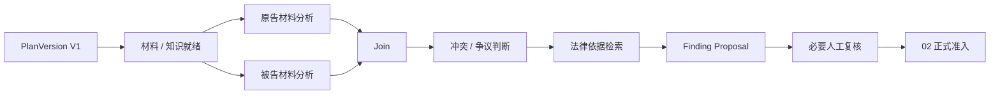
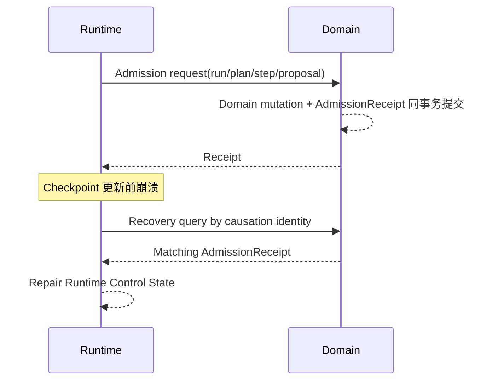

# 04 Agent Runtime & Control（智能体运行与控制）

<!-- status: design-baseline-v1; implementation: not-authorized; native-runtime: measurement-gated; deepening: cross-module-consistency-v2 -->

## Part A — Human Narrative

### 这个模块不是为了让所有问题都“Agent 化”

简单法律问答不需要先造一个复杂运行时。用户问“合同第 8 条写了什么”，只要范围、权限和材料就绪，检索到原文，生成有据回答并通过发布资格检查即可。

运行控制真正有价值的任务，是那些需要多个步骤、依赖关系、并行处理、人工等待、预算控制、失败恢复或中途修改剩余计划的复杂任务。它回答的是：**这次任务应该先做什么、哪些步骤可以同时做、执行到哪里、失败后继续还是改计划、暂停以后怎样恢复，以及最终能不能形成一个可信 RunOutcome（运行结果）。**

它不回答“法律业务世界最终承认什么”。那是 02 法律领域与工作成果的责任。

### 什么时候进入 Zuno 原生运行时，什么时候不进入

总体架构允许两条路径共存。

普通 `Generic Host（通用 Agent 宿主）` 可以承担简单问答和简单工作流，只要它遵守安全、知识就绪、证据和发布边界。只有任务需要 Zuno 自己提供更强的持久控制、复杂计划、并行、人工中断、重规划或恢复时，才进入 `Zuno Native Agent Runtime（Zuno 原生智能体运行时）`。

一旦进入原生运行时，就必须有 Plan（计划）：简单但需要运行时能力的任务使用 `Deterministic Single-Step Plan（确定性单步计划）`；复杂任务使用 `Dynamic DAG Plan（动态有向无环计划）`。

不能进入运行时以后再通过 `direct_answer` 之类的旁路绕过 Plan、Trace、Budget、AnswerPolicy 和 RunOutcome。保持简单的方式是“不进入重运行时”或使用真正单步计划，而不是进入以后失去控制边界。

### 固定运行图、动态计划和单步执行图各负责什么

目标结构保持三层：

```text
固定 AgentRunGraph（整次运行控制）
+
动态 Plan DAG（这次任务要做哪些步骤、依赖和并行关系）
+
固定 StepExecutionGraph（一个步骤内部怎样执行）
```

AgentRunGraph 负责运行生命周期、计划激活、调度、预算、中断、恢复和最终结果。

Plan DAG 只描述当前任务的目标、Step、依赖和可并行关系。它不是一份长期业务流程配置，也不是 Product Agent Definition。

StepExecutionGraph 管单个 Step 内部的执行循环，包括 ReAct（推理—行动—观察）、动作评估、步骤验收和必要 Reflection（反思）。

这种结构允许“运行框架稳定、每次任务的计划不同”，避免为了动态计划去动态拼一整套不可维护的 Graph topology。

### Planner（规划器）怎样决定 Step 粒度

Planner 必须知道 05 Capability（专业能力）和 Executor（执行器）的真实边界，不能把“分析全案、找证据、适用法律、形成结论、提交系统”塞成一个巨大 Step。

一个可执行 Step 至少应该能明确：输入是什么、依赖什么、输出是什么、怎样验收、需要哪些证据、预算是多少、有没有副作用、允许不允许并行。

同时也不需要把每个普通函数调用都拆成图节点。Step 的边界应该围绕“可独立验收和恢复的工作单元”，而不是追求节点数量。

### 一个复杂任务怎样从计划走到可执行步骤

假设任务要比较原被告两组材料、识别争议、检索法条并形成工作成果。

Planner 创建 PlanVersion V1：先确认材料和知识就绪；随后两个材料分析 Step 可以并行；Join 后做冲突判断；再检索法律依据；最后形成 Finding Proposal，进入人工复核和 02 正式准入。



运行控制负责这条执行关系，但 A / B 产出的专业候选仍由 05，证据由 03，正式结果由 02，权限由 08 各自拥有。

### 并行的目标是“安全吞吐”，不是同时启动越多越好

一个 Step 依赖已经满足，并不代表它就可以立即并行。

Ready Step 还要检查：输入版本是否确定、是否会写同一资源、是否争用排他资源、是否有不可逆副作用、预算 / 配额是否足够、当前 Security Gate（安全门禁）是否允许。

默认串行的情况包括：存在数据依赖、写同一业务资源、不可逆副作用、排他资源、Replan、Final Synthesis（最终综合）。

在安全前提成立时才最大化并行。实现优先复用 LangGraph 的 `Send`、Reducer（归并器）、Subgraph（子图）和 Checkpointer（检查点）等原语，而不是预先自建分布式调度系统。

### 并行分支回来以后为什么还需要 Join

并行只解决“可以同时算”，不能解决“结果能否一起使用”。

两个分支都成功返回，也可能引用不同材料版本；一个分支可能证据不足；两个分支可能在关键事实判断上冲突；还有旧 Plan 的分支可能在 Replan 后晚到。

Join 需要先检查 causation（因果身份）、PlanVersion、输入版本、结果资格和冲突情况，再决定是否接受全部、接受部分、触发 Join Reflection（汇合反思）、扩大检索、Replan 或交人工。

因此 Reducer 只是状态合并机制，不等于业务上的 Join Acceptance（汇合验收）。

### 质量控制为什么不是每一步都再调用一次大模型

每个 Action（行动）都必须有 Evaluation（评估），每个 Step 都必须有 Acceptance（验收），但“有评估”不等于“再调用一个 Critic 模型”。

Schema 校验、Citation Check、权限检查、预算、单元测试、确定性规则等能由代码完成时，优先使用确定性能力。

只有 Acceptance 失败、证据冲突、关键决策、重复失败、高风险或部分并行结果冲突时，才触发模型级 Reflection。

简单任务默认只执行 Deterministic Final Gate（确定性最终门）；复杂任务和 Strict Grounded Answer（严格有据回答）才执行模型级 Final Reflection。

这让质量控制成为“触发式决策系统”，而不是“每一步都多花一次模型调用”。

### Retry（重试）、Replan（重规划）和 Reconcile（对账恢复）为什么必须严格区分

这三种控制处理的是三个完全不同的问题。

模型 Provider 503，但输入、能力、依赖和计划仍然正确，是 Retry。

当前 Tool / Capability 的 schema、语义、材料前提或依赖发生变化，原计划假设失效，是 Replan。

外部 POST 已经发出，但现实世界是否执行未知，是 Reconcile；04 不自己猜结果，而是等待 06 的 Effect / Reconciliation facts。

```text
执行暂时失败 + 计划仍正确
→ Retry

计划结构 / 依赖 / 能力 / 事实假设失效
→ Replan

外部现实结果未知
→ Reconcile
```

把三者混在一起，会导致无限重试、错误计划持续执行或重复现实副作用。

### PlanVersion 为什么激活以后不可原地修改

复杂任务运行中可能出现新证据、能力版本变化或分支失败，需要修改剩余计划。

如果直接修改正在执行的计划，已经派出的分支无法知道自己属于旧假设还是新假设。因此 PlanVersion 激活后不可变；Replan 创建 V2、V3……新的版本。

并行环境进入 Replan 前必须经过 Replan Barrier（重规划屏障）：停止继续从旧 Plan 派发新 Step，收集 / 取消 / 标记仍在飞行的旧分支，建立新计划后再继续。

晚到的旧分支必须带原 PlanVersion 和 causation identity。它可以被丢弃、重新评估或作为信息输入，但不能直接写入当前计划状态或正式领域状态。

### Human-in-the-loop（人在回路）暂停以后为什么副作用必须幂等

LangGraph 当前官方 `interrupt()` 语义是：图通过 Checkpointer 保存状态，使用同一 thread id 恢复；恢复时会从触发 interrupt 的 node 起点重新执行，因此 interrupt 之前的 node 内代码可能再次运行。

这意味着不能在同一个 node 里先发送一个不可幂等外部请求，再 `interrupt()` 等人批准，然后期待恢复时从那一行以后继续。

外部副作用应放进 06 Tool Runtime & Effects 的受控边界，或者设计成可以安全重复 / 通过持久任务结果复用的任务。人工中断不是绕过幂等设计的理由。

### 领域提交成功、Checkpoint 失败以后怎么恢复

假设一个 Step 的完成条件是“Finding Proposal 已经正式准入”。02 在 PostgreSQL 事务里成功写入新的 Domain Version 和匹配 `AdmissionReceipt（正式准入回执）`，但 04 还没来得及更新 LangGraph Checkpoint 就崩溃。

恢复时先读取领域的 AdmissionReceipt，确认当前 run / PlanVersion / StepRun / proposal / idempotency identity 对应的业务提交已经发生，再修复 Runtime Control State。不能因为 Checkpoint 落后而重复提交。

反过来，如果 Checkpoint 显示 Step completed，但没有匹配 AdmissionReceipt，就不能宣布 Formal Admission（正式准入）成功。



这条因果恢复链比“DomainVersion 变大了”更强，因为更高版本可能来自别的运行。

### Single Controller（单控制器）和 Specialist Agent（专家智能体）怎样共存

Zuno 默认采用 Single Controller，不建设产品级自治 Multi-Agent Runtime。

Specialist Agent 或 Subgraph 可以作为某个 Step 的执行方式，也可以在安全条件允许时并行。它们输出 Proposal、BranchResult、Evidence refs、Observation 或 Recommendation，不得直接提交 Canonical Domain State、批准权限、激活 PlanVersion、绕过 Budget、执行未审批 Effect 或提交长期 Memory。

一次性 Specialist 通常继承父运行的 checkpointer / subgraph persistence 即可。只有确实需要独立于父任务跨多次调用维持生命周期时，才考虑独立 thread / checkpoint。

### Checkpointer 是控制状态，不是业务数据库

LangGraph Checkpointer 保存 graph state、interrupt / resume 和故障恢复需要的 Runtime Control State。它不能因为底层也使用 PostgreSQL，就和 02 的 Domain Store 混成同一种事实。

`PostgreSQL（领域持久化）` 保存 Canonical Domain facts / AdmissionReceipt；`LangGraph Checkpointer（运行检查点）` 保存执行控制。两者通过 stable identity / receipt 对账，不默认做跨 Store 2PC。

### 一次 Run 从开始到结束，真正需要管理的是“可继续性”

运行状态不能只分成“执行中 / 成功 / 失败”。复杂任务可能正在规划、等待材料、等待审批、等待外部对账、暂停给人工输入，也可能已经完成大部分步骤但因为最终证据不足而主动拒答。

运行控制真正要维护的是：当前激活哪一版计划，哪些 Step 已经被可靠接受，哪些仍可以派发，哪些正在等待外部事实，预算和期限还剩多少，下一次恢复从哪里继续，以及最终 RunOutcome 能够引用哪些已经被其他 Owner 证明的事实。

因此 `COMPLETED` 也不是“所有事情都成功”。一个 Run 可以正常结束但结果是 Abstain；也可以部分完成后因为预算耗尽返回明确的受限结果；还可以运行本身结束，而正式 WorkProduct 因缺少 AdmissionReceipt 仍然不能成立。

### Step 执行成功为什么还必须再过 Acceptance（验收）

模型返回 200、Capability 返回一个对象、工具返回一个响应，都只能说明“这次调用得到了东西”。Step 是否完成，要看这份输出是否满足该 Step 的任务约束。

例如“找出支持主张 A 的证据”这个 Step，即使检索调用成功，如果只找到与主张无关的材料，也不能标为 Accepted；“生成法律依据”即使模型输出格式正确，如果引用无法回到当前材料或法条，也只能失败或进入反思 / 补检索。

Step Acceptance 负责把技术执行成功转成运行控制可以依赖的“这个工作单元已经达到约定结果”。这也是为什么每个 Action 都要评估、每个 Step 都要验收，而不是看某个 Provider 的 success flag。

### Budget（预算）和 Deadline（期限）为什么属于控制逻辑，而不只是报表

预算不仅是事后统计 Token 花了多少。Planner 和调度器在派发前就需要知道剩余预算是否足以完成当前 Step、是否还能做模型反思、是否允许继续扩大检索，以及是否应该选择更便宜但仍符合质量门的路径。

期限同样如此。如果一个工作成果必须在五分钟内返回，某个分支虽然理论上还能继续跑二十分钟，也不应该无条件等待。运行控制可以选择跳过非必要增强、缩小剩余计划、提前进入最终综合，或者明确返回未完成 / 拒答，而不是直到超时才把整次运行标成“系统异常”。

预算耗尽、Quota 耗尽和业务证据不足是三种不同失败。前两者可能让计划改走更便宜的路径，后者则不能通过省钱解决。

### Plan Repair（计划修复）和任务中途 Replan 也不是完全一回事

计划刚生成时，可能存在结构性问题：依赖环、Step 过大、引用了不存在的 Capability、遗漏必要的最终综合。这时还没有真正执行旧计划，可以让 PLAN_REPAIR 对草案进行修复，再激活第一版可执行 PlanVersion。

Replan 则发生在已经有激活计划以后：新证据到来、能力不可用、材料前提改变、分支结果推翻旧假设等现实变化使“剩余计划”不再正确。Replan 必须产生新的不可变 PlanVersion，并处理旧分支的晚到结果。

把两者分开，可以避免“Planner 每次写坏计划都算一次业务重规划”，也避免运行中把真正的事实变化当成普通格式修复。

### 用户取消任务以后，系统到底应该停下什么

取消首先意味着停止未来还能安全停止的派发、模型调用和计算，尽快让运行进入明确的终止状态。但取消不是时间机器。

如果某个 Domain Admission 已经提交，它不会因为 Run 被取消就消失；如果外部 Tool 已经执行，取消不能把现实动作撤销；如果 Tool 正在飞行且结果未知，仍然需要 06 Reconcile；如果模型调用已经产生费用，07 仍然要结算 Usage。

因此取消的正确目标是“阻止更多不必要工作并停止扩大副作用”，而不是伪造一个全局回滚。需要真正撤销现实效果时，应通过新的、明确受控的补偿动作处理，而不是修改旧 EffectReceipt。

### Final Synthesis（最终综合）为什么默认串行，而且不能重新发明证据

并行分支可以分别分析不同材料、不同争议点，但最终综合需要基于已经通过 Join / Step Acceptance 的结果形成一个一致输出。这个阶段如果继续让多个分支各自改写最终答案，就会重新引入冲突和覆盖问题，所以默认串行。

最终综合的职责是组织已接受事实、证据和候选，不是为了“让答案更完整”重新生成没有来源的新事实。严格有据回答中，任何关键结论都应该能回到已接受的 Evidence refs / Capability outputs；缺少依据时可以暴露不确定性或 Abstain，而不能由 Synthesizer 自己补齐。

Final Gate 再检查格式、引用、预算、AnswerPolicy 和必要安全 /业务资格。复杂任务需要模型级 Final Reflection 时，它仍然只能提出质量判断，不能越过 02 / 08 / 01 的正式准入、授权和发布边界。

### 原生运行时为什么仍然是 Measurement-gated（测量门控）

模块边界设计完整，不代表自有运行时已经证明必要。

必须通过 A/B/C 对照回答：Generic Host + Legal Skills、Generic Host + Zuno Legal Backend、Zuno Native Runtime + First-class Domain State，在真实复杂任务的质量、恢复、人工介入、成本、时延和开发复杂度上分别表现怎样。

如果通用宿主加法律后端已经满足持久执行和恢复，Zuno 就应该缩小自有运行时，而不是为了架构完整保留它。

### 当前、目标与缺口

Current Runtime Baseline 已证明 `AgentRunApplicationService → AgentRuntimeService → AgentRunStore / checkpoint → Agent Core graph` 的主路径，以及持久化失败、approval interrupt、duplicate claim、cancel、restart、unknown effect reconcile 等有限语义。

Target 是 Single Controller + fixed AgentRunGraph + dynamic Plan DAG + fixed StepExecutionGraph，配合 safe parallelism、triggered reflection、immutable PlanVersion、AdmissionReceipt recovery 和明确 Retry / Replan / Reconcile。

Gap 包括真实复杂 DAG 故障注入、并行 late branch、Replan Barrier、正式四 Profile runtime、HA / fencing / takeover、AdmissionReceipt recovery E2E、Security Epoch drift、Specialist benefit measurement 和 A/B/C benchmark。没有这些证据不能宣称 production-ready runtime。

## Part B — Engineering / Agent Reference

### B1 Scope / Global Invariants

1. Native Runtime entrant always has a Plan：simple = deterministic single-step；complex = dynamic DAG。
2. 不允许 `direct_answer` 绕过 Plan / Trace / Budget / AnswerPolicy / RunOutcome。
3. Fixed AgentRunGraph + dynamic Plan DAG + fixed StepExecutionGraph。
4. PlanVersion immutable after activation；Replan 创建新版本。
5. Ready Step 只有在 dependency / input / resource / side-effect / budget / quota / security gates 全部允许时才并行。
6. Action always evaluated；Step always accepted；model Reflection triggered, not universal。
7. Retry != Replan != Reconcile。
8. Formal Admission-required Step 没有 matching AdmissionReceipt 不得完成。
9. Runtime Checkpoint != Domain Commit != Tool Effect truth。
10. Single Controller 是默认；Specialist / Multi-Agent 是可选执行模式，不能获得更高权限。
11. Resume / Retry / Replan 发生新受保护访问时重新授权。
12. Native Runtime remains conditional / measurement-gated。

### B2 Responsibility / Ownership

**Owns**：AgentRun、Plan / PlanVersion、Step / StepRun、Branch / Join control、Dispatch decision、Budget control、parallel scheduling、Action Evaluation control、Step Acceptance control、Reflection trigger、Retry / Replan / Reconcile control decision、Interrupt / Resume、Checkpoint-based recovery、RunOutcome。

**Does not own**：02 Canonical Domain State / AdmissionReceipt；03 Knowledge Readiness / EvidenceCandidate；05 Capability semantics；06 Effect truth；07 provider / usage truth；08 Authorization / Approval；01 publication；long-term Memory truth。

### B3 Upstream / Downstream

上游主要接收：01 task goal / scope / product Agent version refs；02 domain version / formal receipt refs；03 Readiness / Evidence refs；05 capability metadata / eligibility；07 model role result / usage refs；08 security / budget-related decisions；06 effect / reconciliation receipts。

下游：调度 03 / 05 / 07 / 06，必要时向 02 提交 Formal Admission request，向 01 返回 typed RunOutcome / result / publication inputs，向 09 输出脱敏 runtime telemetry。

### B4 Authoritative Facts / Core Objects

核心控制对象族：AgentRun、PlanVersion、StepDefinition / StepRun、Dependency / Ready relation、Branch / Join control、Dispatch ref、BudgetState、Interrupt、ControlDecision、RetryAttempt、ReplanBarrier、CheckpointRef、RunOutcome、Specialist / Subgraph execution ref。

Plan DAG 是某次运行的控制事实，不是 Agent Definition，也不是 Canonical Domain graph。

### B5 Cross-boundary Contracts

Runtime 跨边界主要消费 / 产生已有权威 Contract：

- Task / Scope / AgentVersion refs from 01；
- ReadinessDecision / EvidenceCandidate / Citation refs from 03；
- CapabilityVersion / Eligibility / typed proposal from 05；
- ModelRouting / ModelResult / Usage refs from 07；
- AuthorizationDecision / ApprovalDecision / SecurityEpoch refs from 08；
- PreparedAction / EffectReceipt / ReconciliationReceipt from 06；
- AdmissionReceipt / DomainVersion / HumanDecision refs from 02；
- RunOutcome to 01。

Runtime 只持有必要引用，不复制这些模块的权威状态。

### B6 Normal Flow

```text
Task Analyze
→ choose deterministic single-step or Dynamic DAG
→ create immutable PlanVersion
→ activate plan
→ calculate Ready Steps
→ dependency / input / resource / side-effect / budget / quota / security gates
→ dispatch StepExecutionGraph
→ ReAct Action / Observation
→ Action Evaluation
→ Step Acceptance
→ conditional Step Reflection
→ Join Evaluation / Join Reflection when needed
→ Retry or Replan or wait for Reconcile
→ Final Synthesis
→ deterministic Final Gate or model Final Reflection
→ Formal Admission when required
→ verify AdmissionReceipt
→ RunOutcome
```

### B7 State / Lifecycle

最终 enum 后续冻结，但至少覆盖：

```text
AgentRun:
CREATED → PLANNING → RUNNING
→ WAITING_INPUT / WAITING_APPROVAL / WAITING_RECONCILIATION
→ COMPLETED / FAILED / CANCELLED / ABSTAINED

PlanVersion:
DRAFT → ACTIVATED → SUPERSEDED
ACTIVATED is immutable

StepRun:
PENDING → READY → DISPATCHED → RUNNING
→ ACCEPTED / RETRYABLE_FAILURE / REPLAN_REQUIRED / WAITING / TERMINAL_FAILURE

Replan:
TRIGGERED → BARRIER → NEW_PLAN_CREATED → ACTIVATED

Branch:
IN_FLIGHT → ARRIVED → ACCEPTED / REJECTED_STALE / REEVALUATION_REQUIRED
```

状态名是设计语义，不是数据库 enum 冻结。

### B8 Failure Taxonomy

| 失败 | Detection owner | Runtime control | Recovery anchor |
| --- | --- | --- | --- |
| model 503 / rate limit | 07 / 04 | Retry within budget | ModelCallAttempt / StepRun |
| Step schema / acceptance failure | 04 / 05 | parameter repair / Retry / Reflection | Step input/output + acceptance evidence |
| evidence conflict | 03 / 05 / 04 | Join Reflection / more retrieval / Replan | Evidence refs + PlanVersion |
| capability semantic drift | 05 | Replan | CapabilityVersion / eligibility |
| tool schema drift | 06 | Replan | ToolVersion / PreparedAction failure |
| budget / quota exhausted | 04 / 07 | stop / replan to cheaper path / abstain | BudgetState / Usage refs |
| security revoked | 08 | pause / stop / replan permitted path | SecurityEpoch / AuthorizationDecision |
| partial parallel failure | 04 | Join policy / selective Retry | Branch causation + StepRun |
| late old-plan branch | 04 | reject / re-evaluate | PlanVersion + causation identity |
| checkpoint write failure | 04 / Platform | recover from previous checkpoint + durable external receipts | CheckpointRef + receipts |
| Domain commit succeeded / checkpoint failed | 02 + 04 | repair runtime from AdmissionReceipt | matching AdmissionReceipt |
| checkpoint says complete / no AdmissionReceipt | 04 + 02 | formal completion denied | Domain query by causation |
| external effect unknown | 06 | wait Reconcile | Effect / Reconciliation receipts |
| controller crash / takeover ambiguity | 04 / Platform | fencing / recovery protocol | checkpoint + lease/fencing + receipts |

### B9 Retry / Replan / Reconcile / Recovery / Idempotency

**Retry**：计划、依赖、能力语义、输入和安全条件仍成立，仅一次执行失败。同一 action / Step attempt 使用稳定 identity，预算继续累计。

**Replan**：任务结构、依赖、材料、能力、工具、安全可行性或关键事实假设失效。创建新 immutable PlanVersion，并通过 Replan Barrier。

**Reconcile**：外部 Effect 结果未知。04 进入等待控制状态，06 查询现实事实；04 不自行重发动作。

**Recovery**：从 Checkpointer 恢复 graph control state，再用 Domain / Effect / Security / Audit durable receipts 对账。外部权威 receipt 优先于过期 Runtime 推断。

**Idempotency**：PlanVersion、StepRun、Action、Admission、Effect 均通过稳定 causation / idempotency identities 关联。Late branch 必须校验 PlanVersion / input version 后才能参与 Join。

### B10 Security / Approval / Audit

受保护读取、模型外发、Secret 使用、Tool Effect 和 Formal Admission 前消费当前 08 决定。Resume / Retry / Replan 不自动继承过期授权。

Budget / AnswerPolicy / Security Gate / Approval Gate 都不能被模型输出绕过。

高风险 Effect 的 mandatory audit 由 08 定义，06 / audit persistence boundary 提供 durable proof。Runtime 只消费结果。

Specialist / Subgraph 继承父任务的 scope / budget / security constraints，不能形成权限升级通道。

### B11 Persistence / Transaction Boundaries

LangGraph Checkpointer 保存 Runtime Control State；02 Domain Store 保存 Canonical Business State + AdmissionReceipt；06 保存 Effect / Reconciliation facts；08 / audit boundary 保存关键安全与审计 facts。

默认不做 Domain PostgreSQL 与 LangGraph Checkpointer 的 2PC。恢复链依赖 stable identity + durable receipts。

Plan / checkpoint schema 演进必须考虑已有 paused threads 的兼容性。官方 LangGraph 文档指出，重命名 / 删除暂停线程将恢复到的 node 或收紧 state schema 可能破坏旧 checkpoint 的恢复，因此运行时版本升级要有 checkpoint compatibility / drain / migration 策略。

### B12 Observability / Evaluation

Trace 至少关联 run_id、plan_version、step_run_id、branch / join、action identity、capability version、model call、knowledge generation、tool attempt、security epoch、admission receipt ref、budget / usage 和 final outcome。

关键指标：task completion、Step acceptance、Retry amplification、Replan frequency、parallel efficiency、Join conflict、late-branch rejection、interrupt duration、recovery correctness、checkpoint repair、latency、token / cost、model / retrieval / tool calls。

09 组织 A/B/C 测量，比较 Generic Host + Legal Skills、Generic Host + Zuno Legal Backend、Native Runtime + first-class domain control。没有收益时原生运行时应缩小。

### B13 Current / Target / Gap / Evidence

**Current**：主运行链、checkpoint、interrupt、cancel / restart、duplicate claim、unknown effect reconcile 等已有有限代码 / 测试证据，见 `docs/evidence/current-runtime-baseline.md`。

**Target**：Single Controller + fixed AgentRunGraph + dynamic Plan DAG + fixed StepExecutionGraph + safe parallelism + triggered reflection + durable cross-store recovery。

**Gap**：复杂 DAG fault injection、Replan Barrier、late branch、HA / fencing / takeover、四 Profile runtime、AdmissionReceipt recovery E2E、Security Epoch drift、checkpoint schema upgrade、Specialist benefit 和 A/B/C benchmark。

**状态**：design available；runtime necessity / production readiness not established。

### B14 Code / Database / Migration Constraints

- 优先使用 LangGraph 原生 `Send`、Reducer、Subgraph、Checkpointer、`interrupt()` / `Command(resume=...)`，没有证据不自建分布式调度器。
- 当前官方 LangGraph 文档确认：`Send` 用于动态 map-reduce 分发；持久化 Checkpointer 支持 HITL / fault recovery；`interrupt()` 恢复会从触发 interrupt 的 node 起点重新执行；parent graph 的 checkpointer 默认可以传播到 subgraphs。实现必须据此设计幂等与恢复边界。
- 参考官方文档：<https://docs.langchain.com/oss/python/langgraph/graph-api>、<https://docs.langchain.com/oss/python/langgraph/interrupts>、<https://docs.langchain.com/oss/python/langgraph/persistence>、<https://docs.langchain.com/oss/python/langgraph/use-subgraphs>。
- 不默认引入 Kafka、Kubernetes、分布式锁、自定义 Multi-Agent Runtime 或 checkpoint 2PC。
- 不把 Runtime 状态表设计成第二套 Domain database。
- Plan / Step / Branch 字段级 schema、Migration 和 physical service 只有在模块 detail freeze 后确定。
- Native Runtime 物理独立服务仍受 ADR-0012 Evidence Gate 和 A/B/C measurement 约束。

## Part C — Cross-Module Consistency（跨模块一致性）

### C1 Completion Proof / Non-proof（完成证明与非证明）

04 只能证明运行控制事实。`StepRun=ACCEPTED`、`AgentRun=COMPLETED` 或 Checkpoint 中存在 completed 状态，并不自动证明 02 Formal Admission、06 Effect 或 01 Publication 成功。

Formal Admission-required Step 的完成证明必须包含 matching AdmissionReceipt；现实副作用步骤必须消费 EffectReceipt / ReconciliationReceipt；普通专业分析步骤的完成还要满足 05 capability output contract 与 Step Acceptance。RunOutcome 是这些事实的受控汇总 / 引用，不获得它们的所有权。

LangGraph pending writes 可以避免同一 super-step 中已经成功节点在恢复时被无谓重跑，但这只是运行持久化优化；它不能把一个外部 Effect、Domain Admission 或安全决定升级成 Runtime 自己的 truth。

### C2 Causation / Version / Freshness Bindings（因果、版本与新鲜度绑定）

每个派发 / 接收必须能沿以下控制链定位：

```text
run_id
→ PlanVersion
→ StepRun / Branch causation
→ input-version set
→ CapabilityVersion / KnowledgeGeneration / ToolVersion / Model refs
→ SecurityEpoch / Authorization refs
→ output / receipt refs
```

Ready 判定和 Join Acceptance 都必须检查与该 Step 相关的版本和资格仍成立。Replan 后，新 PlanVersion 不能复用旧分支的“成功”标签而跳过输入 / 安全 /能力新鲜度校验。

PlanVersion、StepRun、ActionAttempt 等 Runtime identity 与 Domain admission idempotency、Tool effect idempotency、Model attempt、Delivery identity 分属不同 namespace；Runtime 负责关联，不能用一个全局幂等 key 混合不同语义。

### C3 Cancellation / Late Result / Staleness Rules（取消、晚到结果与失效规则）

`AgentRun=CANCELLED` 的最小含义是停止未来可取消的派发 / 控制工作，不表示已经发生的外部事实被撤销。

- 已经提交的 AdmissionReceipt 仍然成立；
- 已经确认的 EffectReceipt 仍然成立；
- in-flight Effect 的结果未知时必须等待 06 Reconcile；
- 已经产生费用的 ModelCallAttempt 仍由 07 对账 Usage；
- late branch 必须校验 PlanVersion、input versions、SecurityEpoch 和下游资格，默认不能写当前 Plan state；
- 新 Evidence / DomainVersion 使旧 Plan 假设失效时，旧分支即使“成功返回”也可能只能触发 Replan / Review。

LangGraph `interrupt()` 恢复会从节点开头重新执行；因此 interrupt 前的副作用必须幂等或移到可恢复 task / 06 Effect 边界。对于并行 super-step，Checkpointer 的 pending writes 可保存已经成功 sibling 的写入，恢复逻辑应利用这一原语而不是自建重复执行假设。

### C4 Recovery Order / Consistency Tests（恢复顺序与一致性验证）

Runtime 恢复先恢复控制快照，再按当前控制位置查询必要 Owner fact，不能反过来用 Checkpoint覆盖权威事实：

```text
load checkpoint / pending writes
→ validate current PlanVersion / lease / fencing when applicable
→ query matching 02 AdmissionReceipt for admission-required steps
→ query 06 Effect / Reconciliation facts for side-effecting steps
→ refresh 08 Authorization when next protected access occurs
→ revalidate 03 / 05 / 07 eligibility and versions before new dispatch
→ repair Runtime Control State
→ emit 09 telemetry
```

至少验证：interrupt 前代码重执行；同 super-step 一分支失败时成功 sibling 不重复产生副作用；cancel while effect in flight；Domain commit/checkpoint fail；checkpoint completed/receipt absent；Replan 后旧分支晚到；Security Epoch 在等待期间变化；Capability / Tool semantic drift；controller takeover + stale lease / fencing；Specialist per-invocation 与 per-thread persistence 不被混用。