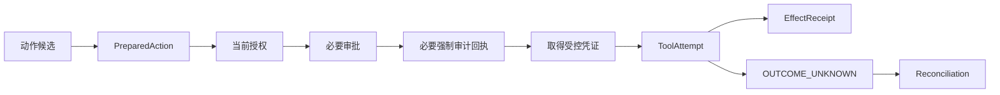

# 06 Tool Runtime & Effects（工具运行与外部效果）

<!-- status: design-baseline-v1; implementation: not-authorized; deepening: cross-module-consistency-v2 -->

## Part A — Human Narrative

### 这个模块真正保护的是“现实世界到底发生了什么”

模型调用失败通常意味着这次没有拿到计算结果；外部动作失败却可能意味着现实世界已经发生变化，只是本地不知道。

假设 Zuno 把一份已经审核的工作成果提交到外围法院系统。请求发送以后连接超时。此时至少有三种可能：请求根本没执行；远端已经成功执行但响应丢失；远端状态暂时无法确认。

如果系统把这三种情况统一写成 `failed` 并直接重试，就可能重复提交、重复通知甚至产生更严重的现实副作用。工具运行与外部效果模块因此负责保护一条非常具体的边界：**一个候选动作怎样被准备、授权、审批、执行、确认和恢复；当结果未知时，系统怎样避免猜测。**

### Tool（工具）不是一个风险等级

“工具调用”只是技术形式，不代表风险相同。

查询法律法规、读取只读业务状态、写入支持幂等键的接口、创建可补偿资源、向外部系统提交不可逆结果，它们的失败和恢复方式完全不同。Tool Definition（工具定义）至少要让执行层知道：操作是否只读、是否产生副作用、是否支持幂等、是否可以查询结果、是否允许重试、是否需要审批和强制审计。

这些风险语义必须成为 Contract 的一部分，而不能只写在 Prompt 或开发者脑子里。

### 一个高风险动作在真正执行前发生什么

运行时或专业能力首先只能提出 Action Proposal（动作候选）。06 不直接执行这段自然语言，而是把它规范化为 `PreparedAction（准备动作）`。现有 Tool Runtime 的具体类型如果叫 `PreparedToolAction`，它只是同一语义在工具边界的实现映射，不建立第二套竞争 Contract。

准备动作至少绑定：工具定义版本、操作身份、目标资源、关键非敏感参数摘要、action identity、action hash、幂等身份、run / step 因果和安全要求。

随后 08 安全与治理重新判断当前授权；高风险动作根据 policy 进入审批；需要强制审计时先取得 `AuditPersistenceReceipt（审计持久化回执）`；需要凭证时只获取受控 Secret / Credential lease。所有这些前置条件满足以后才允许真正调用远端。



### transport success（传输成功）为什么不等于 effect success（现实效果成功）

HTTP 200、SDK 返回 success、队列 ACK 或 RPC completed，只证明某一层协议或传输成功。远端业务系统是否真正接受并完成动作，必须根据该工具的 effect semantics（效果语义）解释。

例如，某 API 返回 202 只表示远端已经接收任务，不表示业务处理完成；某系统返回 200 也可能只表示请求格式合法。`EffectReceipt（效果回执）` 必须记录 Zuno 当前能够可靠确认的现实效果，而不是照抄 transport status。

外部系统仍然拥有它内部业务状态的最终事实。Zuno 只保存足以支撑自己恢复、审计和后续领域处理的 effect knowledge（效果认知）。如果远端结果还要进入正式法律业务状态，仍需经过 02 的正式准入。

### ToolAttempt（工具尝试）和 EffectReceipt（效果回执）为什么必须分开

一次动作可能只有一个逻辑 identity，却经历多个执行尝试。例如第一次请求在连接前失败，第二次成功；也可能第一次结果未知，之后通过查询确认远端已经执行。

`ToolAttempt` 表示“Zuno 做过哪一次实际调用尝试”；`EffectReceipt` 表示“Zuno 最终可靠确认了什么效果”。

因此 Attempt count 不是 Effect count，Checkpoint failure 也不是 Effect failure。恢复时需要读取已经持久化的 Attempt / Receipt，而不是根据某个 graph node 的状态猜现实世界。

### POST 超时以后到底应该怎么处理

如果远端明确返回“请求未被执行”，并且当前授权、审批、动作 hash 和预算仍有效，可以安全 Retry（重试）。

如果远端明确确认已经执行，则补齐或读取既有 EffectReceipt，不能重复提交。

如果无法判断，则进入 Reconcile（对账恢复）：使用 operation id、业务流水号、外部幂等键、资源状态查询或人工确认来建立现实事实。只有确认未执行以后，才允许考虑再次调用。

```text
known not executed
→ Retry may be allowed

known executed
→ reuse / repair EffectReceipt

outcome unknown
→ Reconcile
→ never blind retry
```

这就是 `Retry != Replan != Reconcile` 在工具边界最重要的现实含义。

### 幂等键为什么还不够

有外部幂等键当然更安全，但“有 key”并不自动解决所有问题。Zuno 还必须保证同一个 idempotency identity 对应的是同一个 action hash。

如果同一个 key 被拿来执行不同参数的动作，系统应该拒绝，而不是相信远端会替我们判断。另一方面，远端如果不支持真正幂等，Zuno 就必须有可查询的外部 operation identity、业务唯一约束、补偿机制或人工对账路径，否则这个高风险动作不具备自动恢复资格。

### 工具 Schema 或语义变化以后为什么可能需要 Replan（重规划）

Provider 暂时 503，而工具 Contract 没变，可能只是执行失败；但如果工具版本升级后参数名称、操作语义、审批要求、幂等能力或副作用风险已经变化，原计划的动作假设就不再成立。

06 应拒绝按旧定义猜新参数，并把 capability / tool drift（能力或工具漂移）反馈给 04。运行控制重新解析当前能力和工具，必要时创建新 PlanVersion。工具运行本身不负责偷偷修改计划。

### Secret（秘密凭证）为什么不能成为 PreparedAction 的普通参数

PreparedAction 需要耐久保存足以恢复和审计的动作身份，但不应该保存明文 Secret。

恢复需要知道“这次动作使用了哪个 CredentialVersionRef、哪个工具版本、哪个 action hash”，不需要把 API Key 永久复制到普通数据库。Secret 通过 08 的使用政策和 Platform 的 lease / delivery 原语在执行窗口短暂使用。

普通 Prompt、Trace、日志、EffectReceipt 和审计 payload 都只保存脱敏引用。

### 崩溃发生在远端执行之后、本地回执落盘之前怎么办

这是外部副作用最难的一类 partial failure（部分失败）。进程可能已经把请求发到远端，远端也已执行，但本地在保存 EffectReceipt 前崩溃。

恢复时不能因为数据库没有 Receipt 就认为没有执行。系统先通过稳定 action identity / idempotency identity 查找已有 Attempt，再使用远端 operation id、幂等查询或业务状态进行 Reconciliation（对账）。确认结果后补齐 Receipt。

这也是为什么默认不把网络调用放进本地数据库事务里企图“原子成功”。本地数据库和远端系统之间没有可靠的单事务边界，正确做法是利用身份、回执和对账处理跨系统 partial failure。

### 它和 Capability（专业能力）为什么不能合并

05 专业能力回答“应该怎样分析、可以提出什么专业候选”；06 回答“某个现实动作是否以及怎样发生”。

事件抽取成功意味着得到一个可信候选；提交法院系统成功意味着现实世界已经改变。两者的安全、失败、恢复、幂等和审计语义完全不同。

可以物理上共用 Worker，但不能共享一个 `success`。

### 为什么不默认自建完整 Sandbox 或工具市场

MCP、HTTP API、CLI、法院已有接口和成熟 Sandbox 已经能提供很多调用原语。Zuno 没必要为了“平台完整”先建设通用工具市场、复杂沙箱和独立 Tool 微服务。

Zuno 必须自己保护的是：工具定义版本、动作规范化、权限 / 审批绑定、Secret 最小暴露、幂等身份、Attempt / Receipt、对账和审计因果。

物理拆分继续受 ADR-0012 的 Evidence Gate（证据门）约束：只有安全隔离、独立扩缩容、故障半径或部署生命周期出现可重复证据，才拆成独立网络服务。

### 当前、目标与缺口

Current 证据已经证明 unknown external effect 可以进入 `RECONCILE` 并禁止盲重试，也存在 Tool Gateway、工具 Contract、approval / side-effect 相关实现和测试基础。但这不等于完整 effect-control production path 已经建立。

Target 是 PreparedAction → 当前授权 / 审批 / 强制审计 → ToolAttempt → EffectReceipt → 必要 Reconciliation 的完整链路。

Gap 包括真实外围系统的幂等 / 对账、PreparedAction 持久化、duplicate effect fault injection、崩溃窗口、action-hash approval invalidation、Secret lease failure、mandatory audit-before-effect、tool schema drift、人工 reconciliation 和生产运行证据。

## Part B — Engineering / Agent Reference

### B1 Scope / Global Invariants

1. Outcome Unknown（结果未知）不得映射为普通 Failed；禁止 Blind Retry（盲重试）。
2. Transport Success 不等于 Effect Success。
3. Action Proposal 不等于 PreparedAction，不等于 ToolAttempt，不等于 EffectReceipt。
4. PreparedAction 绑定稳定 action identity / hash、tool version、idempotency identity 和 run / step causation。
5. 同一 idempotency identity 对应不同 action hash 时必须拒绝。
6. 高风险 Effect 前必须重新消费当前 Authorization、必要 Approval 和 Mandatory Audit proof。
7. Secret Material 不进入普通持久化 payload、Prompt、Trace 或 Receipt。
8. Tool Runtime 拥有执行 / Effect 语义，不拥有专业正确性、Authorization policy 或 Canonical Domain Admission。
9. 外部系统拥有其内部最终业务事实；Zuno 保存自己的 Effect / Reconciliation facts。
10. 跨远端系统的部分失败通过 identity + receipt + reconciliation 恢复，不默认依赖 2PC。

### B2 Responsibility / Ownership

**Owns**：Tool Definition / Version binding、PreparedAction / PreparedToolAction、ToolAttempt、EffectReceipt、ReconciliationReceipt / EffectReconciliation、action identity / hash、effect class、retry-safety、idempotency / duplicate suppression、external operation correlation、执行结果确认状态。

**Does not own**：08 的 Authorization / Approval / Audit Requirement；05 的 Capability 专业语义；04 的 Plan / Replan；02 的 Canonical Domain Admission；01 的结果发布；远端系统内部真相。

### B3 Upstream / Downstream

上游接收 04 / 05 的 Action Proposal、08 的 AuthorizationDecision / ApprovalDecision / Audit Requirement / Credential refs，以及 Platform 的 network / secret-delivery primitives。

下游：

- 向 04 返回 effect status / receipt / reconciliation outcome；
- 向 02 提供可被正式准入引用的外部事实 / receipt；
- 向 01 提供交付类动作的 effect 结果；
- 向 09 输出脱敏 tool telemetry；
- 当 schema / semantic drift 使计划假设失效时通知 04 重新解析 / Replan。

### B4 Authoritative Facts / Core Objects

核心对象族：ToolDefinitionRef、ToolVersionRef、EffectClass、PreparedAction / PreparedToolAction、ActionIdentity、ActionHash、IdempotencyIdentity、ToolAttempt、ExternalOperationRef、EffectReceipt、ReconciliationReceipt、RetrySafety / ReconciliationCapability。

字段级 schema 尚未冻结，但 identity、hash、attempt、receipt 和 external correlation 是恢复语义必须存在的概念。

### B5 Cross-boundary Contracts

#### PreparedAction / PreparedToolAction

Purpose：把候选动作规范化为可审查、可授权、可幂等执行的动作身份。

至少绑定：tool / operation version、non-secret parameter digest、action identity / hash、effect class、idempotency identity、run / plan / step causation、target resource、security / approval requirements。

#### ToolAttempt

表示一次实际调用尝试。多个 Attempt 可以属于同一个 PreparedAction；Attempt 自身不能证明现实效果。

#### EffectReceipt

表示 Zuno 已经可靠确认的效果结果，必须能回到 action identity / hash、attempt / external operation、幂等身份和确认来源。

#### ReconciliationReceipt

表示 Outcome Unknown 后通过查询、远端业务标识或人工确认得到的对账结论。它可以确认已执行、未执行或需要人工继续处理。

#### AuthorizationDecision / ApprovalDecision / AuditPersistenceReceipt

06 只消费这些外部权威事实。Action hash / policy 改变后，旧审批或旧授权不得由 Tool Runtime 自行放宽复用。

### B6 Normal Flow

```text
Action Proposal
→ resolve current ToolDefinition / version
→ canonicalize parameters
→ classify effect / retry safety
→ create PreparedAction + action hash + idempotency identity
→ current AuthorizationDecision
→ ApprovalDecision when required
→ committed AuditPersistenceReceipt when required
→ acquire Secret / Credential lease when needed
→ create ToolAttempt
→ execute external operation
→ interpret response under tool effect semantics
→ persist EffectReceipt
→ if OUTCOME_UNKNOWN: Reconcile
→ persist ReconciliationReceipt / repaired EffectReceipt
→ return typed outcome to Runtime / Domain / Application
```

### B7 State / Lifecycle

最终 enum 未冻结，但至少必须表达：

```text
Action:
PROPOSED
→ PREPARED
→ BLOCKED / AWAITING_APPROVAL / READY
→ ATTEMPTED
→ EFFECT_CONFIRMED / KNOWN_NOT_EXECUTED / OUTCOME_UNKNOWN

OUTCOME_UNKNOWN
→ RECONCILING
→ CONFIRMED_EXECUTED / CONFIRMED_NOT_EXECUTED / MANUAL_RECONCILIATION
```

同一个 PreparedAction 可以有多个 ToolAttempt，但 Effect identity 不能因为 Retry 被重新创建成互相无关的动作。

### B8 Failure Taxonomy

| 失败 | 权威判断 | 默认控制动作 | 恢复锚点 |
| --- | --- | --- | --- |
| 参数 / schema 无效 | 06 | Reject；若 Contract drift 则通知 Replan | ToolVersion + validation result |
| tool semantic drift | 06 + 04 | Replan，不猜参数 | ToolVersion / capability re-resolution |
| authorization denied / revoked | 08 | Stop / Review | AuthorizationDecision |
| approval missing / expired | 08 | Wait / Reject | ApprovalDecision |
| action hash 与批准不匹配 | 06 + 08 | 重新审批 | action hash + approval binding |
| Secret lease 获取失败 | 08 / Platform + 06 | Wait / Stop | credential / lease ref |
| known-not-executed transport failure | 06 | Retry may be allowed | Attempt + explicit not-executed fact |
| rate limit / temporary provider error | 06 | policy-bounded Retry | Attempt + budget / retry count |
| response lost / outcome unknown | 06 | Reconcile | action / idempotency / external op refs |
| duplicate request | 06 | return prior effect or continue same reconcile | idempotency identity + action hash |
| external inconsistent status | 06 + remote / human | Manual Reconciliation | all receipts + remote evidence |
| mandatory audit persistence failed | 08 requirement + audit boundary | Block Effect | AuditPersistenceReceipt absence / failure |
| crash after remote effect before local receipt | 06 | Reconcile，不盲重试 | durable Attempt + remote correlation |

### B9 Retry / Replan / Reconcile / Recovery / Idempotency

**Retry**：只在工具语义未变、计划仍成立、当前安全条件仍允许，并且可以证明操作未执行或远端幂等机制能够安全去重时进行。

**Replan**：Tool schema、effect class、参数语义、目标能力或安全前置条件变化，使原计划动作假设失效时由 04 创建新 PlanVersion。

**Reconcile**：任何无法证明“已执行 / 未执行”的现实副作用都进入对账。可使用 external operation id、业务唯一键、远端 query API、idempotency record 或 Human Review。

**Recovery**：先读取 PreparedAction、ToolAttempt、EffectReceipt / ReconciliationReceipt，再读取外部状态；不能只看 Runtime Checkpoint。

**Idempotency**：同一 key + same action hash 继续同一逻辑动作；same key + different action hash 必须拒绝。远端不支持幂等时必须存在可信对账 / unique constraint / compensation / manual path，否则高风险动作不得自动 Retry。

### B10 Security / Approval / Audit

执行前重新授权。Approval 绑定 action hash；安全相关动作参数改变后重新审批。

Secret / Credential 只通过受控 ref / lease 使用，明文不进入 PreparedAction、ordinary DB、Prompt、Trace 或普通日志。

`MANDATORY_BEFORE_EFFECT` 要求存在时，committed AuditPersistenceReceipt 是 Ready-to-Execute 的必要条件。

Prompt Injection 产生的 Action Proposal 不能绕过 06 的 schema、effect classification、authorization、approval 和 audit gates。

### B11 Persistence / Transaction Boundaries

PreparedAction、Attempt、EffectReceipt 和必要 ReconciliationReceipt 必须达到崩溃恢复所需耐久度。具体数据库表后续冻结。

不能把远端网络调用包进本地事务并声称获得跨系统原子性。默认没有远端系统 + Zuno 数据库 2PC。

建议恢复边界：

```text
local durable PreparedAction / Attempt
→ external call
→ local durable EffectReceipt
```

中间任何崩溃窗口都通过 idempotency / external correlation / reconciliation 收敛。

### B12 Observability / Evaluation

至少观测：tool / operation version、effect class、action identity ref、attempt count、latency、known failure vs outcome unknown、reconcile duration、duplicate suppression、approval wait、audit gate failure、secret lease failure、remote error class、manual reconciliation rate。

Telemetry 只引用脱敏 action / receipt identities，不能替代 EffectReceipt。

故障测试至少覆盖：重复提交、响应丢失、远端成功本地崩溃、远端失败本地超时、tool schema drift、审批过期、action hash 变化、Secret lease failure、mandatory audit failure、remote query unavailable 和 manual reconciliation。

### B13 Current / Target / Gap / Evidence

**Current**：已有 Tool Gateway / tool contract / side-effect 相关实现与测试，且 unknown external effect → `RECONCILE` / no blind retry 的基线已有证据。具体以 `docs/evidence/current-runtime-baseline.md` 和代码 / 测试为准。

**Target**：完整 effect-control chain：PreparedAction → Security / Approval / Audit → Attempt → EffectReceipt → Reconciliation。

**Gap**：真实外围系统幂等 / query、durable action / receipt storage、duplicate-effect fault injection、crash-window recovery、approval invalidation、Secret lease、audit-before-effect、manual reconcile、provider drift 和生产运行证据。

**状态**：design available；implementation / production readiness 未由本文证明。

### B14 Code / Database / Migration Constraints

- 不默认建设通用 Sandbox 平台、工具市场或独立 Tool 微服务。
- 优先复用 MCP / HTTP / CLI / existing sandbox，通过薄 Adapter 保护 effect semantics。
- Tool SDK / Provider API 不向所有上层直接暴露；上层使用稳定 Tool Contract。
- 数据库设计先围绕 action identity、hash、attempt、receipt、external correlation、idempotency 和 reconciliation 恢复需求。
- 不为每个 Tool 发明独立状态机 / 数据库体系。
- 不使用 Checkpoint completed 代替 EffectReceipt。
- 物理服务拆分继续受 ADR-0012 证据门控。

## Part C — Cross-Module Consistency（跨模块一致性）

### C1 Completion Proof / Non-proof（完成证明与非证明）

06 的“完成”只由 effect 语义证明。ToolAttempt finished、HTTP 2xx、SDK success、Runtime Step accepted、Trace exported 都不能单独证明现实效果已经成立。

- `EffectReceipt` 证明 Zuno 已可靠确认某个动作的效果；
- `ReconciliationReceipt` 证明 Outcome Unknown 后通过远端查询 / 业务标识 / 人工对账得到了什么结论；
- `KNOWN_NOT_EXECUTED` 才允许在其余门禁仍成立时考虑安全 Retry；
- 如果远端结果还要成为法律业务事实，仍由 02 Formal Admission 决定。

### C2 Causation / Version / Freshness Bindings（因果、版本与新鲜度绑定）

PreparedAction 必须稳定绑定：action identity / action hash、ToolDefinition / ToolVersion、规范化非敏感参数摘要、target resource、effect class、idempotency identity、run / PlanVersion / StepRun causation、当前 Authorization / Approval / Audit refs，以及必要 CredentialVersionRef。

任何会改变安全或现实语义的内容变化——工具版本、目标、参数、effect class、action hash、policy epoch——都不能复用旧 Approval 或旧“可安全重试”结论。

Action idempotency、ToolAttempt identity、Reconciliation identity 分开；同一个 ToolAttempt 不等于逻辑 action，同一个 action 也可能有多个 Attempt。

### C3 Cancellation / Late Result / Staleness Rules（取消、晚到结果与失效规则）

取消 Runtime / request 后，如果外部调用尚未发出，可以阻止新的 Attempt；如果已发出但结果未知，取消不能把状态写成“未执行”，必须进入或继续 Reconcile。

远端迟到响应必须按 action identity / Attempt / external operation correlation 归属。旧 Plan 的结果晚到，如果 action 本身已经确认发生，则 EffectReceipt 仍是真实 effect fact；04 可以拒绝它参与当前 Plan，但不能通过“分支过期”否认现实世界已经发生的动作。

Tool schema / semantic drift 不改写既有 EffectReceipt 历史，只影响未来 PreparedAction 以及尚未执行动作的 eligibility / Replan。

### C4 Recovery Order / Consistency Tests（恢复顺序与一致性验证）

外部效果恢复必须从本地耐久动作身份和远端可查询事实收敛：

```text
PreparedAction / action hash / idempotency identity
→ durable ToolAttempt / external correlation
→ existing EffectReceipt / ReconciliationReceipt
→ 若仍未知则查询远端 / 人工对账
→ 刷新 08 当前授权 / Approval eligibility before any new attempt
→ 返回 typed effect fact 给 04 / 02 / 01
→ 09 补 telemetry
```

至少验证：cancel while request in flight；远端成功后本地 receipt 前崩溃；同 key 不同 action hash；审批后参数变化；SecurityEpoch / Secret lease 在执行前变化；旧 Plan action 响应晚到；远端 query API 不可用；manual reconciliation；mandatory audit persistence failure；Tool semantic drift 时禁止猜参数或盲重试。