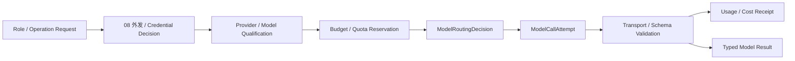

# 07 Model Gateway（模型网关）

<!-- status: design-baseline-v1; implementation: not-authorized; deepening: cross-module-consistency-v2 -->

## Part A — Human Narrative

### 这个模块解决的是“怎样可靠使用模型”，不是“模型说了什么就算什么”

Zuno 会使用不同模型完成规划、执行、抽取、改写、批判、综合和最终反思。如果每个模块都直接依赖厂商 SDK，自行处理凭证、限流、降级、预算、重试和模型选择，很快就会出现同一任务里几套互相不一致的安全规则和成本口径。

模型网关因此把“模型怎样被安全、可控、可替换地调用”集中起来。上层只表达需要什么 Model Role（模型角色）、最低质量、预算、时限和数据边界；07 再在当前允许的 Provider / Model 集合中完成路由。

但模型网关只拥有调用事实，不拥有法律业务事实。一个模型返回 `success`，只说明某次调用得到一个结果，不代表 Step 已验收、Finding 已成立、Tool 已执行或答案可以发布。

### 为什么模型角色比模型名字更稳定

Zuno 的目标角色至少包括：

- `TASK_ANALYZER（任务分析器）`
- `PLANNER（规划器）`
- `PLAN_REPAIR（计划修复器）`
- `EXECUTOR_FAST（快速执行器）`
- `EXECUTOR_REASONING（推理执行器）`
- `QUERY_REWRITER（查询改写器）`
- `EXTRACTOR（抽取器）`
- `CRITIC（批判器）`
- `SYNTHESIZER（综合器）`
- `FINAL_CRITIC（最终批判器）`

这些名字描述任务需要的能力层级，不描述供应商。今天 `PLANNER` 可以绑定一个强推理模型，明天也可以切换到另一家通过资格验证的模型，只要上层 Contract 不变。

如果把某个模型名写进 Plan、Domain Object 或 Capability identity，模型升级就会变成业务语义变更，这会把 Provider 波动扩散到全系统。

### 强模型和弱模型为什么要按角色使用

复杂规划、Plan Repair、关键 Reflection 和 Final Reflection 需要更强推理能力；Query Rewrite、抽取、分类、格式转换和普通 ReAct 通常可以优先使用更快、更便宜的模型。

这里的原则不是“弱模型永远负责简单任务、强模型永远负责复杂任务”，而是：**先按角色和质量门选择最小充分模型，再根据实际失败升级。**

默认升级链保持：

```text
EXECUTOR_FAST
→ 调整参数 / 有界 Retry
→ EXECUTOR_REASONING
→ Critic 判断 Retry / Replan / Abstain
```

升级不能绕过预算、安全和数据外发政策。强模型如果不在当前允许集合里，就不能因为“质量更高”而自动使用。

### 能由确定性代码完成的事情，不应该默认交给模型

Retrieval Execution（检索执行）、Tool Execution（工具执行）、Schema Validation（结构校验）、Citation Check（引用检查）、单元 / 规则测试、Security Gate（安全门禁）和 Approval Gate（审批门禁），只要可以可靠地由确定性代码完成，就优先交给代码。

模型擅长开放式分析、生成、归纳和判断，不应该成为所有 if-else 的替代品。

这条边界会直接影响系统可靠性：如果授权判断、工具参数校验和 Citation Check 都交给模型，“模型认为没问题”就会被误读成系统事实，后续故障也无法稳定复现。

### 一次模型调用从请求到结果应该经过什么

调用方提交 Model Role、operation、输入引用、最低质量要求、deadline、预算 / quota 约束和当前 Security Decision（安全决定）。

08 先决定这些数据是否允许发送给某类 Provider、是否有地域 / 数据分类限制、当前可以使用哪个 CredentialVersionRef。07 在允许范围内检查 Provider / Model Qualification（资格），预留预算或 quota，再创建 ModelRoutingDecision（模型路由决定）和 ModelCallAttempt（模型调用尝试）。



Gateway 负责 Provider-specific formatting（供应商格式适配）和 SDK 差异，但业务 Prompt 的专业语义属于 Runtime / Capability 等调用方。07 不能因为统一了 SDK，就变成“所有 Prompt 的 Owner”。

### Provider Qualification（提供方资格）为什么和一次调用成功不同

某个模型 API 能返回文本，不代表它适合某类法律任务，也不代表它允许处理当前数据。

Provider / Model Qualification 至少需要回答：这个模型是否支持当前角色需要的上下文、结构化输出、工具能力或其他最低特性；当前部署 / 凭证是否可用；安全策略是否允许；是否有足够的质量评测证据。

07 可以拥有技术调用资格与 routing eligibility 的事实，但法律任务质量是否达到目标，仍由 09 的 Eval（评测）提供证据，最终业务接受仍由 04 / 02 / 01 各自决定。

### 模型外发为什么必须由 08 控制

模型网关知道“哪个 Provider 技术上可用”，但不知道“某份法院材料现在是否允许发给它”。

08 Security & Governance（安全与治理）根据主体、事项、数据分类、Provider、地域、用途和 Security Epoch 做外发决定。07 只能在当前允许集合中路由。

因此：

```text
Provider technically available
!=
Provider permitted for this data now
```

Retry / fallback 也必须重新满足这个约束。

### 模型调用失败时什么时候 Retry，什么时候升级，什么时候应该停止

Provider 503、限流、连接超时或短暂错误，在任务输入、角色、质量要求和安全条件都未变化时，可以有界 Retry。

快速模型生成结构错误，可以先调整参数或重试；仍然不满足时升级到 `EXECUTOR_REASONING`。如果更强模型仍然无法满足证据 / 质量要求，Critic 可以返回 Abstain（拒答 / 放弃）或要求 Runtime Replan。

不能把 fallback 设计成“Provider A 失败就随便换 Provider B”。替代 Provider 必须满足当前角色、质量、安全和数据边界；否则结果只能进入 review / draft / abstain。

### 模型调用通常没有业务副作用，但仍然有费用和配额事实

多数模型调用属于计算依赖，不像 06 的外部提交那样改变业务世界。但它仍然可能消耗 Token、产生费用、占用 quota，并存在取消竞态。

所以一次 ModelCallAttempt 即使没有最终内容，也不能被当作“什么都没发生”。Usage / Cost Receipt（用量 / 成本回执）需要累计到 Budget；重试不能把前一次成本清零。

如果本地发出 cancel，但 Provider 是否已经完成计费未知，需要做调用 / usage 层面的 settlement（结算对账）。这不是 06 的现实业务 Effect Reconcile，但同样不能凭本地状态猜 Provider 账单。

### 模型输出为什么只能是 Proposal（候选）

模型可以产生 Plan Proposal、Action Proposal、Extraction Candidate、Critique、Synthesis Draft，但不能直接：

- 更新 Canonical Domain State；
- 批准权限；
- 执行未审批 Tool Effect；
- 激活 PlanVersion；
- 绕过 Budget；
- 提交长期 Memory；
- 宣布最终 WorkProduct 正式有效。

这不是额外保守，而是让模型可替换。即使 Provider 出错或被 Prompt Injection 影响，权威状态仍在各自责任域门禁之后。

### Provider fallback（提供方切换）为什么要保留调用因果

如果第一次调用 Model A 超时，第二次切到 Model B，最终结果来自 B，但成本可能同时包含 A 和 B。Trace 和预算也需要知道为什么发生切换。

因此 RoutingDecision、CallAttempt、provider / model ref、fallback reason、usage / cost 都要可关联。上层最终只消费 typed result 和必要 refs，不需要依赖厂商 SDK 对象。

### 为什么模型网关不应该变成“一个万能 AI 服务”

Gateway 统一调用，并不等于它应该负责 Prompt Registry、Capability Registry、Agent Planning、Tool Calling、业务发布和 Eval。

这些责任如果全部塞进 07，就会形成一个新的 God Service：上层什么都不知道，Gateway 既选模型又定义业务语义又判断结果是否正确。这样的边界既难测试，也会把 Provider 变化与业务变化绑死。

07 的职责应该保持窄：**模型资格、路由、调用、quota / budget usage、取消和 Provider compatibility。**

### 当前、目标与缺口

Current 代码和 Wave 1 Contract 已存在 ModelRoutingDecision、ModelCallAttempt、Quota / Usage / Cancellation 等基础，也有模型网关相关实现和测试。但正式 Provider credentials、四 Profile runtime、Provider qualification、真实 fallback、budget / quota fault test、cancellation race 和角色级质量测量并未完整证明。

Target 是角色驱动、Policy-bound（策略约束）、Provider-neutral（提供方可替换）的统一模型调用边界。

Gap 包括正式资格矩阵、角色—模型映射的质量证据、用量结算、fallback equivalence、模型外发 E2E、真实限流 / 超时 / 取消故障、成本预算门和 production credentials / runtime attestation。

## Part B — Engineering / Agent Reference

### B1 Scope / Global Invariants

1. Model Role 与具体 Provider / Model 解耦。
2. Provider failover 不得绕过 Security、quality floor、Budget / Quota 或 data-egress restrictions。
3. 模型输出只产生 Proposal / Candidate / Draft / Critique，不产生最终权威业务状态。
4. 上层模块不得绕过 Gateway 长期持有 Provider credentials。
5. 能由 deterministic code 完成的 Retrieval / Tool execution / schema validation / citation / security / approval gates 不默认交给模型。
6. Retry / fallback 的成本必须累计，不能重置 Usage truth。
7. Provider technically available != currently permitted != quality qualified。
8. Gateway 调用成功 != Runtime Step accepted != Domain admitted != Answer published。
9. Model role request 必须携带预算、deadline、quality 与 security constraints。
10. Gateway 不拥有专业 Capability semantics 或业务 Prompt ownership。

### B2 Responsibility / Ownership

**Owns**：ModelRole mapping、Provider / Model qualification reference、ModelRoutingDecision、ModelCallAttempt、provider-specific adapter compatibility、quota reservation / consumption、Usage / Cost Receipt、cancellation / timeout state、approved failover / fallback execution、provider / model reference。

**Does not own**：08 Authorization / Egress policy；04 Plan / Step Acceptance；05 professional Capability semantics；02 Canonical Domain；06 Tool Effect；09 legal task Eval ownership；01 final publication。

### B3 Upstream / Downstream

上游主要来自 04 / 05 / 03 / 09 的 role request、operation、prompt / input refs、quality profile、budget / quota、deadline，以及 08 的 egress / provider / credential decisions。

下游向调用方返回 typed model result / failure、routing decision ref、attempt ref、usage / cost、cancellation outcome；向 09 输出脱敏 model telemetry；向 04 提供预算和 fallback 结果用于控制决策。

### B4 Authoritative Facts / Core Objects

核心对象族：ModelRole、ProviderRef / ProviderVersion、ModelRef / ModelVersion、QualificationRef、ModelRoutingDecision、ModelCallAttempt、QuotaReservation、Usage / Cost Receipt、CancellationState、FallbackReason、ProviderErrorClass。

业务 Prompt 本体、Capability identity、Finding、PlanVersion 不属于 Model Gateway 权威对象。

### B5 Cross-boundary Contracts

#### Model Request

至少包含 role、operation、prompt / input refs、required quality profile、deadline、budget / quota、security decision / credential ref、structured-output requirements 和 trace / causation refs。

#### ModelRoutingDecision

记录在当前安全、资格、预算约束下选择了哪个 Provider / Model，以及主要 reason / fallback context。它不是法律质量证明。

#### ModelCallAttempt

表示一次 provider-level 调用尝试，绑定 routing decision、attempt identity、provider/model version、deadline / timeout、request schema ref 和结果 / error class。

#### Usage / Cost Receipt

表达 provider 返回或系统结算后的 token / usage / cost facts，并能够关联到 attempt / run / budget。估算值和最终 settled value 必须可区分。

#### Cancellation State

至少区分 cancel requested、provider-confirmed cancelled、completed-before-cancel、cancellation / billing unknown 等语义，避免本地 cancel flag 被误当成 Provider 最终事实。

### B6 Normal Flow

```text
ModelRole request
→ consume current Security / Egress / Credential decision
→ resolve qualified provider/model set
→ check capability / quality requirements
→ reserve Budget / Quota
→ create ModelRoutingDecision
→ create ModelCallAttempt
→ format provider-specific request
→ execute SDK / API call
→ validate transport / structured schema
→ record Usage / Cost
→ return typed result
→ caller performs Step / Capability / Domain acceptance

failure:
→ policy-bounded Retry
→ qualified fallback / stronger model
→ Critic / Runtime chooses Retry / Replan / Abstain
```

### B7 State / Lifecycle

最终 enum 未冻结，但至少需要表达：

```text
Provider / Model Qualification:
QUALIFIED / RESTRICTED / DISABLED / UNKNOWN

Routing:
REQUESTED → SELECTED / REJECTED

Attempt:
CREATED → IN_FLIGHT → COMPLETED / FAILED / TIMED_OUT
                         ↘ CANCEL_REQUESTED → CANCELLED / CANCEL_UNKNOWN

Usage:
RESERVED → ESTIMATED → SETTLED / DISPUTED / UNKNOWN
```

模型版本升级不修改历史 Attempt 的 provider / model ref。

### B8 Failure Taxonomy

| 失败 | Detection owner | 默认处理 | 可能升级到 |
| --- | --- | --- | --- |
| provider unavailable / 503 | 07 | bounded Retry / fallback | 04 Replan if no equivalent path |
| rate limit | 07 | backoff / alternate qualified provider | budget / deadline failure |
| timeout | 07 | Retry under policy | stronger model / abstain |
| invalid response schema | 07 + caller | repair / retry / stronger role | 04 / 05 acceptance failure |
| quality floor not met | 05 / 09 / 04 | stronger model / review / abstain | Replan |
| model egress denied | 08 | choose allowed provider or stop | no bypass |
| credential unavailable | 08 / Platform + 07 | wait / allowed alternative | stop |
| quota / budget exhausted | 07 + 04 | deny / cheaper route / stop | Replan / abstain |
| fallback provider not equivalent | 07 + qualification / eval evidence | reject fallback | review / stop |
| cancellation ambiguous | 07 | settle provider state / usage | usage dispute |
| usage settlement mismatch | 07 | reconciliation with provider billing facts | finance / ops review |

### B9 Retry / Replan / Reconcile / Recovery / Idempotency

**Retry**：Provider transient failure、schema transport issue 等，前提是 role、prompt / input refs、security decision、quality floor 和 plan assumption 仍成立。每次 Retry 创建新 Attempt，但 Budget / Usage 累计。

**Replan**：模型角色无法满足、所有合规 Provider 不可用、quality assumption 失效或 deadline / budget 迫使任务结构改变时，由 04 决定。

**Reconcile**：普通模型计算不使用 06 的现实 Effect Reconcile；但 Cancellation / Billing / Usage Unknown 需要 provider-level settlement / usage reconciliation。

**Recovery**：用 routing decision + attempt + provider/model version + usage refs 恢复，不依赖某个 SDK session object。重复请求是否可缓存取决于 operation determinism、input identity、model version 和 caller policy；不能默认所有 LLM call 幂等。

### B10 Security / Approval / Audit

08 是 provider/model allowlist、data classification、region / egress、credential scope 和 Secret policy Owner。07 执行这些决定，不自行放宽。

Secret Material 不进入 Prompt / Trace。Prompt / Response telemetry 按数据分类和 redaction policy 处理；敏感正文默认不作为普通 trace payload。

模型调用通常不需要 06 Approval / Effect semantics，但高敏感数据外发可能有额外 Security / Human approval policy，仍由 08 决定。

### B11 Persistence / Transaction Boundaries

RoutingDecision、Attempt、Usage / Cost 和必要 Cancellation state 要达到预算、审计和恢复要求的耐久程度。具体数据库 / event store 后续决定。

不与 Runtime Checkpoint、Domain Store 做默认 2PC。调用成功后本地 receipt 写失败时，需要使用 attempt identity / provider request id / usage API 做恢复，而不是把模型输出写成 Domain fact。

高吞吐 token / telemetry 明细可以外置，但 authoritative budget / usage aggregation 必须可对账。

### B12 Observability / Evaluation

至少观测：role、provider/model/version、routing reason、latency、TTFT / completion latency（可得时）、input/output token、cost、retry / fallback、quota rejection、schema failure、cancellation outcome、quality eval reference、security denial reason ref。

09 负责跨模型质量实验，07 不因为 SDK success 宣称某模型适合某类法律任务。

需要支持：role-level quality / cost benchmark、fallback regression、provider outage simulation、budget / quota fault test、cancellation race、usage reconciliation 和 no-egress verification。

### B13 Current / Target / Gap / Evidence

**Current**：Wave 1 Contract Registry 与现有代码包含 ModelRoutingDecision、ModelCallAttempt、Quota / Usage / Cancellation 等基础；完整 Current 仍以代码 / 测试 / `docs/evidence/` 为准。

**Target**：role-driven、security-bound、budget-aware、provider-neutral model invocation boundary。

**Gap**：正式 provider qualification、production credentials、role-quality evidence、fallback equivalence、usage settlement、budget / quota fault tests、cancellation race、real provider outage、四 Profile runtime 与 production attestation。

**状态**：design available；quality / production readiness not established。

### B14 Code / Database / Migration Constraints

- Provider SDK / model name 只能存在于 Gateway adapter / configuration 边界，不写入 Domain identity 或 Capability semantic identity。
- 上层只依赖 role / request / routing / result / usage typed contracts。
- 不在 Model Gateway 内建立第二套 Planner、Capability Registry、Tool Runtime 或 Release Gate。
- Prompt template ownership 留在具体 Capability / Runtime / product use case，不因 SDK 集中而全部迁移到 Gateway。
- 不默认把模型网关拆成独立网络服务；高吞吐、Secret isolation、独立扩缩容或部署生命周期出现证据时按 ADR-0012 评估。
- 表结构、缓存、batching、streaming、provider pool 和 Migration 在字段级 detail freeze 后确定。

## Part C — Cross-Module Consistency（跨模块一致性）

### C1 Completion Proof / Non-proof（完成证明与非证明）

07 只能证明模型调用与用量事实。`ModelCallAttempt=COMPLETED` 或返回了合法 JSON，只能说明 Provider 调用完成并通过相应传输 / schema 校验；它不证明 05 Capability Contract 已满足、04 Step 已验收、02 Domain 已准入或 01 Answer 可以发布。

`Usage / Cost Receipt` 只证明计量 / 结算事实，不证明模型结果被采用。`Provider Qualification` 证明当前技术 / 资格基线，不等于当前数据允许外发，也不等于该次法律任务质量已经通过。

### C2 Causation / Version / Freshness Bindings（因果、版本与新鲜度绑定）

Model Request / Routing / Attempt 至少绑定：ModelRole、operation、input / prompt refs、Provider / Model version、QualificationRef、current model-egress / Credential decision、Budget / Quota、deadline、run / PlanVersion / StepRun 或 Capability invocation causation。

Retry / fallback 前必须重新确认与该次调用相关的 Security Decision、quality floor、deadline 和 budget 仍有效。不能因为 Provider B“也能调用”就复用 Provider A 的资格 /外发判断。

RoutingDecision、ModelCallAttempt、Usage settlement 各有独立 identity；它们与 Runtime Step、Capability invocation、Tool action、Domain admission 幂等 namespace 分开。

### C3 Cancellation / Late Result / Staleness Rules（取消、晚到结果与失效规则）

`CANCEL_REQUESTED` 不能被解释成 Provider 已停止或费用为零。只有 provider-confirmed cancellation 或后续 usage settlement 才能收敛计量事实。

模型结果在 cancel / timeout / Replan 后晚到时，调用方必须检查所属 PlanVersion / Capability invocation、输入版本、当前资格和安全条件。07 可以保存 late Provider result / Usage fact，但不能自行决定它还能不能进入当前 Step。

模型版本 / Provider 资格后续改变不修改历史 Attempt；它影响未来 Routing 和尚未被下游接受的晚到结果。外部 Effect cancel 仍归 06，不因模型工具调用由模型发起就变成普通 Model cancellation。

### C4 Recovery Order / Consistency Tests（恢复顺序与一致性验证）

模型调用恢复应沿调用事实而不是 SDK session 恢复：

```text
ModelRoutingDecision / Attempt identity
→ provider request / model version refs
→ current / settled Usage facts
→ 08 current egress / Credential decision before any new call
→ 07 qualification / fallback eligibility
→ 04 / 05 decide whether result can still be accepted
→ 09 telemetry / eval correlation
```

至少验证：cancel requested 但 Provider 已完成；timeout 后原 Provider 响应晚到且 fallback 已启动；A / B 双 Provider 成本均累计；SecurityEpoch / egress policy 在 retry 前变化；fallback 非等价时拒绝；模型版本变化后缓存不误复用；Budget exhausted 时不因 retry reset；schema success 但 Capability acceptance 失败；Usage settlement mismatch 不污染 Domain / Runtime truth。