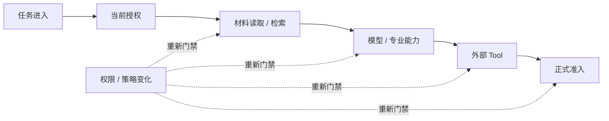

# 08 Security & Governance（安全与治理）

<!-- status: design-baseline-v1; implementation: not-authorized; deepening: cross-module-consistency-v2; detail-design: candidate-v1 -->

## Part A — Human Narrative

### 这个模块保护的不是登录，而是“下一步现在还允许吗”

法律智能系统里的安全不会在用户登录后结束。一个复杂任务可能持续几十分钟，中途等待人工、调用多个模型、检索不同材料、重规划，最后还可能向法院外围系统产生现实副作用。期间用户权限、事项归属、材料密级、模型外发政策、审批状态、凭证版本和法律保全规则都可能变化。

因此安全与治理模块真正回答的是：**当前主体能否在当前时刻，对当前资源执行当前动作；需要什么审批；什么数据允许外发；什么凭证可被使用；什么数据必须保留、禁止召回或最终清除。** 这是一条持续门禁，而不是入口处的一次 `allowed=true`。

### 用一条长任务理解 Continuous Authorization（持续授权）

假设用户开始分析事项 A 时拥有全部材料权限。运行十分钟后，管理员撤销了其中一份敏感附件的访问权。此前已经合法完成的动作仍然是历史事实，但下一次读取附件、从索引恢复正文、把内容发送给模型、继续调用依赖该内容的专业能力、执行外部动作或正式提交结果时，都必须重新消费当前安全事实。

这就是 Continuous Authorization（持续授权）：不是不停轮询一个布尔值，而是在每一个新的受保护边界上，用当前 SecurityEpoch（安全策略纪元）和当前策略判断下一步还能不能继续。



### 三种“人点同意”为什么不能合并

AuthorizationDecision（授权决定）回答“这个主体现在有没有权做这件事”；ApprovalDecision（审批决定）回答“这个具体高风险动作是否得到规定的人批准”；HumanDecision（人工业务决定）回答“专业人员是否接受、修改或拒绝法律业务结果”。第三种属于 02 法律领域与工作成果。

因此 **AuthorizationDecision、ApprovalDecision、HumanDecision 三者 Owner 与语义不同**。一个法官可以认可某个 Finding，却不同意把它发送到外部系统；也可以允许某个系统动作，却不代表模型候选已经成为正式法律事实。

### 为什么审批必须绑定动作，而不是绑定 Step 编号

如果高风险动作只记录“Step 17 已审批”，Replan 后 Step 17 的参数、目标、ToolVersion 甚至 EffectClass 都可能变化。此时继续复用旧审批等于“人批准 A，系统执行 B”。

所以 Approval 必须绑定稳定 action identity / action hash、目标资源、关键非敏感参数摘要、ToolVersion / operation 以及 SecurityEpoch。只要这些会改变现实或安全语义的内容变化，旧 Approval 就失效，必须重新审批。

### 模型外发为什么由安全策略决定，而不是模型网关决定

07 模型网关可以判断某个 Provider 技术上可用、某个模型满足角色需要，却不能自行判断某份法律材料是否允许发送到该 Provider。数据分类、事项范围、地域、Provider 资格、合同限制和当前用途共同决定是否允许外发。

因此“Provider 可调用”和“这份数据允许发给它”必须分开。08 形成 ModelEgressDecision；07 只能在允许集合里做路由、配额与质量选择，不能以 fallback 为理由绕过数据政策。

### Secret 为什么只能通过引用和短期租约使用

模型和 Tool 可能需要 API Key、数据库凭证、法院系统访问令牌等 Secret。为了恢复方便把明文 Secret 写进 Prompt、Checkpoint、普通日志或业务表，会把一次受控使用变成长期泄露面。

目标架构只跨边界传递 CredentialVersionRef / SecretRef / LeaseRef。Platform 可以提供 Secret Delivery、轮换和 Lease 原语；06 / 07 在用途和有效期内消费。恢复保存的是“使用了哪一个受控引用、针对什么动作、哪个策略版本允许”，不是秘密内容本身。

### 强制审计为什么必须在高风险 Effect 前留下耐久证明

某些现实副作用在执行前必须证明谁发起、基于什么授权、谁批准、准备执行什么动作。普通 Trace 即使完整，也可能被采样、丢失或晚到，不能承担这种合规证明。

08 拥有 AuditRequirement；真正的审计持久化边界成功后返回 AuditPersistenceReceipt。如果要求 `MANDATORY_BEFORE_EFFECT`，而该回执没有可靠落盘，06 就不能继续执行高风险副作用。事后补一条 LangSmith 或 OTel span 不能倒推当时已经满足审计要求。

### Prompt Injection 为什么不能靠“更安全的模型”解决

材料正文可能包含恶意指令，例如要求忽略系统规则、泄露文件或调用高权限工具。模型可能被诱导提出危险 Action Proposal，但 Proposal 仍不是执行许可。

03 限制可读数据和来源，05 把材料当数据而不是系统指令，07 执行模型外发政策，04 不允许模型绕过 Plan / Budget / Gate，08 决定授权和审批，06 在真实 Effect 前再次校验动作与审计。安全依赖的是多层确定性门禁，而不是模型“自觉听话”。

### 数据生命周期为什么不能只有 `deleted=true`

Retention（保留）、Recall Eligibility（召回资格）、Physical Purge Completion（物理清除完成）和 Legal Hold（法律保全）是不同事实。用户请求删除以后，可以先禁止未来召回，但因为有效 Legal Hold，底层字节仍然依法保留；反过来，政策要求清除也不等于每个 Store 已经真的完成 purge。

所以必须保持：**Retention != Recall Eligibility != Physical Purge Completion**。08 拥有 EffectiveLifecycleDecision，各 Store 执行自己的义务并产生 enforcement fact / receipt。任何一个 Store 的“还没删完”不能伪装成政策仍允许召回，也不能由 08 直接宣称物理清除已经完成。

### 安全服务故障时为什么默认 fail closed

授权引擎不可用、SecurityEpoch 无法确认、审批记录不可验证、Secret Lease 无法取得或 Mandatory Audit 无法持久化时，高风险路径不能“先继续以后补”。对受保护材料、模型外发、Secret、Tool Effect 和 Formal Admission，缺少必要安全事实时默认 fail closed（失败关闭）或进入人工复核。

低风险诊断功能是否允许降级必须由显式策略定义；不能由 01、04、06、07 各自为了可用性临时改成 fail open。

### 可信身份为什么不能来自用户自己提交的 tenant / role 字段

前端请求可以携带 tenant、role、matter，但这些字段只是输入，不是身份事实。可信 principal、tenant membership 和 role 必须来自经过验证的身份上下文、受控目录或可信 Host assertion。

01 可以负责把已验证 identity assertion 绑定到请求；08 负责决定它能做什么。Prompt、材料正文、模型输出和 Tool 参数都没有权限把自己提升成管理员。

### 撤权发生在不同时间点，结果为什么不同

如果撤权发生在 ToolAttempt 或模型调用之前，后续受保护动作应被阻断；如果请求已经发出，撤权不能把已经外发的数据从 Provider 里“撤回”，也不能把已经发生的现实 Effect 写成“未执行”。晚到结果在继续被使用、发布或正式准入前，仍需重新检查当前安全条件。

如果 Effect 正处于 outcome unknown，06 继续 Reconcile；如果 Domain 已经提交，02 的历史事实继续存在。持续授权控制未来受保护使用，不修改过去真实发生的事情。

### Approval 自己也有生命周期

审批需要区分 required、pending、granted、denied、expired、revoked 和 invalidated。批准后 action hash 变化、ToolVersion 变化、策略升级或有效期结束，都可能使它失效。

这不是为了把审批做成复杂工作流，而是避免“曾经有人点过同意”成为永久通行证。对高风险动作，Approval 的适用范围必须始终可以被解释和重新验证。

### SecurityEpoch 为什么是新鲜度边界，而不是一个展示版本号

SecurityEpoch / PolicyVersion 的价值是让消费者知道旧决定依据的是哪一版政策。当策略发生会影响授权语义的变化时，新受保护访问不得静默复用旧 epoch 的 allow。

Epoch 不要求全系统共享一个巨大的配置事务。08 只需要能够把决策稳定绑定到政策版本，并让 01 / 02 / 03 / 04 / 05 / 06 / 07 在新的受保护边界判断该决定是否仍适用。

### 生命周期执行为什么不能建立一个全局“删除成功”事务

领域库、索引、对象存储、缓存、Checkpointer 和外部 Provider 的数据生命周期并不在一个数据库里。为了追求一个全局 `deleted=true` 而使用跨所有 Store 的 2PC，会增加故障面，也不能解决外部系统不可事务参与的问题。

目标做法是：08 产生有效生命周期决定，各 Store 按自己的事务边界执行并记录 enforcement state / receipt，治理层根据这些事实收敛整体状态。局部失败保持可见并重试，而不是伪造全局原子删除。

### 审计与 Telemetry 为什么必须分开

Telemetry 用于诊断和评测，可以采样、异步导出、切换 Provider；安全审计中需要耐久保存的事实则不能依赖采样成功。09 可以观察 decision / receipt refs，但不拥有安全决定，也不成为审计唯一载体。

这样即使 LangSmith、OTLP Collector 或网络暂时不可用，安全边界仍能知道某次授权为什么成立、审批绑定了什么动作、Mandatory Audit 是否真正落盘。

### 多租户隔离为什么必须进入每个受保护资源引用

仅在登录会话里保存 tenant 不够。材料、KnowledgeGeneration、Domain object、PreparedAction、Model request、Delivery 等跨边界引用都要能够证明它属于哪个 tenant / matter scope。否则缓存 key、后台 Worker 或异步恢复很容易在脱离原 HTTP 上下文后失去隔离信息。

这不意味着把 tenant 名称暴露进所有 Trace；运行时可以传播 opaque scope ref，在可信边界内解析。隔离是业务与安全事实，Correlation 只负责定位。

### Decision Cache 为什么不能变成永久 Capability Token

高频检索和模型调用如果每一步都访问远端 Policy Engine，团队自然会考虑缓存 AuthorizationDecision。缓存本身没有问题，危险的是把一次 `ALLOW` 当成“拿到以后一直能做这件事”的 capability token。资源版本、Matter scope、purpose、SecurityEpoch、数据分类和策略都可能变化；一个只按 user id 缓存的 allow 很容易在权限撤销后继续放行后台 Worker。

因此安全缓存只能缩短评估成本，不能延长授权寿命。cache key 必须包含真正影响语义的 principal / tenant / matter / resource version / action / purpose / policy epoch 等条件，TTL 不得超过 Decision 自身 expiry；新的受保护访问还要判断当前 epoch 是否已经变化。历史 Decision ref 可以继续存在用于解释“当时为什么允许”，却不能在新请求中被当作 bearer token。对撤权敏感的动作甚至可以要求每次重新评估，而不是依赖 TTL。性能优化只能发生在安全语义内部。

### Audit Provider 故障和普通 Telemetry 故障为什么传播方向不同

如果普通 Trace exporter 暂时不可用，低风险业务可以继续，只要各 Owner 的 durable facts 仍然存在；09 记录 export failure，后续恢复诊断投影即可。可是当 08 对某个高风险 Effect 给出 `MANDATORY_BEFORE_EFFECT`，Audit persistence 就已经成为执行前置条件：没有 matching committed AuditPersistenceReceipt，06 必须阻断发送。

两种故障看起来都像“日志写不出去”，传播语义却完全不同。前者影响可观测性质量，不能反过来让已提交 Domain 失败；后者说明法规 / policy 要求的安全条件尚未满足，不能为了可用性 fail open。把两者分离还能避免一个常见反模式：为了让 tracing 不阻塞业务，把真正 Mandatory Audit 也放进异步 best-effort pipeline，最终得到“图上显示有审计，崩溃窗口里却没有耐久记录”的假安全。

### 新策略怎样上线，才能避免一次配置发布让全部长任务同时失效

SecurityEpoch 需要准确反映 active policy，但并不意味着每条新规则都必须瞬间影响全部环境。风险较高的策略修改可以先进行 shadow evaluation：对真实请求计算“如果新策略生效会怎样”，只记录差异，不改变执行决定；再在受控 tenant / profile 做 canary，确认误拒绝、漏放行和性能影响，最后激活为新的 PolicyVersion / SecurityEpoch。

Shadow / canary 结果属于治理和评测输入，不得偷偷变成生产 allow。正式激活以后，新受保护访问消费新 epoch；已经发生的历史动作仍按旧 decision 解释，paused Runtime 在恢复时重新门禁。这样策略演进既不会靠原地覆盖历史记录获得“整洁”，也不会为了兼容旧长任务继续无限延长旧权限。真正的 rollout 机制和策略引擎仍是 Target，需要通过撤权传播、双版本比较和恢复测试后才能称为 Current。

### 当前、目标与缺口

Current Evidence 证明了有限 Security fail-closed、approval binding、tenant isolation、Secret / Credential / Audit / lifecycle Contract 基础，但没有证明完整生产安全体系。当前测试基线明确保留 Security fail-closed、approval binding、artifact authorization、tenant isolation 等行为，同时 Full CI、法院 QA 和 Production Readiness 都未建立。

Target 是持续授权、动作绑定审批、模型外发治理、Secret 最小暴露、Mandatory Audit、生命周期治理和多租户隔离的一致安全边界。Gap 仍包括正式 Policy Engine、撤权传播 E2E、no-egress、credential rotation / lease、prompt-injection-to-tool、legal hold / purge 执行、审计恢复、法院部署资格和安全运行证据。

## Part B — Engineering / Agent Reference

### B1 Scope / Global Invariants

1. `Continuous Authorization（持续授权）`：新的受保护访问必须消费当前有效安全事实。
2. AuthorizationDecision、ApprovalDecision、HumanDecision 三者 Owner 与语义不同。
3. Approval 必须绑定 action identity / action hash；动作语义变化后不得复用旧批准。
4. Model Provider technically available != data egress permitted。
5. Secret Material 不进入普通 Prompt、Checkpoint、Trace、业务 payload 或普通数据库列。
6. `MANDATORY_BEFORE_EFFECT` 要求存在时，committed AuditPersistenceReceipt 是 06 执行的必要条件。
7. Retention != Recall Eligibility != Physical Purge Completion。
8. Policy / Security service 不可用时，高风险路径默认 fail closed。
9. 08 拥有 policy decision；目标 Store / Module 拥有 execution fact。
10. 安全决定不能被 Model、Runtime、Application、Tool 或 Provider 本地默认值放宽。
11. 历史合法事实不因后续撤权被改写；撤权控制新的受保护使用。
12. 不建立跨所有 Store 的安全 2PC。

### B2 Responsibility / Ownership

**Owns**：PrincipalRef / trusted identity assertion policy、Tenant / Matter Scope、SecurityEpoch / PolicyVersion、AuthorizationDecision、ApprovalDecision、ModelEgressDecision、ToolPermissionDecision、Credential / Secret usage policy、EffectiveLifecycleDecision、AuditRequirement、DecisionReason、expiry / refresh semantics、security qualification / policy compatibility。

**Does not own**：02 HumanDecision / Domain Admission；03 knowledge facts；04 Plan / Budget control；06 Effect truth；07 Model usage truth；01 publication / delivery truth；各 Store 的 purge / enforcement completion；09 Telemetry truth。

### B3 Upstream / Downstream

上游接收 01 的 trusted principal / request context、02 / 03 / 04 / 05 / 06 / 07 提交的 resource/action context、Platform 提供的 identity directory / secret-delivery / clock primitives。

下游：03 消费材料读取和检索授权；04 在 resume / retry / replan 后消费新决定；05 消费 capability scope；06 消费 tool authorization / approval / audit / credential refs；07 消费 model-egress / provider / credential decisions；02 在正式准入时消费当前授权；01 在 publication / delivery / validity query 时消费安全事实；09 只消费脱敏 refs。

### B4 Authoritative Facts / Core Objects

核心事实族：PrincipalRef、TrustedIdentityAssertionRef、TenantScopeRef、MatterScopeRef、SecurityEpoch、PolicyVersion、AuthorizationDecision、ApprovalDecision、ModelEgressDecision、ToolPermissionDecision、CredentialVersionRef、SecretRef、SecretLeaseRef、EffectiveLifecycleDecision、AuditRequirement、AuditPersistenceReceiptRef、LifecycleEnforcementRef、DecisionReasonCode、expiry / refresh requirement。

字段和物理表仍是 Target Candidate，不表示 Current 实现已经存在。

### B5 Cross-boundary Contracts

#### AuthorizationDecision

至少绑定 principal、tenant / matter / resource scope、requested action、purpose、data classification、policy epoch、decision outcome、reason、issued / expiry、refresh requirement 和 decision identity。调用方只能消费或重新请求，不能自行放宽。

#### ApprovalDecision

至少绑定 approver principal、approval identity、prepared action identity / hash、operation / ToolVersion、target resource、policy epoch、decision、issued / expiry、revocation / invalidation reason。安全相关参数或 action hash 改变后重新审批。

#### ModelEgressDecision

至少绑定 source data classification / scope、allowed provider / region / processing class、purpose、policy epoch、decision expiry。07 fallback 只能从允许集合中选。

#### EffectiveLifecycleDecision

表达 retention、recall eligibility、purge obligation、legal hold、compliance exception、decision priority / reason 和生效时间。Store 产生自己的 enforcement fact。

#### AuditRequirement / AuditPersistenceReceipt

08 拥有 Requirement；Audit persistence boundary 拥有实际持久化 Receipt。`MANDATORY_BEFORE_EFFECT` 时 06 只接受与当前 action hash / policy epoch 匹配的 committed receipt。

### B6 Normal Flow

```text
protected operation requested
→ resolve trusted principal / tenant / matter / resource / action / purpose
→ load current SecurityEpoch / policy
→ evaluate Authorization
→ evaluate egress / tool / secret restrictions when applicable
→ determine Approval requirement
→ bind Approval to action hash when required
→ determine AuditRequirement
→ require durable AuditPersistenceReceipt when required
→ issue typed decision refs / Secret Lease refs
→ target module re-checks freshness and executes
→ target module records its own execution fact
```

### B7 State / Lifecycle

最终 enum 名称在实现任务中可以调整，但语义必须覆盖：

```text
Policy: ACTIVE → SUPERSEDED / RETIRED
Authorization: EVALUATED → ALLOW / DENY; ALLOW → EXPIRED / REVOKED / SUPERSEDED
Approval: REQUIRED → PENDING → GRANTED / DENIED; GRANTED → EXPIRED / REVOKED / INVALIDATED
Secret Lease: ISSUED → ACTIVE → EXPIRED / REVOKED
Lifecycle: EVALUATED → RETAIN / NO_RECALL / PURGE_REQUIRED / LEGAL_HOLD
Store Enforcement: PENDING → ENFORCED / FAILED / BLOCKED_BY_HOLD
```

### B8 Failure Taxonomy

| 失败 | 权威边界 | 默认处理 | 可自动继续条件 |
| --- | --- | --- | --- |
| identity / tenant / scope 缺失 | 08 | deny / clarification | 获得可信上下文后重新评估 |
| policy engine unavailable | 08 | fail closed | 仅显式低风险降级策略 |
| stale SecurityEpoch | 08 | re-evaluate | 新决定成立后 |
| authorization revoked | 08 + target | block new protected use | 新授权成立后 |
| approval missing / expired | 08 | wait / deny | 新批准成立后 |
| action hash mismatch | 08 + 06 | invalidate approval | 重新审批 |
| model egress denied | 08 | deny / alternate allowed route | 只能使用允许 Provider |
| Secret Lease unavailable | 08 / Platform | wait / stop | 新 lease / allowed credential |
| Mandatory Audit write failed | audit boundary | block Effect | committed matching receipt |
| cross-tenant resource | 08 | deny + durable audit when required | 不自动继续 |
| lifecycle policy conflict | 08 | fail closed / compliance review | 明确新决定 |
| Store purge failed | target Store | keep pending / failed | Store-level Retry |
| prompt injection proposes high-risk Tool | 04/05/06 + 08 | proposal remains non-executable | 全部门禁通过后才执行 |

### B9 Retry / Replan / Reconcile / Recovery / Idempotency

Authorization 在相同 principal / resource / action / purpose / policy epoch 下可以稳定重算，但不能无限缓存。SecurityEpoch、资源版本或动作语义变化后必须新评估。

Approval 只在 action hash、ToolVersion、policy epoch、有效期和审批范围仍匹配时复用。Replan 产生新的 PreparedAction 时重新审批。Reconcile 若需要再次访问远端或 Secret，也重新消费当前授权。

恢复锚点是 durable policy / decision / approval / audit facts，而不是 Trace。08 不承担 02 Admission、03 rebuild、06 Effect Reconcile 或 01 Delivery recovery，只在这些恢复过程继续提供当前安全资格。

### B10 Security / Approval / Audit

这是本模块主责。所有门禁都必须明确 fail-open / fail-closed 策略；法律材料越权、模型敏感外发、Secret、高风险 Effect、Formal Admission 和 Mandatory Audit 默认不得因为 Provider 故障而自动放行。

普通日志、Trace 和 Eval 必须数据最小化；Secret NEVER EXPORT。安全审计需要的 durable facts 与 09 Telemetry 分离。

### B11 Persistence / Transaction Boundaries

Policy / SecurityEpoch、需要历史复核的 Authorization / Approval、EffectiveLifecycleDecision、AuditRequirement 和必要 audit refs 需要达到治理要求的耐久度。单个安全决定写入可以在 08 自己的 Store 内事务化，但不与 02 / 03 / 04 / 06 / 07 建立全局 2PC。

高风险 Effect 前的 AuditPersistenceReceipt 必须在独立耐久边界成功；Store 生命周期通过 per-store enforcement facts 收敛。Platform 提供 PostgreSQL、CAS、Lease、Fencing、Secret Delivery、Clock 等物理原语，不改变政策结果。

### B12 Observability / Evaluation

至少观测 decision identity、SecurityEpoch、resource / action class、allow / deny / revoke / expiry reason、approval wait、egress denial、Secret Lease error、audit gate failure、lifecycle enforcement lag、cross-tenant denial。默认只输出 opaque refs 和分类结果。

评测至少覆盖 cross-tenant、no-egress、revocation-during-run、stale credential、secret leakage、approval action-hash invalidation、prompt-injection-to-tool、duplicate effect gate、mandatory audit failure、legal-hold / deletion、policy-engine outage 与恢复后重新授权。

### B13 Current / Target / Gap / Evidence

**Current**：[`current-test-baseline.md`](../evidence/current-test-baseline.md) 证明当前测试入口保留 Security fail-closed、approval binding、artifact authorization、tenant isolation 等有限行为；`docs/evidence/` 仍明确 Full CI、法院 QA、production qualification 未建立。

**Target**：Continuous Authorization + action-bound Approval + Model Egress + Secret Lease + Mandatory Audit + lifecycle governance + tenant isolation 的统一安全边界。

**Gap**：正式 Policy Engine、cross-tenant / no-egress E2E、撤权传播、approval invalidation、credential rotation、prompt injection、legal hold / purge enforcement、audit recovery、法院部署安全资格和生产证据。

**状态**：detail design candidate available；implementation / qualification / production readiness not established。

### B14 Code / Database / Migration Constraints

- 不预冻结独立 Security Service；优先模块化实现和 typed decision ports。
- 不允许任何消费者用本地默认值放宽安全策略。
- 不允许明文 Secret 进入普通业务持久化、Checkpoint、Prompt 或 Trace。
- 不把 HumanDecision 合并进 ApprovalDecision。
- 不把 Store 生命周期执行压成一条全局 `deleted=true`。
- 不默认引入跨 Store 2PC、全局分布式锁或事件溯源。
- 物理服务拆分继续受 ADR-0012 Evidence Gate。

#### B14.1 Detail Freeze Candidate：Authorization / Approval 字段组

`AuthorizationDecision` candidate 至少包含：`decision_id`、`principal_ref`、`tenant_scope_ref`、可选 `matter_scope_ref`、`resource_ref / resource_version_ref`、`action`、`purpose`、`data_classification`、`policy_version / security_epoch`、`outcome`、`reason_code`、`issued_at`、`expires_at / refresh_after`、必要 `provider / region / tool class constraints`。

`ApprovalDecision` candidate 至少包含：`approval_id`、`approver_principal_ref`、`prepared_action_ref`、`action_hash`、`tool_version / operation_ref`、`target_resource_ref`、`policy_version / security_epoch`、`outcome`、`issued_at`、`expires_at`、`revoked_at`、`invalidation_reason`。

Decision identity 与 execution identity 分离。`ALLOW` / `GRANTED` 不能直接作为 ToolAttempt、ModelCall、DomainVersion 或 Publication completion proof。

#### B14.2 Detail Freeze Candidate：Policy / SecurityEpoch 与缓存新鲜度

安全缓存 key 必须覆盖真正影响语义的 principal、tenant / matter、resource version、action、purpose、policy epoch 和必要数据分类。缓存 TTL 只能进一步缩短资格，不能超过 Decision 自身 expiry。

策略变更如果影响授权语义，必须产生新的 SecurityEpoch / PolicyVersion；旧 Decision 在新的受保护访问中重新评估。消费者可以持有 decision ref 做历史关联，但不得把旧 ref 当永久 capability token。

#### B14.3 Detail Freeze Candidate：Secret / Credential / Lease

Credential metadata 与 Secret Material 分离。候选字段至少包括 `credential_ref`、`credential_version`、`allowed_consumer / operation class`、`lease_id`、`issued_at`、`expires_at`、`revoked_at`、`rotation_epoch`；明文 Secret 只通过受控 delivery channel 在短生命周期内出现。

任何持久化对象只保存 ref / version / lease outcome。Retry / Resume 如果原 Lease 已失效，重新取得资格，不复用旧 Secret Material。

#### B14.4 Detail Freeze Candidate：Mandatory Audit 与动作绑定

`AuditRequirement` 至少绑定 `requirement_id`、`action_hash / protected_operation_ref`、`policy_epoch`、`minimum_fact_set`、`durability_class`、`timing=MUST_BEFORE_EFFECT | MAY_BE_AFTER` 等语义。

`AuditPersistenceReceipt` 至少能证明 `audit_record_id`、matching action / requirement、持久化边界、committed_at 和不可否认的 outcome。06 在 `MANDATORY_BEFORE_EFFECT` 下必须检查 Receipt 与当前 PreparedAction / action hash 匹配。

#### B14.5 Detail Freeze Candidate：生命周期与 per-store enforcement

EffectiveLifecycleDecision 至少表达 `subject_ref`、`policy_version`、`retention_until`、`recall_eligible`、`purge_required`、`legal_hold_refs`、`compliance_exception_refs`、`effective_at`、`reason_code`。

每个 Store 的 `LifecycleEnforcementFact` 独立表达 `store_owner`、`subject_ref`、`decision_ref`、`state`、`attempt`、`completed_at / failed_at`、`failure_class`。08 不伪造全局 purge complete；治理查询通过多个 Store facts 汇总。

#### B14.6 Detail Freeze Candidate：Crash Window / Revocation Matrix

| Window | Durable truth | 恢复 / 下一步 | 禁止 |
| --- | --- | --- | --- |
| Decision 形成后响应丢失 | durable decision 可查 | 同输入查询 / 重算 | 产生语义不同的隐式 allow |
| Approval granted 后 action hash 改变 | 旧 Approval 历史仍在 | INVALIDATED + 新审批 | 复用旧批准 |
| Readiness 后、模型外发前撤权 | 新 SecurityEpoch 生效 | 07 重新 egress gate | 使用旧 allow |
| Tool 发出后撤权且 outcome unknown | 现实结果未知 | 06 Reconcile；阻止新 Attempt | 写成未执行 |
| Audit write 失败 | 无 matching receipt | block Effect | 事后用 Trace 补票 |
| Purge 部分 Store 成功 | per-store facts 不一致 | 继续剩余 enforcement | 宣称全局已删除 |
| Secret rotation 发生在 Retry 前 | 旧 Lease 过期 / revoked | 获取新 lease | 重放旧 Secret |

#### B14.7 Detail Freeze Candidate：Schema Evolution / Policy Rollout

1. Policy / Decision schema 必须向后读取历史记录；旧 Decision 按当时 policy version 解释。
2. 新的 mandatory 字段采用 add → backfill / derive when valid → verify → tighten constraint；不能伪造历史审批或授权默认值。
3. action-hash / canonicalization 算法带版本；算法升级不能让旧 Approval 失去可解释性。
4. Policy rollout 需要支持 canary / shadow evaluation 只用于比较，不得让未激活 policy 静默执法。
5. Credential / Secret schema migration 不把 Secret Material 搬进普通表。
6. 生命周期策略 schema 升级不得把 Legal Hold、No-Recall 和 Purge 合并成单一状态。
7. Policy Engine / Store 物理迁移必须证明历史 decision/audit refs 仍可查询。

#### B14.8 Detail Freeze Candidate：Failure Injection / Freeze Evidence

08 进入 Module Detail Freeze Review 前至少验证：

| 场景 | 必须证明 |
| --- | --- |
| cross-tenant read / retrieval | fail closed，且无旁路缓存泄露 |
| SecurityEpoch 在 Runtime interrupt 期间变化 | Resume 后重新门禁 |
| Readiness 后 egress 前撤权 | 07 不外发 |
| Approval 后 action hash / ToolVersion 改变 | 旧 Approval 无效 |
| Secret Lease 过期 / rotation | Retry 获取新 lease，不泄露旧 Secret |
| Policy Engine outage | 高风险路径 fail closed |
| Mandatory Audit persistence failure | 06 不产生 Effect |
| Tool 已发出后撤权 + timeout | 继续 Reconcile，不伪造未执行 |
| Legal Hold + No-Recall 同时存在 | 禁止召回但保留要求仍执行 |
| 多 Store purge 一个失败 | 全局状态不虚报 complete |
| Prompt Injection 诱导高风险 Action | Proposal 无法绕过 04/06/08 gates |
| cached old authorization | 新受保护访问因 epoch/version 检查拒绝复用 |

## Part C — Cross-Module Consistency（跨模块一致性）

### C1 Completion Proof / Non-proof（完成证明与非证明）

08 的 Decision 证明政策判断，不证明目标动作已经执行。`AuthorizationDecision=ALLOW` 不证明材料已读取、模型已调用、工具已执行或 Domain 已准入；`ApprovalDecision=GRANTED` 只证明指定 action hash 的审批成立。

`AuditRequirement` 不等于审计已经持久化；`EffectiveLifecycleDecision=PURGE_REQUIRED` 不等于 Store 已 purge。真正 execution proof 分别来自 AuditPersistenceReceipt 和各 Store enforcement facts。

### C2 Causation / Version / Freshness Bindings（因果、版本与新鲜度绑定）

Authorization / Approval / Egress / Secret / Lifecycle 决定必须绑定 principal、tenant / matter / resource、action、SecurityEpoch / PolicyVersion、decision identity、expiry / refresh；Approval 额外绑定 action identity / hash / ToolVersion。

旧 SecurityEpoch 的 allow 不能因为进入 Checkpoint、cache、PreparedAction 或 ModelRoutingDecision 就自动延长。AuthorizationDecision、ApprovalDecision、Secret Lease、Audit Receipt、LifecycleDecision 使用不同 identity namespace，通过 causation refs 关联。

### C3 Cancellation / Late Result / Staleness Rules（取消、晚到结果与失效规则）

撤权、PolicyVersion 更新或 Approval 失效只约束新的受保护访问和尚未执行动作，不重写过去合法历史。已经载入内存的数据是否允许继续纯计算必须由显式政策决定。

晚到结果如果要被继续使用、发布、外发、执行 Effect 或 Formal Admission，必须消费当前安全决定。任务取消不等于撤销既有 Effect / Admission；02 / 06 各自保存现实与业务历史。

### C4 Recovery Order / Consistency Tests（恢复顺序与一致性验证）

```text
current SecurityEpoch / PolicyVersion
→ historical decision / approval / audit refs needed for reconstruction
→ current Authorization / Egress / Secret / Approval eligibility for next protected action
→ matching AuditPersistenceReceipt when required
→ target module resumes and records its own execution fact
→ 09 records redacted correlation
```

一致性测试至少覆盖：撤权发生在 interrupt / retrieval / model / tool / admission 不同阶段；Approval action-hash drift；Secret rotation；Audit failure；Legal Hold + No-Recall；partial purge；旧缓存 Decision；Prompt Injection；Tool outcome unknown 与撤权并发。