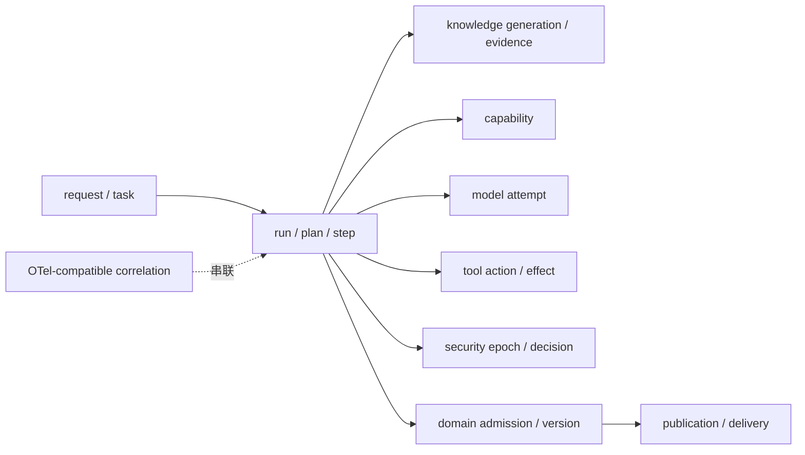

# 09 Observability & Evaluation（可观测性与评测）

<!-- status: design-baseline-v1; implementation: not-authorized; quality: not-established; deepening: cross-module-consistency-v2 -->

## Part A — Human Narrative

### 这个模块要回答两个问题：系统发生了什么，复杂度到底值不值得

复杂 Agent 系统很容易产生漂亮的 Trace（链路跟踪），但“看得到一条调用链”并不等于系统可信。

如果系统无法回答某个 Finding 为什么被正式准入、谁批准了高风险动作、某次外部提交到底有没有成功，Trace 再完整也不能成为业务真相。

反过来，如果系统只有业务事实，没有统一的运行观测，就很难知道为什么某类任务变慢、为什么频繁 Replan、哪个模型角色正在烧掉预算、GraphRAG 是否真的提高质量。

因此 09 可观测性与评测承担两类相关但不同的责任：

1. **Observability（可观测性）**：把跨模块运行行为组织成可关联、可脱敏、可诊断的遥测视图；
2. **Evaluation（评测）**：用版本化数据集、对照实验和可重复指标回答“质量怎么样、复杂机制有没有价值、当前版本能不能通过发布评测门”。

### Trace 为什么只是“投影”，不是所有事实的总账本

一次复杂任务可能同时产生：

- 04 的 AgentRun / Plan / Step；
- 03 的 KnowledgeGeneration / EvidenceCandidate；
- 05 的 Capability output；
- 07 的 ModelCallAttempt / Usage；
- 06 的 ToolAttempt / EffectReceipt；
- 08 的 Authorization / Approval / Audit refs；
- 02 的 AdmissionReceipt / WorkProduct version；
- 01 的 Publication / Delivery facts。

09 可以把这些身份串进一条 Trace，让工程师看到“先发生了什么、后发生了什么”。但真正恢复和审计时，仍要回到各 Owner 的 durable facts（耐久事实）。

例如 Domain commit 成功但 Runtime checkpoint 失败，恢复锚点是 AdmissionReceipt；POST 超时的现实结果由 Effect / Reconciliation receipt 证明；权限撤销由 AuthorizationDecision / Security Epoch 证明。

因此：

```text
Telemetry tells us what we observed
Durable owner facts tell us what the system is allowed to assert
```

中文理解就是：遥测告诉我们“观察到了什么”，权威事实告诉我们“系统能够负责地断言什么”。

### 为什么 OpenTelemetry（开放遥测）适合作为跨 Provider 契约

Zuno 不应该把架构绑定到某一个 Trace SaaS。

OpenTelemetry / OTLP 可以提供 vendor-neutral（供应商无关）的 Trace、Metric、Log 等遥测协议与数据模型，适合作为跨模块 canonical telemetry contract（统一遥测契约）的技术基础。当前官方 OTLP specification 对 traces、metrics、logs 都是 Stable；Collector 可以作为可选中间层接收、处理、脱敏、批处理并转发遥测。

LangSmith 可以作为 Agent / LLM Trace 与 Eval 的默认 / 优先 Provider；Grafana-compatible 体系可以承担系统指标；法院侧需要更强部署主权时，也可以评估 Langfuse 或其他 on-prem Provider。

Provider 可以替换，但 correlation identity、redaction、sampling、错误分类和关键字段语义不能跟着 Provider 一起变化。

### 一条跨模块 Trace 最少要能串起什么

一个请求至少要能够关联 request / task、run、plan version、step run、knowledge generation、capability version、model attempt、tool action / attempt、security epoch、domain version / admission、publication / delivery 等关键身份。

不是每个 Span 都要携带所有字段，而是跨边界时必须有足够稳定的 correlation refs（关联引用），让人可以从某个结果一路定位到它使用的执行、证据和安全上下文。



### Telemetry（遥测）为什么可以降级，而 Mandatory Audit（强制审计）不一定可以

普通 Trace、Metric 和 Log 的目的主要是诊断、性能分析和评测。它们可以采样、批处理、异步发送；Provider 短暂不可用时，低风险业务不一定需要跟着停机。

Mandatory Audit 是另一回事。08 可能要求某个高风险 Effect 前必须先耐久保存授权、审批、动作身份等最小审计事实。如果这个持久化失败，执行应该按安全策略阻止。

09 可以记录或关联 `AuditPersistenceReceipt（审计持久化回执）`，但不能自己宣布“审计已满足”。

所以架构上必须保持：

```text
Telemetry failure
→ may degrade / fail-open under policy

Mandatory audit persistence failure
→ may fail-closed before effect
```

两者不能因为都叫“日志 / trace”而合并。

### 数据脱敏为什么是架构契约，不是 Provider 配置小细节

法律材料、Prompt、模型响应、工具参数都可能包含敏感信息。如果每个 Trace Provider 自己决定记录什么，换 Provider 时就会改变系统安全边界。

Zuno 的统一遥测契约需要先定义：默认记录哪些 identity / metadata，哪些 payload 只记录 hash / reference，哪些正文必须 policy opt-in，Secret 永远不能导出。

Redaction（脱敏）发生在 export 之前，不能先把 Secret 发给 SaaS 再指望 Dashboard 隐藏。

跨服务关联也不能反过来成为泄密通道。Correlation ID 应优先使用不含业务含义的 opaque identity（不透明身份）。OpenTelemetry Baggage 会随网络请求传播，官方文档明确提醒其中的内容可能被下游继续传播到非预期第三方，而且 Baggage 自身没有内置完整性校验。因此 tenant、用户、案件名称、Secret、原文片段等敏感信息默认不得直接放进 Baggage；如果确实需要传播关联信息，应使用最小化的不透明 ID，并在接收端回查受控事实。

### Current 现在究竟能证明什么

当前仓库已经存在：

- `ObservabilityTracePort`；
- Noop / InMemory / LangSmith adapters；
- OTel / LangSmith-compatible span schema；
- redacted export；
- eval dataset schema；
- release baseline contract；
- audit span bridge。

这些证据能证明 **contract foundation available（统一观测契约与适配基础存在）**，不能证明 AgentRunGraph、StepExecutionGraph、Retrieval、Tool Runtime、Security、Domain Admission 和 Final Gate 已经形成生产级全链路观测。

当前正式 benchmark 仍处于 measurement blocked（测量受阻）状态；没有正式 runtime / credentials / dataset / attestation 时，不能因为 Eval 框架存在就说质量已经证明。

### 法律任务评测为什么不能只用一个 LLM Judge 分数

Zuno 的评测对象至少包括：证据是否充分、引用是否正确、有没有无依据主张、事实 / 事件 / 冲突抽取是否准确、法条是否适用、人工 Reviewer 是否接受、任务是否完成，以及这些质量换来了多少时延、Token、模型调用、检索轮次和工具调用。

不同指标回答不同问题：

- Citation Correctness（引用正确性）关注回答与来源是否一致；
- Evidence Sufficiency（证据充分性）关注支撑结论的材料是否够；
- Unsupported Claim Rate（无依据主张率）关注模型是否说了材料没有支持的话；
- Applicability Accuracy（适用性准确率）关注法律 / 类案是否真的适用；
- Reviewer Acceptance（人工接受率）关注专业人员是否愿意采用；
- Task Completion / Recovery Correctness 关注系统有没有真正完成并正确恢复；
- Latency / Token / Cost 则衡量代价。

模型 Judge 可以是其中一项工具，但不能替代 deterministic checks、人工标注和真实任务结果。

### Release Gate（发布评测门）为什么不能只看平均分

法律场景里的风险往往集中在少数严重错误，而不是平均值。

一次评测即使平均分很好，如果仍出现越权检索、错误引用、stale WorkProduct 未失效、重复外部副作用或严重法条误用，也不能直接宣称 release passed。

Release Evidence 至少需要绑定 dataset version、样本数、failure taxonomy、指标和阈值、commit SHA、模型 / Provider / prompt / capability 配置、运行 profile、judge / human review 配置以及 blocked reason。

如果关键数据缺失、样本数为 0 或 benchmark 环境不可用，应明确 `BLOCKED`，不能用空数据、synthetic demo 或“路径可运行”伪装成质量通过。

### 为什么四类复杂能力都必须接受“删除测试”

Zuno 不是以“功能越多越先进”为目标。09 需要专门支持 complexity kill test（复杂度淘汰测试）。

当前至少四类能力必须持续接受对照：

1. Native Runtime vs Generic Host + Legal Backend；
2. Long-term Memory ablation（长期记忆消融）；
3. Specialist / Multi-Agent vs Single Controller + parallel steps / subgraphs；
4. GraphRAG vs simpler retrieval on specific query classes。

如果复杂机制没有带来稳定质量、恢复、安全或成本收益，就应该删除、外置或保持 Optional，而不是因为已经实现就永久保留。

### A/B/C 评测应该怎样理解

推荐的系统级比较不是“模型 A 和模型 B 哪个分高”，而是产品架构组合：

```text
A. Generic Host + Legal Skills
B. Generic Host + Zuno Legal Backend
C. Zuno Native Runtime + First-class Domain State
```

这能回答：真正有价值的是法律 Capability、领域状态，还是自有 Runtime；也能帮助防止团队把所有收益都归因于“Agent 更复杂”。

对比必须尽量控制原始语料、模型、预算和任务集合，并明确哪些条件无法完全控制。

### 一次故障恢复应该怎样被评测

恢复能力不能只靠单元测试 happy path。

需要构造：Domain commit 后 checkpoint 失败、checkpoint complete 但 AdmissionReceipt 缺失、POST timeout outcome unknown、Security Epoch 在任务中变化、并行旧分支晚到、Knowledge generation partial publish、Model provider outage 等故障。

评测不是只看“任务最终有没有结束”，还要看有没有重复副作用、有没有错误正式准入、有没有用旧权限继续执行、有没有把旧分支污染新 Plan，以及恢复耗时和人工介入程度。

### 为什么生产系统不能硬依赖某个外部 Trace SaaS

如果 LangSmith Cloud 不可用就导致法院侧核心业务无法完成，说明 Observability Provider 已经偷偷变成业务正确性依赖。

核心 Domain / Security / Effect / Runtime recovery 依赖自己的 durable facts。Telemetry sink 故障最多影响诊断和评测完整性；只有安全策略明确声明某类审计是 Mandatory 时，才由 durable audit gate 阻止动作。

因此法院生产部署可以使用 LangSmith，也可以使用私有 Collector / backend，但核心业务语义不依赖特定 SaaS 在线。

### 当前、目标与缺口

Current 是 unified trace / eval contract foundation + adapters / schemas / tests，正式 benchmark 仍为 `MEASUREMENT_BLOCKED`。

Target 是 provider-neutral telemetry + full-chain correlation + reproducible legal eval + failure / recovery evaluation + release evidence + complexity kill tests。

Gap 包括正式数据集、真实 case samples、production trace wiring、OTLP / Collector deployment profile、A/B/C benchmark、judge / human review calibration、SLO / DR metrics、长期质量回归、法院侧 telemetry policy 和完整 release qualification。

## Part B — Engineering / Agent Reference

### B1 Scope / Global Invariants

1. Telemetry != Durable Audit != Business Truth。
2. Observability Provider 可替换；correlation / redaction / identity semantics 稳定。
3. Trace 丢失不能让 Domain / Security / Effect / Admission facts 消失。
4. Mandatory Audit durability 不由普通 Trace 替代。
5. Eval 缺关键输入、zero sample 或不可比较时保持 BLOCKED，不伪造 PASS。
6. Release Gate 绑定 dataset / commit / config / sample count / threshold / failure taxonomy。
7. Secret NEVER EXPORT；敏感正文默认 reference / hash / redact。
8. 复杂能力必须接受 A/B / ablation / kill test。
9. Measurement evidence 不能反向把 Target 自动写成 Current；实现与质量证明分开。
10. 法院核心业务不硬依赖外部 SaaS observability。
11. 跨边界 correlation 默认使用 opaque identity；敏感业务信息不进入 OpenTelemetry Baggage。

### B2 Responsibility / Ownership

**Owns**：Telemetry contract / projection、Trace / Span / correlation conventions、Metric definitions / views、Eval Dataset / DatasetVersion、Eval Run / Evaluation Result、Experiment / Baseline、Release Evaluation Evidence、measurement blocked reason、quality / cost trend、sampling / redaction conventions。

**Does not own**：02 Canonical Domain / Admission truth；08 Authorization / Approval / Audit durability；06 Effect truth；04 Run control truth；07 provider billing truth；01 publication truth；Production Readiness declaration without evidence。

### B3 Upstream / Downstream

上游接收所有责任域输出的脱敏 telemetry / fact refs：request / publication、domain version / admission、knowledge generation / evidence、run / plan / step、capability、tool / effect、model / usage、security / audit refs，以及 Platform resource metrics。

下游向工程诊断、SLO / alerting、Release Gate、architecture measurement、A/B/C experiments、回归分析和人工 Review 提供 trace / metric / eval evidence。

### B4 Authoritative Facts / Core Objects

核心对象族：TraceId / SpanId / CorrelationRef、TelemetryEnvelope、MetricSeries / MetricEvent、SamplingDecision / RedactionMetadata、EvalDataset / DatasetVersion、EvalCase / ExpectedEvidenceRef、EvalRun、EvaluationResult、Experiment / BaselineRef、ReleaseEvaluationEvidence、BlockedReason、ProviderExportStatus。

`AdmissionReceipt`、`EffectReceipt`、`AuthorizationDecision`、`AuditPersistenceReceipt` 只作为外部权威引用，不复制为 09 自己的 truth。

### B5 Cross-boundary Contracts

#### Telemetry Envelope

至少支持 module / operation、trace / correlation identity、request / run / plan / step / action refs、domain / knowledge / security refs、provider refs、timing、status / error class、sampling、redaction metadata。不是每条事件携带所有字段，但跨边界必须可关联。

Correlation value 默认是无业务含义的 opaque identifier。OpenTelemetry Baggage 不用于携带 Secret、tenant / matter 名称、用户 PII、法律材料正文或授权决定正文；如确需跨进程传播最小关联，只传播受控 opaque ref，并在可信边界内回查实际事实。

#### Eval Dataset / DatasetVersion

绑定 case identity、input / material refs、expected evidence / labels、task class、split、annotation provenance、data policy 和版本。修改标签或 case set 创建新版本。

#### Eval Run / Evaluation Result

绑定 dataset version、commit SHA、runtime / provider / model / capability / prompt config、judge / deterministic checker versions、sample count、metric outputs、failure cases、blocked reason 和 run identity。

#### Release Evaluation Evidence

从可复现 Eval Run 汇总 release decision inputs。它不是单次任务的 Domain Admission，也不等于 production readiness。

### B6 Normal Flow

```text
runtime module emits typed telemetry / fact refs
→ redact / normalize
→ export through ObservabilityTracePort / OTLP-compatible adapter
→ optional Collector / provider backend
→ traces / metrics / logs support diagnosis

Eval:
versioned dataset
→ bind commit + configuration + profile
→ deterministic checks + model judges + human review as required
→ metric computation + failure taxonomy
→ compare baseline / experiment
→ Release Evidence / BLOCKED result
→ architecture complexity keep / remove decision input
```

### B7 State / Lifecycle

最终 enum 未冻结，但至少表达：

```text
Telemetry:
CREATED → EXPORTED / DROPPED_BY_POLICY / RETRYING / DEGRADED

Eval Dataset:
DRAFT → VERSIONED → FROZEN_FOR_RUN → SUPERSEDED

Eval Run:
QUEUED → RUNNING → COMPLETED / FAILED / BLOCKED

Release Evidence:
NOT_EVALUATED → ELIGIBLE / NOT_ELIGIBLE / BLOCKED
```

`BLOCKED` 永远不能与 `PASS` 合并；partial / sampled Trace 也不能冒充 complete reconstruction。

### B8 Failure Taxonomy

| 失败 | 影响 | 默认处理 | 是否阻塞业务 |
| --- | --- | --- | --- |
| telemetry sink unavailable | 诊断数据 | bounded retry / buffer / degrade | 低风险普通业务通常否 |
| Collector / exporter backlog | 遥测延迟 | backpressure / drop policy / scale | 按 policy |
| redaction failure | 敏感数据风险 | fail export / sanitize | 不得泄漏 |
| correlation break | 无法串联链路 | mark partial + repair instrumentation | 不改变业务 truth |
| Trace sampled / partial | 诊断不完整 | 明确 partial | 不可用于关键重建断言 |
| eval dataset missing | 无法测量 | BLOCKED | 阻塞 release evidence |
| zero sample | 无测量意义 | BLOCKED | 是 |
| model / judge credential unavailable | Eval 无法完成 | BLOCKED / retry | release evidence blocked |
| metric computation failure | Eval 不完整 | fail / rerun | 是 |
| baseline incomparable | 无法比较 | BLOCKED / redesign experiment | 是 |
| release threshold not met | 质量不足 | NOT_ELIGIBLE | 是 |
| mandatory audit persistence failure | 08 / audit boundary truth | 由安全策略 fail closed | 09 不自行降级 |
| sensitive Baggage / correlation payload | 数据泄露与伪造风险 | block / sanitize propagation | 不得继续泄露 |

### B9 Retry / Replan / Reconcile / Recovery / Idempotency

普通 telemetry export 可以 bounded Retry、buffer 或降级；必须有 stable event / span identity 防止重复聚合产生错误计数。

Eval Run 使用 stable run identity 和 dataset / config / commit fingerprint 区分“同一次失败重试”和“新的 experiment”。重新运行必须保留样本数和失败原因，不覆盖历史结果。

09 不拥有 Runtime Replan、Tool Reconcile 或 Domain Recovery。它只关联这些控制的事实并评估结果。

关键观测恢复：Telemetry provider 丢失时从本地 owner facts 恢复业务，不从 Trace 重建业务状态；Trace 后续只能补充诊断视图。

### B10 Security / Approval / Audit

默认 data minimization + redaction。Secret never export。

受保护 Prompt / Response / Evidence 只有在 08 policy 显式允许且满足脱敏 / 存储要求时才进入 trace payload。默认优先保存 refs / hashes / metadata。

跨服务传播的 correlation context 同样执行最小化；Baggage 默认只允许 opaque refs，不能作为授权凭据或可信安全输入，因为其跨网络传播范围可能超出预期且本身没有内置完整性保证。

09 不拥有 Mandatory Audit Requirement 或 AuditPersistenceReceipt；可以关联 receipt identity 用于诊断 / evaluation。

法院侧可以选择 on-prem Collector / backend；核心业务不依赖外部 SaaS 在线。

### B11 Persistence / Transaction Boundaries

Telemetry backend、metric store、eval store 与 Domain / Runtime / Effect transaction 分离。

普通 telemetry 可以异步写；Release Evidence / Eval Result 需要绑定 immutable dataset version、commit / config、sample count 和 metric output，满足可复现 / 审查需求。

不要求 Telemetry write 与 Domain Admission / Tool Effect 2PC。业务提交成功但 trace export 失败时，业务事实仍以 Owner receipt 为准。

当前官方 OpenTelemetry / OTLP 文档将 traces、metrics、logs 的 OTLP signal 标为 Stable；Collector 可作为 vendor-neutral receiver / processor / exporter。具体 Collector 是否部署在 Zuno profile 中仍是物理部署决策，不由本模块逻辑边界自动要求。

### B12 Observability / Evaluation

最低质量 / 行为指标族：

- Evidence Sufficiency；
- Citation Correctness；
- Unsupported Claim Rate；
- fact / event / conflict / dispute quality；
- fact–article mapping / Applicability Accuracy；
- Reviewer Acceptance；
- Task Completion / Abstention；
- Recovery Correctness / duplicate-effect rate / stale-result rejection；
- latency / TTFT / token / cost；
- model calls / retrieval rounds / tool calls；
- Retry amplification / Replan rate / parallel efficiency；
- Domain State Reuse Rate。

持续保留四类 complexity gate：Native Runtime、Long-term Memory、Specialist / Multi-Agent、GraphRAG query-class。

### B13 Current / Target / Gap / Evidence

**Current**：`src/backend/zuno/platform/observability/README.md`、`ObservabilityTracePort`、Noop / InMemory / LangSmith adapters、OTel-compatible schema、redacted export、eval dataset / release baseline、audit span bridge 等证明 contract / adapter foundation available。正式 benchmark 当前仍是 `MEASUREMENT_BLOCKED`。

**Target**：provider-neutral telemetry + full-chain correlation + reproducible legal eval + release evidence + architecture kill tests。

**Gap**：正式数据集 / case samples、全链路 production wiring、OTLP / Collector profile、A/B/C benchmark、judge calibration、human review protocol、SLO / DR、长期 regression、法院 deployment policy 和 release qualification。

**状态**：design available；quality not yet proven；production readiness not established。

### B14 Code / Database / Migration Constraints

- 不把 LangSmith、Grafana、Langfuse 或某个 SaaS 变成不可替换架构依赖。
- 上层 instrumentation 依赖 provider-neutral ports / envelopes；Provider adapter 处理具体 SDK。
- 参考官方 OpenTelemetry：<https://opentelemetry.io/docs/>、<https://opentelemetry.io/docs/specs/otlp/>、<https://opentelemetry.io/docs/collector/>、<https://opentelemetry.io/docs/concepts/signals/baggage/>。
- 不把 telemetry table 作为 Domain / Security / Effect receipt 替代品。
- 不让 “trace export success” 成为普通业务成功前置条件；Mandatory Audit 除外且由 08 policy 明确定义。
- 不为 Eval 数据集和运行结果建立不可追溯的可变记录；必须有 dataset / config / commit identity。
- 具体 backend、Collector topology、retention、sampling、storage schema 和独立服务拆分在测量 / 安全 / 运维需求明确后决定。

## Part C — Cross-Module Consistency（跨模块一致性）

### C1 Completion Proof / Non-proof（完成证明与非证明）

09 的 Trace / Metric 只证明“系统观测到了什么”；EvalResult / ReleaseEvaluationEvidence 只证明“在绑定的数据集、commit、配置、样本和阈值下测到了什么”。它们都不能成为 02 Admission、06 Effect、08 Authorization / Audit、04 Runtime completion 或 01 Publication 的替代 truth。

Release Evidence=ELIGIBLE 也不等于 Production Ready；如果生产 runtime、credentials、security qualification、load / DR 等证据缺失，生产资格仍然未建立。Eval `BLOCKED`、zero sample 或不可比较不得转换为 PASS。

### C2 Causation / Version / Freshness Bindings（因果、版本与新鲜度绑定）

跨模块 correlation 以稳定、无业务含义的 opaque refs 串联 request、run / PlanVersion / StepRun、KnowledgeGeneration、CapabilityVersion、ModelAttempt、PreparedAction / EffectReceipt、SecurityEpoch / Decision、DomainVersion / AdmissionReceipt、Publication / Delivery。

Telemetry 不复制这些对象的完整权威 payload；Eval 则必须绑定 immutable DatasetVersion、commit SHA、runtime/profile、model/provider、prompt/capability/tool / policy configuration 和 sample set。配置变化后不能把旧 EvalResult 当成新版本质量证明。

Telemetry event identity、EvalRun identity、Experiment identity 与各业务模块 idempotency namespace 分开。

### C3 Cancellation / Late Result / Staleness Rules（取消、晚到结果与失效规则）

业务 Run 被取消后，Telemetry 仍可以接收晚到 span；这些 span 只是诊断投影，不能让 cancelled Runtime 重新变成 completed，也不能改变已发生的 Effect / Admission。

Eval Run 被取消或 Provider 失败时，必须保存 cancelled / failed / blocked 和实际 sample count，不能把部分结果覆盖成完整基线。晚到 judge / model 结果只有在同一 EvalRun identity、DatasetVersion 和 config fingerprint 仍匹配时才能合并。

旧 Trace、旧 Dashboard 或旧 Release Evidence 不能证明当前 WorkProduct / SecurityDecision / Capability eligibility 仍然新鲜；当前事实始终回到 Owner。

### C4 Recovery Order / Consistency Tests（恢复顺序与一致性验证）

观测系统故障时，恢复顺序是“业务先由 Owner fact 恢复，遥测后补”：

```text
02 / 06 / 08 / 04 / 03 等 Owner durable facts
→ 01 / Runtime projection repair
→ Telemetry pipeline recover / replay as policy allows
→ Eval / diagnosis rebuild from versioned inputs
```

至少验证：telemetry sink outage 不破坏普通业务恢复；Mandatory Audit outage 仍由 08/06 fail-closed；correlation break 被标 partial 而非伪装完整；sensitive Baggage 被拒绝 / 脱敏；同一 span 重放不重复计数；Eval zero sample 保持 BLOCKED；cancelled Eval 的晚到结果不污染新 EvalRun；Domain commit/checkpoint fail、Outcome Unknown、Security revocation、late branch、knowledge partial publish 等场景能从 Owner receipts 重建，而不是依赖 Trace。